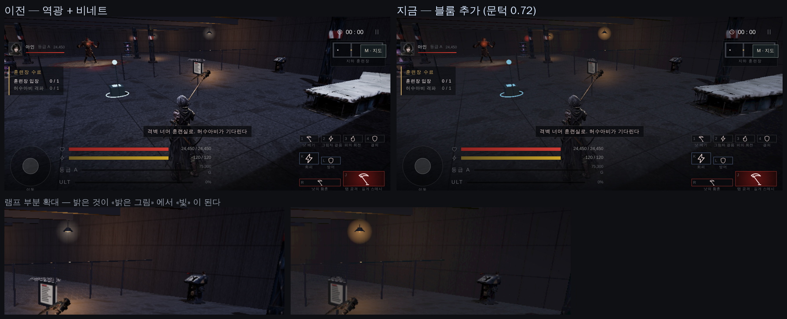

# 57 · 블룸 — 밝은 것이 «빛» 이 되게

docs/design/53 §5 에 「남은 큰 지렛대는 블룸인데 아직 안 했다」고 적어 뒀다. 했다.

## 1. 왜 필요했나

램프·불꽃·궤적·보스의 붉은 핵은 전부 **가산 스프라이트**다. 블룸이 없으면 그건
«빛» 이 아니라 **«밝은 색으로 칠한 도형»** 으로 보인다. 몬헌·마영전의 타격이 눈부신 건
대부분 블룸 덕이다.

## 2. 직접 짰다 — `js/bloom.js`

`vendor/three` 에 `EffectComposer` 가 없어서 최소 구성으로 직접 만들었다. 네 단계:

1. 장면을 **렌더 타깃**에 그린다 (톤매핑까지 적용된 선형 값)
2. **밝은 부분만** 뽑는다 — 휘도 > 문턱
3. 가로 → 세로 **9탭 가우시안** (폰 1/4, PC 1/2 해상도라 싸다)
4. 원본 + 블룸 을 더해 캔버스로. **sRGB 인코딩을 셰이더에서 직접 한다** —
   렌더 타깃에서 캔버스로 바로 그리면 three 가 인코딩해 주지 않는다.

| | 값 | 왜 |
|---|---|---|
| 문턱 `threshold` | **0.72** | 0.62 는 바닥까지 떠서 어두운 벙커가 흐려졌다. 0.80 은 램프만 남는다 |
| 부드러움 `soft` | 0.28 | 문턱 근처를 서서히 |
| 세기 `amount` | 0.75 (폰) / 0.85 (PC) | |
| 흐림 해상도 | 1/4 (폰) / 1/2 (PC) | |

장면은 **이미 톤매핑을 거쳐 0~1** 이므로 문턱은 1 보다 작아야 한다 (HDR 파이프라인이
아니다). 그래서 0.72 같은 값이 나온다.

## 3. 깨지면 «검은 화면» 이다 — 세 겹으로 막았다

방금 고친 그 증상이다 (docs/design/52). 그래서:

* `createBloom` 이 실패하면 **`null` 을 돌려준다** — `draw()` 는 평소대로 그린다
* 매 프레임 `draw()` 가 `try/catch` 로 감싸고, 던지면 그 자리에서 블룸을 끄고
  렌더 타깃을 풀고 평소 경로로 돌아간다. 진단에 한 줄 남는다
* **설정에서 끌 수 있다** — 일시정지 → 설정 → 「빛 번짐」

그리고 자동으로 꺼지는 경우: 저사양 모드(`SAFE`), 화질 「낮음」,
프레임이 낮아 스스로 낮춘 상태(`autoLow`). 빛 번짐은 있으면 좋은 것이지
프레임을 내줄 만큼은 아니다.

## 4. 성능은 «못 쟀다»

이 컨테이너에는 GPU 가 없다 (SwiftShader). 여기서 재는 fps 는 디렉터의 S25 와
아무 상관이 없다. 추가 비용은 구조상 **전체 해상도 그리기 1회 + 1/16 해상도 패스 3회**
(폰 기준)인데, 실제 ms 는 **기기에서만 알 수 있다.**

**디렉터가 폰에서 보고 무거우면 설정에서 끄면 된다.** 그 스위치를 먼저 만들어 둔 이유다.
