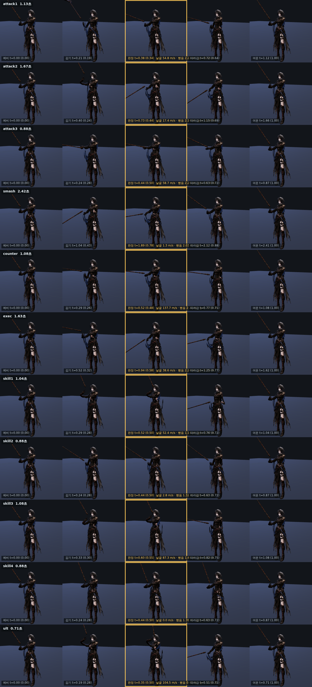

# 59 · 클립 검수 시트 — 「게임이 실제로 재생하는 것」을 한 장에

전투 품질 D(#105)의 ④. 지금까지 모션을 고칠 때마다 뷰어를 열어 한 클립씩
눈으로 봤다. 클립이 11 개고 손볼 때마다 다시 봐야 하니 실제로는 «안 보게»
된다. 한 장으로 굽는 도구를 만들었다.

## 1. 무엇을 보게 되는가

`tools/3d/ain-sheet.html` — 세로는 클립, 가로는 다섯 박자다.

```
예비(t=0) · 감기 · 판정 · 따라감 · 여운(t=끝)
```

가운데 «판정» 칸이 본체다. 노란 테두리가 쳐져 있고, 이 칸의 시각은
`js/dungeons.js` 의 `RULES.motion.clipContacts` 에서 **그대로 읽는다**.
시트가 게임과 어긋날 수 없다 — 판정값을 고치면 시트의 칸도 같이 움직인다.



쓰는 법:

```
ain-sheet.html                  전투 클립 11 종
ain-sheet.html?clip=ult,smash   골라 보기
ain-sheet.html?clip=all         로코모션까지 전부
ain-sheet.html?side=1           옆에서 (보폭·다리 스윙)
ain-sheet.html?norig=1          리그 보정 끄고 (클립 원형)
ain-sheet.html?raw=1            ain-bind-repair 갈아 끼우기 전
```

## 2. 「실제로 재생하는 것」을 보려고 한 두 가지

**하나.** `js/ain-bind-repair.js` 가 런타임에 클립을 갈아 끼운다
(`ult ← smash`, `skill4 ← guard`). GLB 를 그냥 열면 **게임이 재생하지 않는
모션**을 보게 된다. 시트는 `repairAinClips` 를 통과시킨 뒤 굽는다.

**둘.** 그림은 `makeAinRigAdapter` 의 양손 그립·접지 보정을 **켜고** 그린다.
끄면 낫이 손에서 떠 보인다. 정지 화면이라 감쇠가 수렴하지 않으므로 칸마다
열 번 돌려 수렴시킨다.

여기서 한 번 헛디뎠다. 보정 함수는 three 의 `AnimationAction` 이 아니라
**전투 행동 모양의 객체**(`{id,clip,kind,duration,elapsed}`)를 받는다.
`AnimationAction` 을 넘겼더니 `a.elapsed/a.duration` 이 `NaN` 이 되어 뼈
회전이 전부 `NaN` 이 됐고, 캐릭터가 화면에서 사라졌다. 예외는 나지 않는다 —
`NaN` 은 조용히 퍼진다. `game3d.js:605` 가 만드는 것과 같은 모양으로 고쳤다.

## 3. 숫자는 그림과 다른 조건에서 잰다 — 그리고 일부는 싣지 않는다

판정 칸에 세 가지를 적는다: **날끝 속도 · 뻗음 · 높이**.

- **리그 보정을 끄고** 잰다. `tests/ult-contact.test.mjs` 와 49 번 문서의
  숫자가 전부 보정 없는 60 fps·엉덩이 기준이라, 켜고 재면 기존 수치와 비교가
  안 된다. 보정은 감쇠(적분)라 표본 간격에 따라 값이 달라지기도 한다.
  **그림은 켜고, 숫자는 끄고** — 두 조건이 다르다는 걸 알고 봐야 한다.
- 날끝은 낫 메시의 로컬 정점 중 자루 원점에서 가장 먼 점(1.86 m)이다.
  처음에는 월드 bbox 를 로컬로 되돌려 잡았는데, 회전한 만큼 엉뚱한 점이
  나와 속도가 1/8 로 작게 나왔다. 정점에서 직접 구해 고쳤다.

**최고속과 「판정-최고속 어긋남」은 재기는 하되 그림에는 싣지 않았다.**
되감기(time warp)로 계단이 생긴 클립에서는 표본 간격에 따라 값이 바뀐다.
ult 를 240 fps 로 재면 손목이 154.6°/프레임, 960 fps 로 재면 56.5°/프레임 —
같은 모션인데 «최고속» 이 3 배 차이 난다. 비교할 수 없는 숫자를 그림에 적어
두면 나중에 그걸 근거로 판단하게 된다. `window.__ainSheet.metric` 에는
그대로 들어 있으니, 조건을 아는 사람이 꺼내 쓰면 된다.

## 4. 시트가 찾아낸 것 — 궁극기는 스매시를 2.01 배속으로 돌린 것이다

**먼저 정정.** 이 문서의 첫 판에는 「3.41 배속」이라고 적었다. 틀렸다.
3.41 은 클립 길이의 비(2.417 ÷ 0.708)인데, **전투에서는 그 클립 길이가
쓰이지 않는다.** 아래에 맞는 값을 적고, 왜 틀렸는지도 남긴다.

시트가 짚어 준 출발점은 맞았다. `ain-bind-repair.js` 는 소스를 목적지 길이에
맞춰 `track.scale()` 한다:

```
ult   ← smash :  2.417초 → 0.708초
skill4 ← guard :  1.083초 → 0.875초
```

그런데 판정이 있는 기술(`mult>0`, 궁극기는 `mult:6.0`)은 «timed» 로 재생된다.
`game3d.js:598` 이 매 프레임 `sampleAction` 으로 클립 시각을 **행동 시간에 다시
매핑한다** — 클립을 처음부터 끝까지, 행동 시간 전체에 걸쳐 편다.

그러니 플레이어가 보는 배속은 클립 길이가 아니라 **행동 시간**이 정한다:

```
                행동 시간   소스 대비
기본 아레나        1.20초     2.01 배속
보스 오버라이드     1.62초     1.49 배속
```

2.4 초짜리 묵직한 내려치기를 1.2 초에 보여 주고 있다. 여전히 «두 배 빨리 감은
스매시» 지만, 3.4 배는 아니다. `tests/ult-timescale.test.mjs` 가 이 계약을
못박는다.

**틀린 이유.** 클립 길이(0.708초)가 재생 속도를 정한다고 넘겨짚었다.
`playOnce` 의 `speed:1.1` 도 봤으니 더 그럴듯해 보였는데, 그 경로
(`if(!e.timed) ainAttack('ult')`)는 궁극기에서는 **아예 안 탄다** —
`mult:6.0` 이라 항상 timed 다. 코드를 끝까지 따라가지 않고 나눗셈부터 했다.

### 고칠 방향

앞서 적었던 「ult 클립을 1.0~1.2 초로 늘린다」는 **취소한다.** 전투에서는
클립 길이를 안 보므로 아무것도 바뀌지 않는다.

듣는 손잡이는 하나뿐이다 — **`RULES.ult.duration`**. 1.20 → 1.6 초로 올리면
2.01 → 1.51 배속이 되고, 이미 보스 오버라이드가 쓰는 1.62 초와 같아진다.
접점은 깨지지 않는다: 매핑이 판정 시각을 항상 클립 접점(0.354초)에
맞추므로, 행동 시간을 바꿔도 판정 프레임의 자세는 그대로다 —
위 테스트의 두 번째 항목이 그것이다.

다만 이건 **모션이 아니라 전투 시간 변경**이다. 궁극기를 쓰는 동안 묶이는
시간이 0.4 초 늘어나므로 위험 부담이 달라진다. 수치가 아니라 설계 결정이라
디렉터 판단으로 남긴다.

## 5. 남은 것

- ④ 이 문서 — **끝**
- ① 회전(피벗) 클립 — 소스 없음. 지금은 기울기(banking)로 대신하고 있고
  발은 여전히 제자리에서 돈다
- ③ exec 소스 교체 — 소스 없음 (49 번 문서 §8.3.1)
- **새로 나온 것**: 궁극기 2.01 배속 → `RULES.ult.duration` 1.20 → 1.6 초?
  (디렉터 판단)
