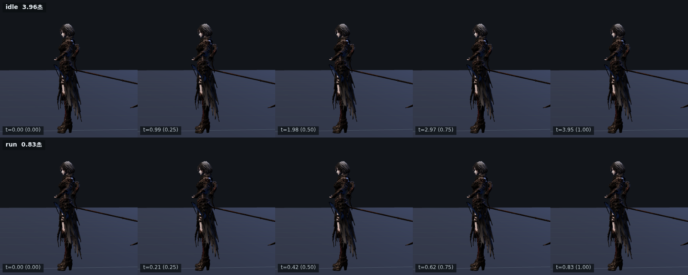

# 60 · 낫을 깃발처럼 들지 않는다

디렉터: 「그 큰 낫을 들고 있는데 깃발 드는게 아니라 살짝 땅에 끌듯이 가야지」

## 무엇이 그랬나

`js/ain-two-hand.js` 의 `ready` 자세 하나가 대기·걷기·달리기를 전부 맡고 있었다.

```
ready = [0, -.12, .32,   -.65, .75, .18]
                          └── 자루 방향: +Y 0.75 = 위, −X 0.65 = 왼쪽
```

자루가 위·왼쪽을 가리키니 낫이 머리 옆으로 솟는다. 말 그대로 깃발이다.

`ready` 를 그냥 내릴 수는 없다. 모든 공격 경로의 **시작 키이자 끝 키**라
(`[[0,ready], …, [1,ready]]`) 건드리면 휘두름의 예비와 여운이 전부 바뀐다.
그래서 평상시 전용 자세 `AIN_CARRY` 를 따로 두고, 전투 행동이 없을 때
(`!a && !guard`)만 섞는다.

## 값은 재서 맞췄다

손잡이(날 뿌리)가 y≈1.03, 날 길이 1.861 m 이므로 **자루의 y 성분이 날 끝 높이를
정한다.** 쓸어 본 결과:

| 자루 y | 날 끝 높이 |
|---|---|
| −.86 | **−0.73 m** (바닥 아래 73 cm — 파묻혀서 안 보인다) |
| −.45 | −0.09 m |
| −.38 | 0.08 m |
| **−.34** | **0.17 m** ← 채택 |
| −.25 | 0.40 m (다시 뜬다) |

`-.34` 로 잡아 17 cm 를 남겼다. 회전 기울기(`tickBank`, 최대 15°)가 날 끝을
약 24 cm 끌어내리므로 여유가 필요하다. 0 cm 에 딱 맞추면 돌 때마다 바닥을
뚫는다.

최종값: `AIN_CARRY = [.06, -.30, .10, -.34, -.34, -.88]`
→ 날 끝이 몸 뒤 1.40 m, 옆 0.94 m, 높이 0.17 m 를 스치며 따라온다.



## 섞는 속도 — 여기서 한 번 틀렸다

처음에는 지수 감쇠(`lerp`, rate 9)로 섞었다. 그랬더니
`tests/ain-two-hand` 가 **관절 튐 9.24°/프레임**(문턱 8°)으로 잡아냈다.
들고 다니는 자세와 겨눔 자세는 자루 방향이 120° 넘게 벌어져 있어서, 지수
감쇠는 처음 몇 프레임에 그 각도의 큰 몫을 한꺼번에 밀어 넣는다.

속도 자체를 제한하는 방식으로 바꿨고, **비대칭**으로 뒀다:

- 싸우러 들어갈 때 **0.18 초** — 평타 접점이 0.30 초라, 올리는 게 느리면
  반쯤 들린 채로 친다
- 끝나고 내릴 때 **0.45 초** — 급할 이유가 없다

## 남은 것

- 달리기 중에도 날 끝 높이가 고정이다. 실제로는 뛸 때 살짝 들려야 자연스럽다
- 바닥이 기울거나 계단이 있는 던전에서는 날이 지면을 뚫는다. 지금 던전은
  모두 평지라 문제가 없지만, 경사가 생기면 접지 그림자처럼 지면 높이를
  읽어 보정해야 한다
