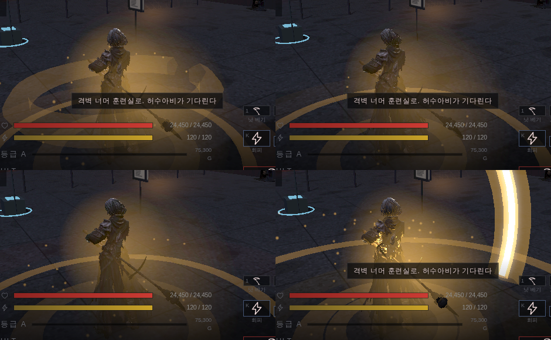
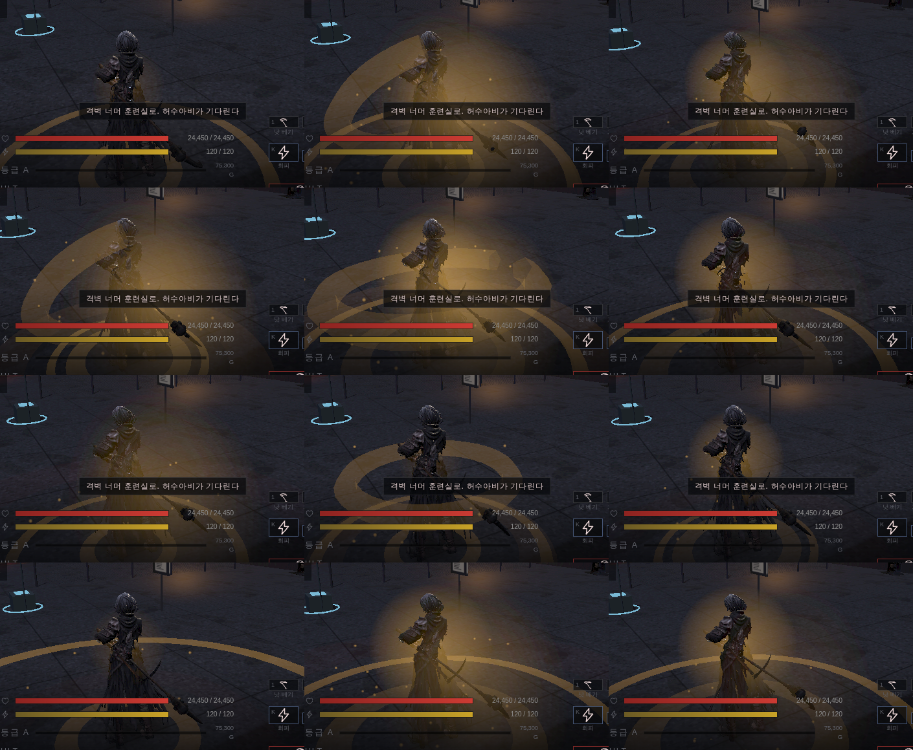

# 63 · 스킬 연출 — 마영전·몬헌 조사 후 다시 만들기

62 번까지는 「아인만 아크가 꺼져 있었다」를 되돌린 수준이었다. 이번엔 조사부터
다시 하고 연출 자체를 다시 짰다.

## 1. 조사에서 건진 것

**마영전(마비노기 영웅전)**
- 카메라가 **가깝고 흔들림이 세다.** 같은 계열인 검은사막과 비교하면 BDO 는
  카메라가 멀고 흔들림이 약해 «느긋한» 느낌이고, 마영전은 «바짝 붙어 치고받는»
  느낌이다. 카메라가 타격감의 절반이다.
- 크리티컬은 **짧게 번쩍 + 특유의 소리**다. 오래 끌지 않는다.
- 물리(Havok)로 사슬·천·장식이 따라 흔들린다. 타격의 2차 운동을 물리가 만든다.
- 「히트 딜레이가 없어서 가볍다」가 다른 MMO 를 깎을 때 쓰는 표현이었다.

**몬스터헌터**
- 히트스톱이 정체성이다. 슬래시 액스 내려치기가 **8프레임**(30fps 기준 0.27초).
- 와일즈 베타에서 히트스톱을 줄였더니 「가벼워졌다」는 반응이 바로 나왔고
  이후 빌드에서 되돌렸다. 빼면 즉시 티가 나는 종류의 것이다.
- 우리 값과 비교: 스매시 0.21 · 파괴 0.28 · 처형 0.38초 — **같은 구간에 있다.**
  여기는 이미 맞다.

**실시간 VFX 관행**
- 슬래시 하나를 **3~4겹**으로 쌓는다. 같은 색 다른 채도의 리본 여러 겹 +
  «크게 → 0» 으로 줄어드는 아크 메시 + 연기/파편.
- 한 겹으로는 «기술» 로 안 읽힌다. **우리가 딱 한 겹이었다.**

## 2. 그래서 바꾼 것

### 세 박자로 쪼갰다

전에는 스킬을 누르는 «그 순간» 에 링 하나 띄우고 끝이었다.

```
예비(tell)  ─ 날에 빛이 모인다. 바닥 고리가 «조여든다»
              (커지는 게 아니라 작아진다 — 모으는 동작이니 안으로 와야 힘이 실린다)
타격(strike) ─ 아크 3겹 + 먼지 + 불티 + 잔상 + 빛
여운         ─ 불티가 떠서 흩어진다
```

**타격은 «맞았을 때» 만 터진다.** 빗나간 스윙에 충격을 붙이면 맞았는지가
흐려진다 — 몬헌이 히트스톱으로 지키는 바로 그 구분이다.

### 아크를 3겹으로 쌓았다

```
굵고 흐린 겹  두께 2.4배 · 밝기 0.22 · 0.34초
얇고 밝은 겹  두께 1.0배 · 밝기 0.80 · 0.28초
흰 심지       두께 0.45배 · 밝기 0.85 · 0.22초 · 0.18 늦게 들어온다
```

전부 «1.18배 → 0.56배» 로 줄면서 사라진다. 이 줄어드는 곡선이 슬래시의 본체다.

### 스킬마다 휘두르는 «면» 이 다르다

| 스킬 | 면 | 왜 |
|---|---|---|
| 낫 베기 | 비스듬히 | 대각선 베기 |
| 그림자 걸음 | 수평 | 스치며 지나간다 |
| 피의 회전 | 수평 (거의 한 바퀴) | 도는 기술 |
| 결의 | 수평 (완전한 원) | 몸 둘레로 퍼진다 |
| 궁극기 | 내리꽂기 | 위에서 아래로 |

전부 같은 도넛을 띄우면 스킬이 구분되지 않는다.

### 캐릭터를 «비춘다» — 이게 제일 컸다

아크를 아무리 밝게 해도 캐릭터가 어두운 실루엣으로 남으면 «그림을 덧댄 것»
처럼 보인다. 타격 순간 0.28초짜리 점광원을 캐릭터에 붙였다.



## 3. 여기서 한 번 틀렸다 — 등급을 크기로 표현하려 했다

처음엔 스킬 등급이 오르면 반지름도 레벨당 17% 씩 키웠다. 3레벨 회전 베기가
**2.48 m** 가 됐는데, **낫의 실제 사거리가 1.86 m** 다(손잡이~날 끝 실측,
60 번 문서). 무기보다 큰 궤적은 «휘두른 자국» 이 아니라 그냥 떠 있는 고리로
보인다.

반지름은 레벨당 8%(최대 1.32배)만, **불티·먼지 같은 «양» 은 17%** 로 키우게
나눴다. 등급은 크기가 아니라 밀도로 읽힌다. `tests/skill-fx.test.mjs` 가
반지름 상한과 «양이 크기보다 확실히 많이 늘어난다» 를 둘 다 못박는다.

## 4. 결과



한 스킬이 화면에 올리는 개체 수:

```
이전   1 ~ 2 개  (발밑 링 0.25초 하나)
지금   8 ~ 13 개 (아크 3 + 예비 2 + 먼지 2 + 불티 + 잔상 + 빛)
```

## 5. 확인하지 못한 것

- **성능.** 이 컨테이너에는 GPU 가 없어(SwiftShader) 개체가 8~13개로 늘어난
  값을 S25 에서 재 볼 수 없다. 점광원 하나가 추가로 붙는 것도 마찬가지다.
  블룸처럼 끌 수 있게 해 두지 않았다 — 필요하면 다음에 설정 항목으로 뺀다.
- **실제 전투에서의 그림.** 보스전 인트로 컷신이 카메라를 잡고 있어 헤드리스로는
  전투 중 스킬을 정면에서 못 찍었다. 위 그림은 검수 훅(`TW_DUNGEON.fxDemo`)으로
  같은 함수를 같은 값으로 부른 것이다 — 코드 경로는 같지만 «전투 중» 은 아니다.
- **마영전의 «물리로 흔들리는 장식».** 우리는 머리카락·천 흔들림(99 번)까지는
  했지만 타격 충격이 옷을 때리는 건 아직 없다.

## 6. 남은 것

- 스킬 전용 소리 (지금은 공용 타격음을 쓴다)
- 궁극기 전용 카메라 (마영전 SP 스킬처럼)
- 타격 순간 캐릭터 옷·머리에 충격 전달
