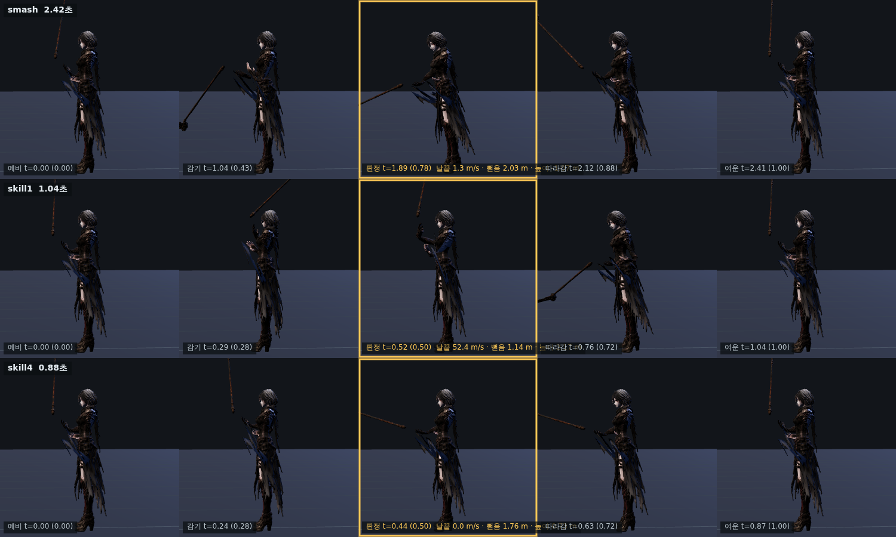

> ⚠ 이 문서의 「두 손 그립 IK 의 팔꿈치 특이점이 천장」이라는 진단은
> **틀렸다.** 재 보니 특이점 근처에 간 적이 없다. docs/design/68 참고.

# 64 · 「어깨 위에서 달랑달랑」 — 큰 동작은 팔이 아니라 몸통에서 나온다

디렉터: 「스킬 모션이 큼지막해야지. 어깨 위에서 달랑달랑하는게 아니라.
기본공격도 연계가 전혀 없고.」

## 1. 먼저 쟀다 — 어느 게 얼마나 작았나

날 끝이 한 동작 동안 지나가는 거리(엉덩이 기준)와 높이 폭을 재는 도구를 만들었다
(`scratchpad/swing.mjs`). 고치기 전:

```
클립      날끝이동  높이폭   최저
skill1      9.55m    2.63   -0.25
skill3      8.09m    1.87   +0.50   ← 허리 아래로 안 내려온다
skill2      1.86m    0.66   +1.06   ← 어깨 위 상자 안에서만 논다
skill4      1.06m    0.24   +1.72   ← 거의 안 움직인다
attack1     5.55m    1.17   +0.55
attack3     3.54m    1.22   +0.50
```

**그림자 걸음과 결의는 키 두 개가 «같은 값» 이었다.**

```js
skill2:[[0,ready],[.22,[0,-.20,.23,-.8,.4,.12]],
                  [.65,[0,-.20,.23,-.8,.4,.12]],[1,ready]]
                        └─ .22 와 .65 가 완전히 동일 = 자루가 멈춰 있다
```

디렉터가 본 「달랑달랑」이 정확히 이 둘이다. 추측이 아니라 데이터로 확인됐다.

## 2. 팔로 키우려다 실패했다 — 그리고 왜 실패했는지

자루 방향을 크게 흔들어 봤다. 날 끝 이동이 1.06 → 10.6 m 로 뛰었지만
**팔이 부서졌다**:

- `attack2` 왼손이 자루에서 17.5 cm 미끄러짐 (허용 0.3 cm)
- `smash` 왼팔이 **한 프레임에 166.6° 뒤집힘**

원인은 `solveGripCircle` 이 팔꿈치를 «자루 방향» 으로 매개화한다는 데 있다.
자루가 어깨→손 방향에 가까워지면 팔꿈치가 놓일 원이 무너지고, 해가 반대 가지로
튄다. 코드에도 이미 그 흔적이 있었다 — 「negative-X shaft component keeps the
two hands ordered」, 「팔꿈치 분기가 뒤집혀 한 프레임에 13.3° 튄다」.

값을 골라 피해 보려 했지만 **거동이 단조롭지 않다.** 중간 키 하나를 이웃한
세 값으로 바꿔 가며 재 보니:

```
(−.66,.24,.36) → 136.5°     (−.70,.30,.22) → 21.2°     (−.68,.10,.48) → 95.9°
```

키를 더 잘게 쪼개면 오히려 나빠지기도 했다 (13.0° → 17.0°).
**이건 조율이 아니라 운이다.** 여기서 멈추고 방법을 바꿨다.

(가는 길에 진짜 버그도 하나 잡았다: 조준 보정이 `phase === .42` 인 키만
갈아 끼우는데, 접점 키를 .44 로 옮겼더니 조준이 걸리는 순간 경로가
«예비 → 대기» 두 키로 쪼그라들어 휘두름이 통째로 사라졌다. 테스트가 잡았다.)

## 3. 몸통으로 옮겼다 — 실제 검술이 그렇다

어깨가 통째로 돌면 **팔과 무기의 상대 자세는 그대로**이고 날 끝만 더 지나간다.
특이점을 건드리지 않는다. 사람이 크게 베는 방식도 이쪽이다.

전에도 몸통 비틀기는 있었다. `sin(2πt) × 0.08` = **±4.6°**. 두 손으로 든
큰 낫에 4.6° 는 없는 것과 같다.

`js/swing-body.js` 로 빼고 박자를 제대로 줬다:

```
0 ───── .28 ───── .42 ───── .72 ───── 1
        감기       접점       풀림      제자리
       −25°        0°        +25°       0°
```

### 접점에서 요우는 반드시 0 이다

처음엔 접점에 감기의 최대(−25°)를 놓았다. 그랬더니 **때리는 순간 몸이 비틀린
채라 낫이 목표를 0.44 m 빗나가고 날이 앞을 안 봤다** — 기존 테스트 두 개가
바로 잡았다. 실제 검술도 「치는 순간 몸은 정면」이다. 감기는 그 전에 끝나고
풀림은 그 뒤에 온다. 채찍처럼 보이는 이유이기도 하다.

## 4. 연계 — 뒤로 갈수록 커진다

세 타가 같은 크기로 나가면 이어지는 느낌이 안 난다. 연계 단계를 행동에 실어
(판정·피해에는 안 쓴다) 몸을 더 쓰게 했다:

```
1타 감기 −17.2° 풀림 +17.2°
2타      −19.3°      +19.3°
3타      −21.3°      +21.3°
```

## 5. 결과

```
클립      날끝이동            높이폭          바닥 여유
skill1     9.55 → 11.44m     2.63 → 2.97     0.39m
skill2     1.86 →  5.75m     0.66 → 1.67     1.02m   ← 3.1배
skill3     8.09 →  9.86m     1.87 → 2.24     1.11m
skill4     1.06 →  4.82m     0.24 → 1.80     1.36m   ← 4.5배
ult        7.80 →  9.90m     2.71 → 3.16     0.30m
smash      7.07 →  9.70m     2.67 → 3.10    −0.05m
attack1    5.55 →  6.78m     1.17 → 1.32     1.38m
attack2    7.10 →  9.05m     2.68 → 3.02     0.04m
attack3    3.54 →  4.85m     1.22 → 1.30     1.40m
```



관절 튐은 **7.840° 로 고치기 전과 똑같다** — 몸통이 돌아도 팔의 «상대» 자세는
안 바뀌기 때문이다. 이게 이 방법을 고른 이유다. 297 통과.

## 6. 남은 것 — 그리고 천장

- **IK 특이점이 크기의 천장이다.** 지금 값은 그 천장 바로 아래다 (7.84 / 8.0).
  더 키우려면 `solveGripCircle` 의 팔꿈치 매개화를 고쳐야 한다. 그게 본 수리다.
- **연계는 아직 «크기» 로만 구분된다.** 방향까지 다르게 하려면(오→왼, 왼→오,
  위→아래) 자루를 좌우로 넘겨야 하는데 그게 정확히 특이점이다. 위 수리가
  선행돼야 한다.
- 클립 자체는 그대로다. skill2 는 여전히 «점프» 클립, skill4 는 «손 드는»
  클립이다 (49 번 문서 §2). 몸통과 자루 경로로 덮었을 뿐이다.
