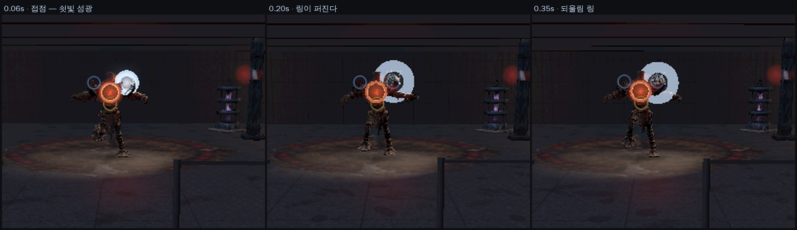

# 65 · 닿았을 때 — 저항감, 그리고 내가 빠뜨리고 있던 목록

디렉터: 「실제 봉이나 다른 검술에서처럼 스킬의 존재감. 그리고 다른 알피지처럼
보스의 몸에 무기가 닿았을 때의 저항감. 구현해야 될 게 많잖아. 왜 이런 것들을
놓치는지 모르겠어.」

맞는 지적이다. 나는 한 번에 하나씩 고쳐 왔고, **「닿으면 무슨 일이 일어나야
하는가」의 전체 목록을 세운 적이 없다.** 이 문서가 그 목록이다.

## 1. 조사 — 수치로 가져온 것

| 항목 | 업계 기준 | 우리 |
|---|---|---|
| 히트스톱 | 1~4프레임 (1~2만으로도 확 달라진다) | 평타 0.09초 ≈ 5프레임 · 스매시 0.21초 |
| **접점 감속** | **2~4프레임 동안 애니메이션 속도를 낮춘다** | **없었다** ← |
| 평타 스윙 | 6~12프레임 (0.2~0.4초) | 예비 0.24초 ≈ 14프레임 |
| 강공격 스윙 | 12~24프레임 | 스매시 0.40초 ≈ 24프레임 |
| 예비 최소 | 0.1~0.2초 | 0.24초 |
| 피격 반응 | 0.3~0.5초 | 0.26~0.46초 |
| 수평 베기 따라감 | 중심 지나 30~60° | 몸통 ±25° (64번) |
| 최고속 지점 | 아크의 60~70% | 판정 0.42 |
| 연계 창 | 후딜의 약 70% | cancel/duration = 0.73 |
| 몬헌 튕김 | 피해 −30% · 예리도 2배 소모 · **사냥꾼이 경직에 묶임** | 없음 |
| 몬헌 부위 경도 | 肉質 0~100, 부위·속성별 | core/metal/straw 3종 |

**대부분은 이미 기준 안에 있었다.** 빠진 건 두 개다 — 접점 감속과 튕김.

## 2. 히트스톱과 저항은 다른 것이다

이걸 구분 못 하고 있었다.

```
히트스톱   ■■■■□□□□□□□□   완전 정지. «맞았다» 는 신호
저항(감속) □□□□▨▨▨▨▧▧▧□   느려졌다가 풀린다. «살을 가르며 지나간다»
```

정지는 때린 순간을 도장처럼 찍는다. 저항은 **날이 몸 안에 있는 동안 계속되는
일**이다. 우리는 앞엣것만 갖고 있었고, 그래서 「닿았다」는 알겠는데
「들어갔다」가 없었다.

## 3. 넣은 것 — 재질별 저항

`js/contact-feel.js`. 재질이 단단할수록 **오래·느리게 끌리고 얕게 박힌다.**

```
재질/기술        정지    끌림   속도배율   깊이
짚·살/평타       90ms    70ms    0.42     16cm
핵/평타          90ms    95ms    0.34     11cm
금속/평타        90ms   130ms    0.22      4cm
짚·살/스매시    210ms   102ms    0.29     23cm
금속/스매시     210ms   189ms    0.15      6cm
```

측정한 행동 시계 (접점 0.240초, 벽시계 기준):

```
벽시계  행동시계
 0.24    0.240   ← 접점. 여기서 멈춘다
 0.32    0.240   ← 정지 중
 0.36    0.251   ← 풀렸지만 «느리다» (28%)
 0.40    0.270
 0.44    0.305
 0.48    0.345   ← 원래 속도로 복귀
```

**감속은 «보이는 클립 시각» 에만 건다.**

여기서 내가 사고를 냈다. 처음엔 행동 시계(`a.elapsed`)를 늦췄다. 그러면
저항은 느껴지지만 **한 대마다 행동이 0.07~0.19초씩 길어진다.** DPS 가 빠지고,
d03 수문기 2페이즈를 기준 봇이 **못 깼다** — 보스 HP 13,504 남기고 사망.
`8c62163` 로 그대로 배포됐고, 균형 관문(`tests/expedition-flow.test.cjs`)이
`contact-feel.js` 를 안 불러서 통과해 버렸다.

이 저장소의 규칙은 「연출이 판정을 옮기지 않는다」다. 내가 그걸 깼다.

고친 방식: 시계는 정상 속도로 두고, **화면에 그릴 클립 시각만 뒤처지게** 한다
(`js/game3d.js` 의 `dragLag`). 뒤처진 양은 저항 창이 끝나면 2.2배속으로
따라잡아 0 으로 돌아온다. 총 재생 시간이 보존되므로 균형이 변하지 않는다.

| | 행동 시계 | 세상 시계 | 클립 시각 |
|---|---|---|---|
| 히트스톱 | 멈춤 | 흐름 | 멈춤 |
| 저항(끌림) | **정상** | 흐름 | 뒤처졌다 따라잡음 |

관문 두 개를 새로 박았다.
- `tests/contact-feel.test.mjs` — 접점 직후에도 `a.elapsed` 가 준 만큼만 간다.
- `tests/expedition-flow.test.cjs` — 이제 `contact-feel.js`·`combat-quality.js`
  를 먼저 `require` 한다. 전투에 끼어드는 모듈은 균형 관문이 반드시 봐야 한다.

봇 재측정(고친 뒤): 압력 승리 84.3s / HP 20750, 과압 승리 38.9s / HP 11550 —
저항이 아예 없던 때와 **완전히 같다.**

같은 검수에서 버그 하나를 더 잡았다. 저항 계산이 `emit('hit')` **뒤**에 있어서
이벤트가 `feel:null` 로 나갔다. 연출이 저항을 애초에 못 받고 있었다.
계산을 emit 앞으로 옮겼다.

풀릴 때는 부드럽게 1 로 돌아온다 — 딱 끊으면 「툭」 하고 다시 빨라져 오히려
어색하다.

## 4. 저항이 플레이어 몸으로 돌아온다

몬헌에서 튕기면 **사냥꾼이 경직에 묶인다.** 그 몫을 작게 가져왔다: 단단한 곳을
치면 흔들림·카메라 킥·진동이 세지고, 되튄 불꽃이 반대 방향으로 튄다.
무른 곳에서는 거의 없다. 날이 박혀 있는 동안은 궤적(칼바람)도 끊는다 —
몸 안에서는 칼바람이 안 난다.

## 5. 튕김(弾かれ) — 넣었다

디렉터 승인(「진행해」)으로 균형 작업과 함께 넣었다.

### 조사에서 가져온 것

몬헌에서 단단한 부위를 약한 공격으로 치면 무기가 **튕긴다.** 피해 30% 감소,
예리도 2배 소모, 그리고 **사냥꾼이 경직 모션에 묶인다.** 벌을 주려는 장치가
아니라 「아무데나 치면 안 된다」를 **몸으로 가르치는** 장치다. 마영전의
경직·넉백도 같은 역할을 한다.

### 우리 판

부서지지 않은 **금속** 부위를 **약공격(attack1~3)** 으로 치면 튕긴다.

| | 값 | 왜 |
|---|---|---|
| 피해 | ×0.70 | 몬헌의 −30% 를 그대로 |
| 부위 피해 | **0** | 약공격으로는 장갑을 **영영** 못 벗긴다 |
| 경직 | 0.22초 | 되튄 만큼 내가 묶인다 |
| 연계 | 끊김 | 콤보 0 으로 |
| 쇳소리·불꽃 | ring ×2 | 재질 저항의 기존 값을 두 배로 |

**무거운 것은 «절대» 안 튕긴다.** 스매시·스킬·궁극기·카운터·처형은 그대로
들어가고 장갑도 깎는다. 튕김이 벌이 아니라 **「답이 따로 있다」는 신호**가
되려면 그 답이 항상 통해야 한다. 부위가 한 번 부서지면 그 뒤로는 안 튕긴다 —
살이 드러났으니까.

행동 자체는 **끊지 않는다.** 끊으면 오히려 후딜이 짧아져서 이득이 된다.
휘두르던 것은 끝까지 가고, 그 뒤에 경직이 붙는다.

### 쇠로 «보이는» 것을 쇠로 만들었다

재질 분류가 실제로는 허수아비(shl/shr/chain)와 수문기 배기구(exhaust)에만
금속을 주고 있었다. 기계 보스의 장갑이 전부 «짚» 이었다. 눈에 쇠로 보이는데
짚처럼 반응하면 튕김이 말이 안 된다. 그래서 넓혔다:

| 보스 | 부위 | 전 | 후 |
|---|---|---|---|
| 과부하 계전기 | contactl/contactr (전기 접점) | straw | **metal** |
| 파쇄 기갑 | jawr/arml (턱·팔) | straw | **metal** |
| 소생기 | pumpl/armr (펌프·팔) | straw | **metal** |

식물(식인초 덩굴)·짐승(모르버스)은 그대로 무르게 뒀다. 거기까지 금속으로
만들면 튕김이 가르침이 아니라 벌이 된다.

### 균형 — 전 던전 재측정

기준 봇(`botsim2.cjs`)으로 7개 아레나 전 페이즈. 전부 승리.

| 아레나 | 페이즈 | 시간 | 남은 HP | 튕김 |
|---|---|---|---|---|
| 허수아비 | 사슬 | 51.9s | 24,450 | 8 |
| 수문기 | 압력 | 80.4s | 20,750 | 8 |
| 수문기 | 과압 | 38.9s | 11,550 | 0 |
| 계전기 | 계전 | 96.3s | 24,450 | 8 |
| 파쇄 기갑 | 파쇄 | 113.3s | 24,450 | 16 |
| 소생기 | 소생 | 101.5s | 24,450 | 16 |

금속 부위는 전부 1페이즈에 있고 1페이즈는 만피로 끝나므로, 아슬아슬한
2페이즈(과압 HP 11,550 · 과부하 2,850 · 개화 9,450)는 **하나도 안 변했다.**
1페이즈만 계전기 +1.2s, 파쇄 +8.9s, 소생 −1.9s.

### 보이는 몫



끌림이 「날이 들어갔다」면 튕김은 「안 들어갔다」다. **반대로** 그려야 한다.

- 차가운 **강철빛 링**이 접점에서 퍼진다 — 따뜻한 색(살·피)과 구별돼야
  「쇠에 튕겼다」로 읽힌다. 0.35초에 두 번째 링이 늦게 터져 **되울림**을 만든다.
- 불꽃이 **나에게로** 되튄다 (보스 반대 방향 축).
- 캐릭터가 보스 반대쪽으로 0.30m 밀렸다 돌아온다 (`recoilOffset`, 연출 전용 —
  판정 좌표 `P.x/P.y` 는 안 건드린다).
- 궤적(칼바람)을 끊는다. 「튕겼다」 글자.

만들면서 두 번 고쳤다.
- **카메라 킥을 크게 넣었더니 보스가 화면 밖으로 나갔다.** 튕김은 카운터보다
  자주 일어나므로 흔들림도 카운터보다 약해야 한다 (0.009 vs 0.012). 회전
  킥은 거의 뺐다.
- **섬광을 1.5배로 크게 넣었더니 접점이 하얀 덩어리로 뭉개졌다.** 읽히는 건
  링이지 섬광이 아니다. 섬광을 0.85 / 0.13초로 줄이고 링을 키웠다.

### 남은 것

- **온라인 레이드(server/)에는 아직 없다.** 서버는 `js/combat.js` 가 아니라
  `server/rpg-rules.cjs` 로 돌아간다. 솔로 라인 먼저, 균형이 확인되면 이식.
## 5-1. 아직 안 넣은 것 — 그리고 이유

- **부위 경도를 0~100 으로.** 지금은 3종(core/metal/straw)이다. 몬헌처럼
  부위마다 숫자를 주면 «어디를 쳐야 하는가» 가 생기는데, 이건 보스 데이터
  전면 개정이다.
- **날이 표면에서 멈추는 시각적 처리.** 지금은 감속으로 «느려짐» 만 준다.
  날이 실제로 표면에 걸려 멈추게 하려면 무기를 IK 로 되끌어야 하는데,
  그 IK 가 64번 문서의 특이점을 안고 있다.

## 6. 왜 놓쳤나

한 번에 하나씩 고쳤기 때문이다. 「이펙트가 안 보인다」 → 이펙트, 「모션이
작다」 → 모션. 그때마다 그 하나는 고쳤지만, **«한 대 때리는 동안 일어나야 하는
일» 을 한 번에 적어 놓고 빠진 걸 세어 본 적이 없었다.** 위 1절 표가 그
목록이고, 앞으로 전투를 손볼 때는 여기부터 본다.
