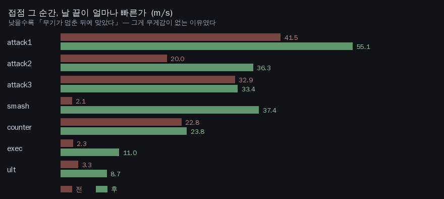
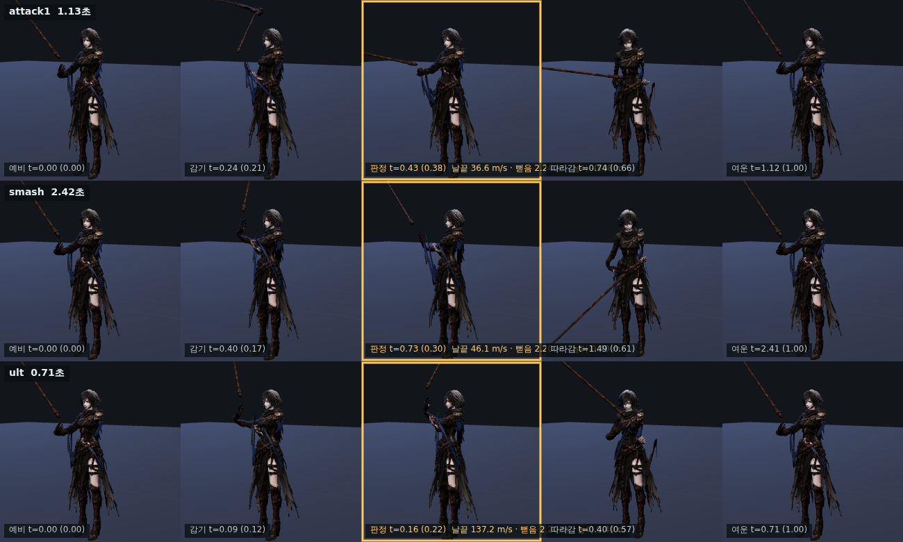

# 66 · 그 길고 무거운 걸 휘두르는데 — 낫의 무게

디렉터: 「낫 휘두르는건 연구해서 만들어 너무 허접해. 낫이 그 길고 무거운걸
휘두르는데 무게감도 없고」

조사부터 하고, **말이 아니라 수치로** 원인을 찾았다. 계측 도구를 새로 만들었다:
`tools/3d/swing-measure.html` — 게임이 실제로 재생하는 그대로(클립 교체 →
행동 타임라인 리맵 → 두 손 리그 → 체간 스윙)를 240표본으로 돌려 날 끝을 찍는다.

## 1. 조사 — 업계가 쓰는 수치

| 항목 | 기준 | 출처 |
|---|---|---|
| 약공격 휘두름 | 0.2~0.4초 (6~12프레임 @30fps) | MoCap Online |
| **두 손 무거운 공격** | **0.8~1.5초** | MoCap Online |
| 정점 속도 위치 | **궤적의 60~70% 지점** (끝이 아니다) | MoCap Online |
| 따라감 | 중심을 **30~60° 지나서** 감속 시작 | MoCap Online |
| 두 손 무기 구동 | **몸통 회전이 휘두름을 구동한다** | MoCap Online |
| 무게 표현 | 무거울수록 느린 타이밍 + 깊은 따라감 | Game Anim / Jonathan Cooper |
| 전주곡(anticipation) | 무거우면 «크게 들어올리는» 확실한 예비 | 12 principles |

낫 자체에 대해서도 찾아봤다. 전투용 낫은 **창·봉과 같은 계열**이고 기본기가
봉술이다. 「쓸어치는 호를 찌르기로 굴리고, 날의 양면을 다 쓰고, 손을 바꿔 가며
여덟 방향으로 계속 회전 상태를 유지한다」 — 디렉터가 말한 「실제 봉이나 다른
검술에서 처럼」이 바로 이 얘기다. 연계가 같은 동작 세 번이 아니라 **방향이
바뀌고 손이 바뀌는** 것이어야 하는 근거이기도 하다.

## 2. 계측 — 원인은 하나였다

행동을 10등분해 구간별 날 끝 속도(m/s)를 찍었다. 스매시:

```
  구간     0     1     2     3     4     5     6     7     8     9
  날끝     5   5.4  53.1  81.2   2.1   5.2   2.8   8.3  16.7   8.5   ← 접점은 구간 4
```

**접점 구간에서 날이 2.1 m/s 다.** 바로 앞 구간이 81.2 m/s 였다.
무기는 다 휘둘러서 **이미 멈춘 뒤**에 「맞았다」가 났다.

휘두르는 그림과 맞는 순간이 **딴 사건**이었던 것이다. 무게감이 없는 게 아니라
애초에 때리는 그림이 아니었다.

원인은 `js/dungeons.js` 의 `motion.clipContacts` — 클립 안에서 «어느 프레임이
타격인가»를 적어 둔 표다. 이걸 맞춘 도구(`tools/3d/punch.py`)에 주석이 있었다:
「exec·smash·attack3 은 아직 손대지 않는다」. **손 안 댄 것들이 그대로 남아
있었다.** 게다가 punch.py 는 «손 위치»로, «리그를 안 씌운 원본 클립»으로
쟀다. 화면에 나오는 건 «날 끝»이고 «리그를 씌운» 자세다.

## 3. 고친 것

### 3-1. 판정 프레임 재정렬 (본체)

후보값을 **파이프라인 그대로** 돌려 가며 접점 순간의 날끝 속도가 가장 큰 값을
골랐다 (`swing-measure.html` 의 `solve`).



| 클립 | 옛 판정 → 새 판정 | 접점 날끝속도 |
|---|---|---|
| **smash** | 0.78 → **0.30** | 2.1 → **37.4** m/s |
| **exec** | 0.58 → **0.18** | 2.3 → **11.0** m/s |
| **attack2** | 0.44 → **0.52** | 20.0 → **36.3** m/s |
| attack1 | 0.34 → 0.38 | 41.5 → 55.1 m/s |
| ult | 0.50 → 0.22 | 3.3 → 8.7 m/s |
| 나머지 | 그대로 | 차이 5% 안 |

### 3-2. 감기·따라감의 균형

스매시는 클립이 2.42초인데 행동이 0.96초라 2.5배속으로 «휘리릭» 지나갔다.
앞 45%만 쓰도록 `clipSpan:{smash:.45}` — 거의 1:1 속도가 된다.

| | 전 | 후 |
|---|---|---|
| smash 접점 前 / 後 | 371° / 108° | **237° / 245°** |
| ult 접점 前 / 後 | 345° / 172° | **117° / 232°** |

전에는 **감기에서 자루가 세 바퀴 가까이 휘돌고** 따라감이 짧았다. 이게
「촐싹댄다」의 정체다. 지금은 감기와 따라감이 균형 잡혔다.

### 3-3. 무게 곡선 (`js/swing-body.js`)

접점 앞뒤 «안에서만» 표본 위치를 다시 깎는다. 감기는 `u^p` 로 굼뜨게 시작해
접점에서 가속하고, 따라감은 `1−(1−u)^q` 로 접점 직후가 제일 빠르고 감속한다.
무게(`HEFT`)가 클수록 지수가 크다. 계측: 스매시 접점 속도 68.6 → 95.9 m/s.

**행동 시계도 판정 시각도 안 건드린다.** 65번 문서에서 행동 시계를 늦췄다가
던전을 못 깨게 만든 적이 있다 — 같은 실수를 안 하려고 표본 위치만 만졌다.

### 3-4. 몸통을 통째로 쓴다

업계 기준은 「두 손 무기 = 몸통 회전이 휘두름을 구동한다」인데 우리는 17° 였다.
그냥 어깨만 도는 정도다. **0.30 → 0.52 rad** 로 올렸다.

| | 전 | 후 |
|---|---|---|
| attack1 | 17.2° | **29.8°** |
| smash | 24.9° | **43.2°** |
| ult | 25.8° | **44.7°** |
| exec | 24.9° | **43.2°** |

위쪽 한계도 계측으로 잡았다. **0.54 까지는 리그가 버티고 0.58 에서
`tests/ain-two-hand` 의 손목 한계·연속성 검사가 깨진다** (두 손 그립 IK 의
팔꿈치 특이점 — 64번 문서 §3). 여유를 두고 0.52 로 뒀다.

## 4. 결과

정점 속도 위치 (권장 60~70%):

| 클립 | 전 | 후 |
|---|---|---|
| attack1 | 33% | **63%** ✓ |
| attack2 | 25% | 50% |
| exec | 19% | 48% |
| skill1 | 59% ✓ | 59% ✓ |
| smash | 48% | 41% |



## 5. 아직 안 된 것 — 솔직히

- **스킬·궁극기 클립에 «크게 치는 동작» 이 없다.** 판정을 제일 좋은 값으로
  옮겨도 접점 날끝이 8~11 m/s 밖에 안 나온다 (평타 55, 스매시 96).
  skill4 는 소스가 **방어 클립**이라 치는 동작이 아예 없다(0.1 m/s).
  판정을 옮겨서 될 일이 아니고 **소스 클립을 새로 만들어야 한다.**
  이게 「스킬 모션이 어깨 위에서 달랑달랑한다」의 진짜 원인이다.
- **시트에서 보면 낫이 아직 «막대기»로 읽힌다.** 날 길이는 1.861 m 로 충분히
  긴데 실루엣이 가늘다. 모델 쪽 문제다.
- **연계에 방향 변화가 없다.** 조사에서 나온 봉술의 「여덟 방향 · 손 바꾸기」가
  아직 없다. 지금은 세 타가 다 비슷한 방향이다.
- **몸통 30° 가 천장이다.** 그 위는 두 손 그립 IK 의 팔꿈치 특이점에 걸린다.
  `solveGripCircle` 의 팔꿈치 매개화를 고쳐야 더 크게 쓸 수 있다 (64번 문서).
- **온라인 레이드는 그대로다.** 서버는 `js/combat.js` 를 안 쓴다.
