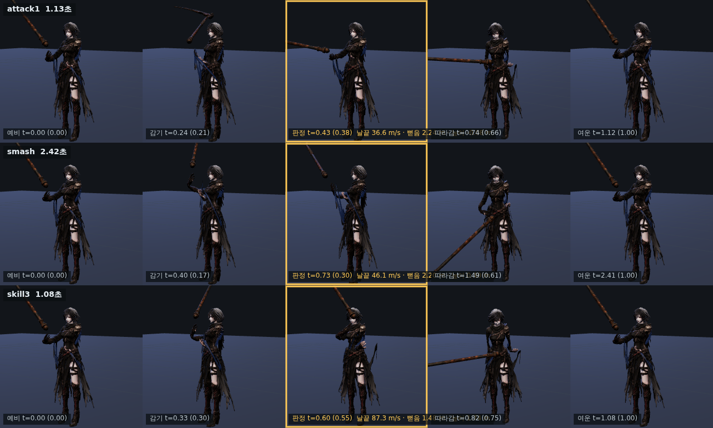

> ⚠ 이 문서 §2 의 「천장은 또 두 손 그립 IK」 서술은 **틀렸다.**
> 진짜 천장은 관절 각속도였다. docs/design/68 참고.

# 67 · 전부 다 적용 — 자루 굵기 · 휘두름 크기 · 연계 방향

66번 문서 §5 에 「아직 안 된 것」으로 적어 둔 셋을 디렉터가 전부 하라고 했다.
하면서 **내가 66번에서 한 진단 하나가 틀렸다는 걸 찾았다.** 그것부터.

## 0. 정정 — 「스킬 소스 클립에 치는 동작이 없다」는 틀렸다

66번에서 「스킬 클립에 크게 치는 동작이 없으니 클립을 새로 만들어야 한다」고
적었다. 클립을 전부 훑어 날 끝 속도를 재 보니 그게 아니었다.

| 클립 | 원본 날끝 정점 |
|---|---|
| ult | 217.2 m/s |
| attack3 | 174.3 |
| smash | 147.3 |
| **skill3** | **141.3** |
| **skill1** | **117.5** |

skill1·skill3 소스에는 강한 타격이 **있다.** 그런데 화면에는 안 나온다.

이유는 `js/ain-two-hand.js:130` 이다.

```js
const keys = AIN_SKILL_PATHS[name] || (… chop / thrust / slash …);
```

**무기의 움직임은 클립이 아니라 여기 적힌 «키 경로» 가 만든다.** 클립은 몸
(다리·몸통)만 굴린다. 그러니 스킬이 작은 건 소스 클립 탓이 아니라 키 경로가
작기 때문이고, **클립을 새로 만들어도 안 바뀐다.**

(skill2 7.2 m/s · skill4 0.1 m/s 는 각각 그림자 걸음·결의 — 둘 다 `mult:0`
유틸 기술이다. 치는 동작이 없는 게 맞다. 이것도 66번에서 잘못 적었다.)

## 1. 자루를 굵게

전투 카메라가 4~6 m 다. 재 보니 자루가 **2.2~3.0 cm** 였다 — 화면에서
3~4 픽셀, 그래서 «선» 으로 보였다. 실제 전투용 낫(폴암) 자루는 4 cm 안팎이다.

`tools/3d/glb_thin_shaft.py` 로 ×1.85 (날 머리 y=1.50 아래만):

| y | 전 | 후 |
|---|---|---|
| 0.36 | 3.0 × 2.2 cm | **4.9 × 4.1 cm** |
| 0.72 | 2.8 × 2.2 cm | **4.7 × 4.1 cm** |
| 1.35 | 2.9 × 2.3 cm | **4.9 × 4.2 cm** |



손 접촉은 그대로다 — 그립은 형상에서 계산하므로 자동으로 따라온다
(`tests/ain-grip-contact` 통과).

## 2. 휘두름을 크게 — 다만 «접점은 그대로»

키 경로의 자루 방향을 겨눔 자세에서 더 멀리 민다 (`AIN_SWING_GAIN`).
날이 1.861 m 이므로 각 1° 가 날 끝 3.2 cm 다.

**첫 시도는 틀렸다.** 전 구간에 같은 배율을 걸었더니 접점 자세까지 밀려서
오히려 나빠졌다:

| 클립 | 균일 배율 1.6 일 때 접점 날끝 |
|---|---|
| skill3 | 15.4 → **8.8** m/s |
| skill1 | 9.5 → **7.0** m/s |

크게 휘두르되 **맞는 순간은 그대로** 여야 한다. 그래서 접점(.42)에서 배율 1,
예비와 여운으로 갈수록 커지는 **텐트 모양**으로 바꿨다. 그 뒤로는 모든
배율에서 접점 속도가 정확히 유지된다.

| 클립 | 배율 | 날끝 경로 | 최저(바닥) |
|---|---|---|---|
| attack1 | 1.30 | 12.74 → **13.01 m** | 1.08 |
| attack3 | 1.25 | 9.32 → **9.65 m** | 0.29 |
| skill3 | 1.35 | 16.97 → **18.32 m** | 0.46 |
| ult | 1.25 | 12.79 → **13.54 m** | 0.21 |

**천장은 또 두 손 그립 IK 다.** 1.35~1.50 에서 관절 튐이 8.54°/프레임 —
문턱 8° 를 넘겼다. 64번 문서가 지목한 `solveGripCircle` 의 팔꿈치 특이점이
여기서도 한계다. 한 단계 내렸다.

안 건 것도 재서 안 걸었다:
- **attack2·smash** — 이미 날이 바닥을 **뚫는다** (−0.47 m, −0.06 m).
  배율을 걸면 더 깊이 들어간다. 이건 따로 고쳐야 할 별개 버그다.
- **skill1** — 배율 1.1 에서 경로가 오히려 **줄었다** (14.14 → 12.59 m).
  겨눔 자세와 거의 반대인 키가 있어 회전축이 불안정하다(같은 특이점).

솔직히 이득은 +6~8% 다. 큰 수가 아니고, 더 키우려면 IK 를 고쳐야 한다.

## 3. 연계에 «방향» 을 넣었다

66번 조사에서 나온 봉술 원리 — 「쓸어치는 호를 찌르기로 굴리고, 날의 양면을
다 쓰고, 손을 바꿔 가며 여덟 방향으로 계속 회전 상태를 유지한다」.

핵심은 크기가 아니라 **방향이 번갈아 바뀐다**는 것이다. 세 타가 다 같은 쪽으로
나가면 아무리 커도 «이어진다» 로 안 읽힌다.

몸통 비틀기의 부호를 타수마다 뒤집었다 (`SB.sideOf`). 1타 오른쪽→왼쪽,
2타는 그 끝에서 **되돌아** 오른쪽, 3타 다시 왼쪽. 자루 방향(slash/chop/thrust)은
이미 셋 다 다르므로 여기서는 «몸이 어느 쪽으로 도는가» 만 맡는다.

스매시·스킬·궁극기는 방향 고정이다 — 한 방짜리가 매번 반대로 돌면 어느 쪽이
본체인지 흐려진다.

## 4. 남은 것

- **`solveGripCircle` 의 팔꿈치 매개화.** 이번에도 세 군데에서 천장이었다:
  몸통 30° · 휘두름 배율 1.35 · skill1 배율 불가. 이걸 고치는 게 다음 단계의
  전제다.
- **attack2·smash 의 바닥 관통** (−0.47 m, −0.06 m).
- **손 바꾸기(換手).** 봉술의 여덟 방향 중 지금은 «몸 방향» 만 넣었다.
  진짜 손 바꾸기는 그립을 좌우 교대해야 하는데 역시 IK 문제다.
- **온라인 레이드는 그대로.**
