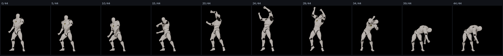

# 70 · 각속도를 고르게 — 목표를 «실제 클립» 에서 재 왔다

69번에서 「배율을 올릴 유일한 길은 각속도 프로파일 평탄화 (정점/평균 5.3 → 2~3)」
라고 적었다. 그 2~3 은 내가 짐작한 값이었다. 이번에는 **재서** 가져왔다.

## 1. 목표를 구했다 — 힉스필드 3D 리그 애니메이션 라이브러리

힉스필드의 `animation_actions` 는 678개짜리 3D 리그 애니메이션 목록이다
(Meshy 라이브러리). AI 가 지어낸 영상이 아니라 **실제로 만들어진 클립**이고,
미리보기 GIF 가 공개돼 있어 **크레딧을 한 푼도 안 쓰고** 받아 볼 수 있다.

무거운 무기 클립 넷을 받아 프레임 간 움직임 세기로 정점/평균을 쟀다:

| 클립 | 정점/평균 | 정점 위치 |
|---|---|---|
| **Heavy_Hammer_Swing** | **1.55** | 41% |
| Charged_Slash | 2.18 | 52% |
| Sword_Judgment | 2.49 | 24% |
| Charged_Axe_Chop | 3.90 | 51% (긴 모으기가 있어 평균이 눌린다) |
| **우리 (궁극기)** | **5.3** | — |



`Heavy_Hammer_Swing` 의 프로파일(평균=1):

```
0.54  0.58  0.63  0.98 │ 1.46  1.32  1.17  1.34  1.39  1.02
   ── 느리게 들고 ──   │ ──── 끝까지 안 떨어진다 ────
```

**뒤끝까지 1.0 밑으로 안 내려간다.** 우리는 접점에서 치솟았다가 0.6 으로
주저앉는다 — 그게 「흘러간다」는 느낌의 정체다.

## 2. 한 것 — 호 길이로 다시 매개화

키 경로를 시간이 아니라 «지나온 각도» 로 다시 매개화했다.

```
A(t)  = t 까지 자루가 쓸고 온 각도 (0→1)
결과  = A⁻¹( 목표곡선(u) ) 지점의 키 값
```

접점(u=.42)은 원래 접점 키의 각도 비율에 못 박는다 — 연출이 판정을 옮기지
않는다.

**두 번 틀렸고 두 번 다 계측이 잡았다.**

1. 접점 고정을 «두 토막 선형» 으로 했더니 접점에서 속도가 꺾여 관절 튐이
   7.83 → **20.3°** 로 뛰었다. 68번에서 잡은 `sampleAction` 불연속을 그대로
   재현한 것이다. → 세 매듭을 지나는 **단조 3차**(Fritsch–Carlson)로 교체.
2. 그래도 12.1° 였다. 튐이 `attack3 LeftArm` 에서 났다 — **자루가 아니라 팔**
   이다. 자루를 고르게 펴는 것과 팔이 고르게 도는 것은 다른 문제다.
   무거운 기술(smash·ult·exec)에만 걸었더니 **7.275°** — 기준(7.831°)보다
   오히려 낮다.

| 대상 | 관절 튐 |
|---|---|
| 전부 | 12.10° ✗ |
| + skill3 | 9.08° ✗ |
| **smash·ult·exec** | **7.275°** ✓ (기준 7.831) |

smash 의 날끝 정점/평균도 2.08 → **1.96** 으로 내려왔다.

## 3. 얻은 여유는 어디로 갔나 — 바닥이 새 한계다

평탄화로 관절 여유가 생겼는데, **배율을 올려도 소용없었다.**

- **smash**: 배율 1.0 → 1.6 에서 경로 18.92 → 19.00 m (거의 0). 호 길이로 다시
  매개화하면 «총 각도» 가 정규화되므로 배율의 시간 효과가 상쇄된다.
- **ult**: 1.35 에서 바닥 여유 0.08 m, 1.55 면 −0.13 (날이 땅속). **바닥이 한계.**

즉 관절 관문은 더 이상 안 막는데 **69번에서 절반만 고친 바닥 관통이 새 천장**
이 됐다. 손잡이 높이를 프레임마다 읽는 바닥 가드가 다음 단계다.

## 4. 균형

전 던전 전부 승리, 기준 대비 **완전히 동일**. 이번 변경은 전부 연출층
(키 보간 재매개화)이라 판정·피해·행동 시간을 안 건드린다.

## 5. 남은 것

- **손잡이 높이 기반 바닥 가드** — 이제 이게 제일 위 천장이다.
- **평타 계열 평탄화** — 지금 걸면 관절이 튄다(12.1°). 팔 쪽 프로파일을
  따로 봐야 한다.
- 69번의 「평탄화가 배율을 올려 준다」는 절반만 맞았다: 관절 여유는 생기지만
  배율 자체는 호 길이 정규화로 상쇄된다. 이 문서가 보탠다.
