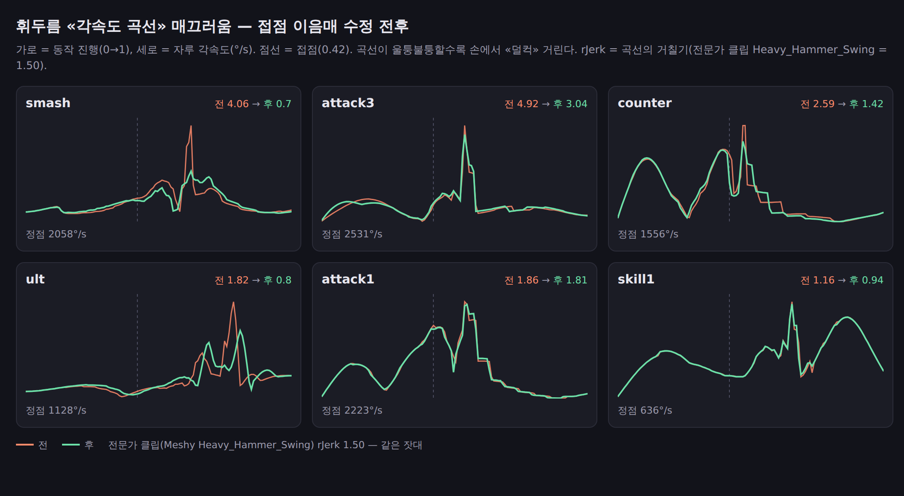
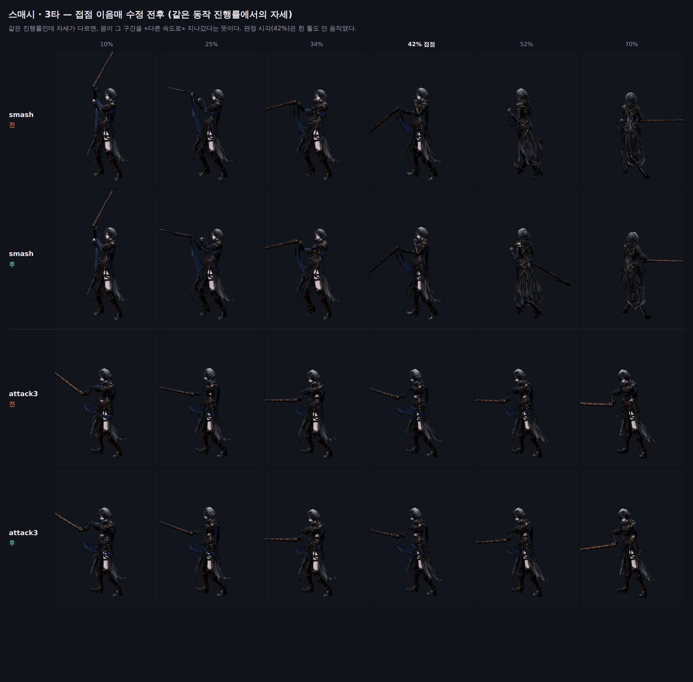

# 72 — 접점 이음매: 「부드러운 움직임」의 진짜 원인

디렉터: 「명조나 몬스터헌터가 우리의 벤치마킹이야」 / 「다른 게임처럼 부드러운
움직임이 제일 중요해」.

## 0. 먼저 «잣대» 를 세웠다 (그리고 두 번 틀렸다)

전문가가 만든 클립을 하나 확보해서 같은 자로 재기로 했다. Meshy 라이브러리의
`Heavy_Hammer_Swing` (양손 무기, 1.87 s) 을 우리 몸 메시에 리깅해서
(`tools/3d/clip-to-path.mjs`) 우리 클립들과 나란히 놓았다.

**1차 잣대 — 정점/평균 각속도.** 전문가 클립 4.63, 우리 스매시 5.67.
→ 쓸모없다. 무거운 무기는 «감았다 후려치는» 것이라 정점/평균이 큰 게 당연하다.
몬헌 대검이 이 수치가 제일 클 것이다.

**2차 잣대 — 무차원 거칠기** (표본당 2차차분 ÷ 표본당 평균 1차차분).
전문가 클립 1.65, 우리 스매시 3.24.
→ 이것도 반쯤 틀렸다. **등속 원운동이어도 빠르면 커진다**(|Δ²| ≈ Δθ²).
「빠름」과 「끊김」이 섞인다.

**3차 잣대 — rJerk** = `max|ω(i+1) − 2ω(i) + ω(i−1)| ÷ 평균 ω`.
각속도 «곡선 자체» 가 매끄러운지만 본다. 등속이면 0 이다. 이게 맞다.
전문가 클립 = **1.50**. `tools/3d/swing-measure.html` 의 `cond().rJerk`,
`tools/3d/clip-to-path.mjs` 의 같은 이름이 같은 잣대다.

## 1. 원인 찾기 — 짐작을 세 번 버렸다

rJerk 로 재니 스매시 4.06, 3타 4.88 로 전문가 클립의 2.7~3.3 배였고,
**최악 위상이 전부 0.35~0.46**, 즉 접점 언저리에 몰려 있었다.

### 버린 가설 ① 「보정들이 튄다」

바닥 가드·조준 보정·들어올림·증폭·균등속도를 하나씩 꺼서 쟀다
(`js/ain-two-hand.js` 의 `TW_AIN_ABLATE` 스위치):

| 보정 끄기 | attack1 | attack3 | smash | counter | ult |
|---|---|---|---|---|---|
| 기준 | 3.50 | 4.94 | 3.24 | 5.17 | 3.05 |
| 바닥가드 끔 | 3.50 | 4.94 | 3.24 | 5.17 | 2.88 |
| 조준보정 끔 | 3.50 | 4.94 | 3.24 | 5.17 | 3.05 |
| 들어올림 끔 | 3.50 | 4.94 | 3.24 | 5.17 | 3.05 |
| 증폭 끔 | 3.64 | 5.07 | 3.24 | 5.17 | 3.33 |
| **전부 끔** | **3.64** | **5.07** | **3.07** | **5.17** | **3.42** |

전부 꺼도 그대로다. 보정 탓이 아니었다.

### 버린 가설 ② 「키를 잇는 방식이 C¹ 이라 가속도가 끊긴다」

Catmull-Rom 접선은 속도만 잇는다. 가속도까지 잇는 고정단 3차 스플라인(C²)으로
바꿔 봤다 — **rJerk 가 거의 안 움직였고**(1.88→1.88, 4.88→4.88, 4.06→4.06),
관절 한 프레임 이동량은 7.275° → 8.876° 로 올라 `tests/ain-two-hand` 의 8° 게이트를
깼다. 되돌렸다. 기록은 `js/ain-two-hand.js` 의 `tangents` 주석에 남겼다.

### 진짜 원인 ③ — 접점에서 «몸의 재생 속도» 가 툭 바뀐다

`sampleAction` 은 행동 시간을 클립 시간으로 옮기면서 접점을 0.42 에 못박는다.
감기(`coilEase`)와 내치기(`throwEase`)를 접점에서 이어 붙이는데, **값은 이어지지만
기울기는 안 이어진다**:

```
접점 직전 기울기 = hit · pc / 0.42
접점 직후 기울기 = (1 − hit) · pt / 0.58
```

| 클립 | 직전 | 직후 | 차이 |
|---|---|---|---|
| smash | 1.28 | 1.91 | **+49%** |
| attack3 | 1.81 | 1.19 | **−34%** |

맞는 그 순간에 몸 애니메이션이 재생 속도를 바꾼다. 손에서 「덜컥」 하는 게 이거였다.

## 2. 고친 것

값은 1 로 유지한 채 «끝 기울기만» 바꿀 수 있는 보정항을 건다
(`js/swing-body.js` 의 `seam`):

```
감기    x^pc · (1 + a(1−x))        h(1)=1 그대로,  h'(1) = pc − a
내치기  1 − (1−x)^pt · (1 + b·x)   h(0)=0 그대로,  h'(0) = pt − b
```

접점의 «값» 은 한 톨도 안 움직이므로 **판정 시각은 그대로다** —
「연출이 판정을 옮기지 않는다」.

그런데 1:1 로 맞추는 게 늘 최선은 아니다. 클립 자체가 접점에서 속도를 바꾸는
경우가 있어서, 그때는 이음매를 살짝 기울여 상쇄해야 최종 곡선이 매끄러워진다.
그래서 비율 `k` 를 클립별로 두고 **쓸어서** 골랐다 (`seamSweep`).

**그리고 매끄러움만 보고 고르지 않았다.** `k<1` 은 「접점으로 들어가는 속도를
깎아서」 매끄러워진다 — 디렉터가 요구한 무게를 버리는 짓이다. 그래서 rJerk 와
«접점 날끝 속도» 를 같이 보고 골랐다:

| 클립 | k | rJerk (전→후) | 접점속도 m/s |
|---|---|---|---|
| attack1 | 1.00 | 1.88 → 1.81 | 55.0 |
| attack2 | 1.00 | 1.66 → 1.23 | 23.5 |
| attack3 | 1.20 | 4.88 → **3.04** | 37.2 |
| smash | 0.60 | 4.06 → **0.70** | 32.6 |
| counter | 0.80 | 2.64 → 1.42 | 24.4 |
| skill1 | 1.40 | 1.25 → 0.94 | 10.9 |
| skill2 | 0.80 | 0.81 → 1.06 | 16.2 |
| skill3 | 1.00 | 1.81 → 1.10 | 15.6 |
| skill4 | — | 0.04 → 0.18 | 5.4 |
| ult | 1.60 | 1.75 → **0.80** | 7.4 |
| exec | 0.40 | 1.90 → 1.51 | 13.6 |

attack2 는 `k=0.4` 면 rJerk 0.81 까지 떨어지지만 접점속도가 23.8 → 18.1 (−24%) 이라
버렸다. 평균 **2.06 → 1.38** — 전문가 클립(1.50)보다 낮고, 11개 중 9개가
전문가 클립 이하다.

### 3타(찌르기) 경로도 손봤다

3타만 이음매를 고쳐도 4.37 로 남았고 최악 위상이 0.344, 즉 **접점 전** 이었다.
보니 `.24 / .42 / .62` 세 키의 자루 방향이 (−.6, y, .75) 로 거의 같다 — 스윙 시간의
대부분은 자루가 «안 돌고», 회전이 앞뒤 전환 구간에 통째로 몰려 있었다.
양쪽 전환에 중간 키를 하나씩 넣어 회전을 펼쳤다. 접점 키(.42)는 값도 시점도 그대로.
4.88 → 3.04. 여전히 우리 중 제일 거칠다 — 다음 차례다.

## 3. 안 움직인 것

- **판정**: 기준 봇으로 7개 아레나 **15개 보스 페이즈 전부** 돌려 전후 출력이
  **바이트 단위로 같다** (남은 HP·소요 시간·타격 수까지).
- **관절 게이트**: 한 프레임 최대 이동량 7.275° (게이트 8°) — 기준과 동일.
- **바닥**: 날끝 최저 높이 attack1 −0.03 m, attack2 −0.02 m — 기준과 동일.
- 테스트 322개 전부 통과.

## 4. 그림





## 5. 다음

1. **3타(3.04)** — 우리 중 유일하게 전문가 클립보다 두 배 거칠다. 찌르기 경로를
   더 손봐야 한다.
2. **회피·이동** — 아직 이 잣대로 재 본 적이 없다 (`BodyMovements` 군).
3. 온라인 레이드(`server/rpg-rules.cjs`) 는 `js/combat.js` 를 안 쓰므로 이 작업이
   반영돼 있지 않다.

## 부록 — Meshy 애니메이션 파이프라인 (검증 완료)

- `generate_3d` `model:'3d_rigging'` + `enable_animation` + `animation_action_id`
  → 우리 `ain_body.glb` 를 전문가 클립으로 리깅한 GLB. **8 크레딧**, 본 이름이
  Mixamo 규약이라 리타게팅 단계가 없다.
- `tools/3d/clip-to-path.mjs` 가 그 GLB 에서 우리 `AIN_SKILL_PATHS` 형식
  (손잡이 = 두 손 중점, 자루 = 왼손→오른손, 어깨 중점 기준 · 몸통 프레임)으로
  키를 바로 뽑는다.
- 이번엔 **클립을 갈아 끼우지 않았다** — 재 보니 우리 경로가 전문가 클립보다
  거칠지 않았고(무차원 1.65 vs 3.24 는 「빠름」이 섞인 값이었다), 진짜 문제는
  경로가 아니라 이음매였기 때문이다. 파이프라인 자체는 살아 있으니 필요할 때
  8 크레딧으로 다시 쓰면 된다.
