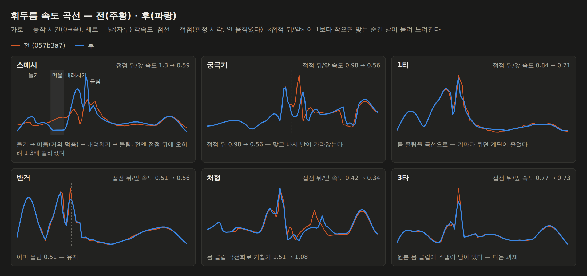
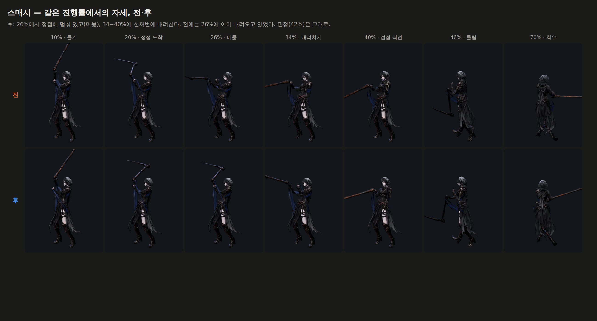
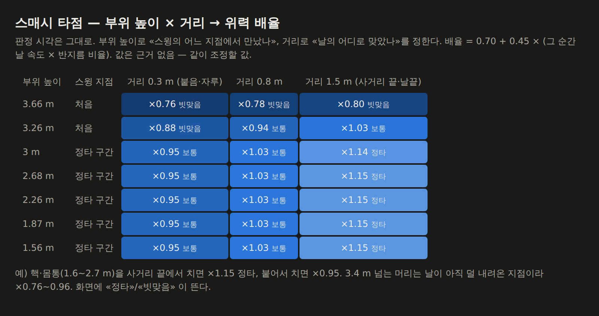
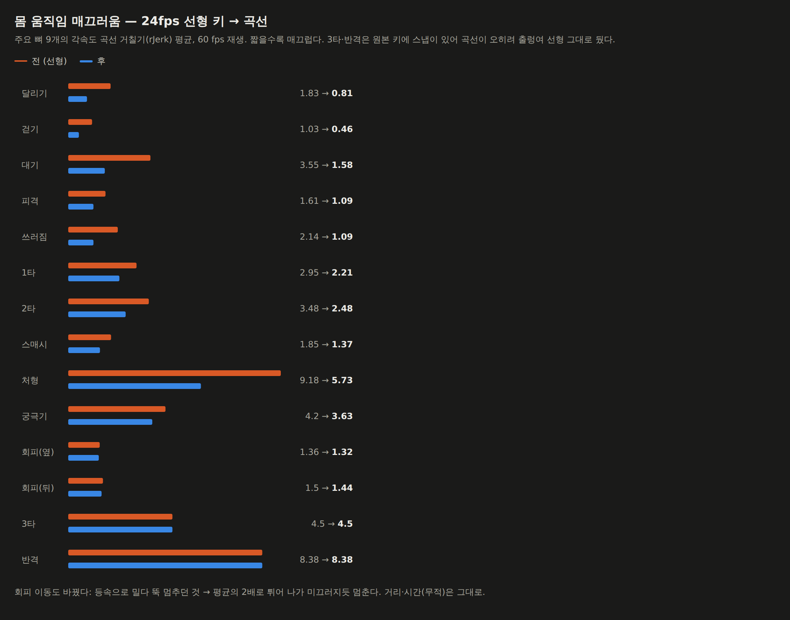

# 73 — 스매시 세 박자 · 접점 감속 · 타점 위력 · 움직임 바닥 공사

디렉터: 「맞는 순간 속도는 줄어드는게 맞아. 그리고 스매쉬의 속도도 처음과 중간
마지막이 달라야하고. 그 지점에 따라 데미지도 달라야하지. 남은거 적용하자.」

> **72번 정정.** `swing-measure.html` 의 `rateProfile` 이 동작의 **앞 2/3 만** 담고
> 있었다(`per = floor(180/120) = 1`). 그래서 `72-seam.png` 의 가로축이 틀렸다 —
> 「접점 직후 스파이크」라고 설명한 것은 실제로는 접점 **전** 이었다. rJerk 숫자는
> 전 구간으로 계산돼 맞다. 이번에 고쳤고, 아래 그림은 전 구간이다.

## 1. 접점 감속 (bite)

날이 뭔가를 물면 속도를 잃는다. 72번에서 매끄럽게 이은 접점을 이번엔 **일부러**
끊는다: 접점 직전 속도는 그대로, 직후만 떨어뜨린다. 판정 시각·접점 자세는 불변.

- 무기 경로: `js/ain-two-hand.js` `BITE` — 스매시 .55 · 평타 .68 · 궁극기 .52 … (근거 없음)
- 몸 재생: `js/swing-body.js` `seam` + `SEAM_BIAS` — «실제로 잰» 날 감속(접점 뒤 50 ms
  평균 각속도 ÷ 앞 50 ms)이 목표에 맞도록 `biteSweep` 으로 다시 쓸었다.

| 클립 | 전 | 후 |
|---|---|---|
| 스매시 | **1.30** (접점 뒤에 오히려 빨라졌다) | **0.59** |
| 궁극기 | 0.98 | 0.56 |
| 1타 | 0.84 | 0.71 |
| 반격 | 0.51 | 0.56 |

## 2. 스매시 세 박자

몬헌 대검 모아베기, 마영전 강타, 무협의 큰 초식이 다 같은 박자다.

| 박자 | 위상 | 날끝 실측 |
|---|---|---|
| 들기 | 0 ~ .20 | ~480 °/s |
| 머묾 | .20 ~ .28 | **~70 °/s** (거의 멈춤) |
| 내려치기 | .28 ~ .42 | ~1340 °/s |
| 물림 | .42 | ×0.59 |
| 회수 | .42 ~ 1 | 감속 |

곡선은 `js/swing-body.js` 의 `tempoCurve` **한 곳** 에 있고 몸 클립(sampleAction)·
몸통 비틀기(tempoPhase)·무기 경로(tempoPace)가 같이 쓴다.
⚠ 처음엔 무기 경로에만 걸었다 — 몸이 계속 돌아서 날끝으로는 머묾(167 °/s)이
들기(195 °/s)와 구분이 안 됐다. 또 몸 클립은 접점 뒤에도 제 속도로 크게 움직여서
몸 쪽 감속은 따로 둔다(`bodyBite .30`).

관절 한 표본 이동량 게이트(8°) 안에서 골랐다: `strike 2.7` 이면 14.9° 로 깨졌고,
`1.2` 에서 7.16°. 균등 각속도(EVEN_PACE)는 스매시에서 걷었다 — 디렉터 요구와 정면으로 어긋난다.

## 3. 타점 위력

판정 **시각** 은 그대로(접점 한 순간). 그 순간의 **기하** 로 배율을 정한다
(`js/swing-point.js`, 솔로 `js/combat.js` · 서버 `server/raid.cjs` 공통):

1. **언제 만났나** — 부위 높이. 1.3~2.85 m 는 내려치기 끝(정타 구간), 3 m 위 머리는
   날이 아직 덜 내려온 «처음», 1.2 m 아래는 물린 뒤 «끝». 앵커는
   `tools/3d/swing-point-table.mjs` 로 잰 날끝 궤적 + 리그가 들어 올려 주는 범위.
2. **그때 날이 얼마나 빨랐나** — `SPEED` 표(세 박자 곡선에서 잰 값,
   `tools/3d/swing-speed-table.mjs`, 어긋나면 `tests/swing-point.test.mjs` 가 잡는다).
3. **날의 어디로 맞았나** — 거리. 붙으면 자루, 사거리 끝이면 날끝 (선속도 = 각속도 × 반지름).

배율 = 0.70 + 0.45 · (속도 × 반지름 비율). 화면에 «정타»/«빗맞음». **값은 근거 없음.**

균형: 기준 봇은 기하가 없어 배율 1 — 15 페이즈 결과 동일. 실제 플레이에서 스매시는
사거리 끝에서 치면 최대 +15%, 붙어서 치면 −5%, 높은 머리는 −20~−24%.
실기 확인: 허수아비 핵을 사거리 끝에서 친 스매시가 `point.grade = sweet, ×1.143` 으로 들어갔다.

## 4. 움직임 바닥 공사 — 클립을 곡선으로

아인의 클립 28개가 **전부 24 fps · 선형 보간** 이었다(회피는 0.42초에 키 10개).
선형 보간은 키마다 속도가 계단을 탄다 — 3타 허리 21 → 870 → 282 → 89 °/s.

`js/clip-smooth.js` 가 클립별로 «재서» 정한 방식으로 다시 뽑는다
(뼈 9개 월드 각속도 rJerk 평균, 60 fps):

- **곡선** (키를 정확히 지나는 캣멀롬, 60 fps 격자 + 원래 키 시각): 공격·회피 대부분.
  키 자세 그대로 → 접점 자세·`clipContacts` 불변.
- **펴기** (σ 0.03초 가우시안, 단발 동작은 처음·끝 자세 고정): 이동·대기·피격. 자세 변화 ≤ 9°.
- **선형 유지**: 3타·반격·스킬1·2·구르기 — 원본에 스냅이 있어 곡선이 넘쳐 출렁인다.
- 공격을 펴면 안 된다: σ .045 에서 1타 자세가 최대 100°, 접점에서 54° 바뀌었다.
- 성분별 단조 제한(Fritsch–Carlson)도 해 봤지만 사원수 성분에서 평평한 구간을 만들어
  더 나빴다(3타 4.5 → 12.1).

전체 평균 2.68 → 2.11. 달리기 1.83 → 0.81, 걷기 1.03 → 0.46, 대기 3.55 → 1.58.

## 5. 회피 이동

등속으로 밀다가 뚝 멈추던 것을 속도 ∝ (1−u) 로 — 평균의 2배로 튀어 나가 미끄러지듯
멈춘다. 위치를 구간 차 S(u) = 1 − (1−u)² 로 읽어 dt 와 무관하게 거리·시간(무적·회피
거리)이 정확히 같다. 끝나면 달리기는 «거의 멈춘 데서» 다시 붙는다. 서버도 같은
`js/world-sim.js` 를 쓴다.

## 6. 온라인

- 서버 `raid.cjs` 에 타점 배율, 이벤트에 `point` — 본인 스매시면 «정타/빗맞음» 안내.
- `party.html` 이 `swing-body.js` 를 안 불러서 온라인 아바타에는 몸통 비틀기·세 박자가
  **아예 빠져 있었다**. 이제 같이 불린다. 클립 곡선화는 `repairAinClips` 를 통해 자동.

## 7. 남은 것

1. 3타·반격·스킬1·2 는 원본 몸 클립에 스냅이 있다 — 곡선으로도 펴기로도 안 된다.
   스냅 키만 골라 손보거나 클립을 새로 받아야 한다(Meshy 파이프라인, 72번 부록).
   → **74번에서 했다** (`74-meshy-clips.md`).
2. 카인·류·세라 클립은 아직 곡선화하지 않았다(재 보지 않았다). → **75번에서 했다**.
3. 실기 화면 캡처는 SwiftShader 에서 타격 플래시 때문에 검게 나와, 그림은 계측
   하네스 렌더러(`swing-measure.html` 의 `shot()`)로 찍었다.
