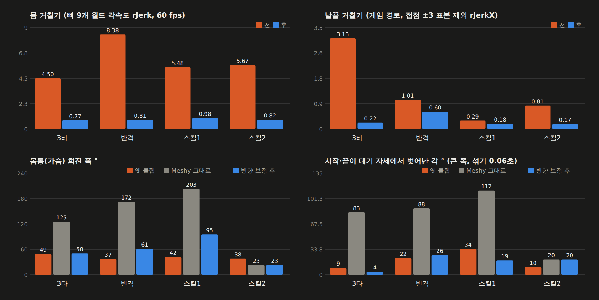
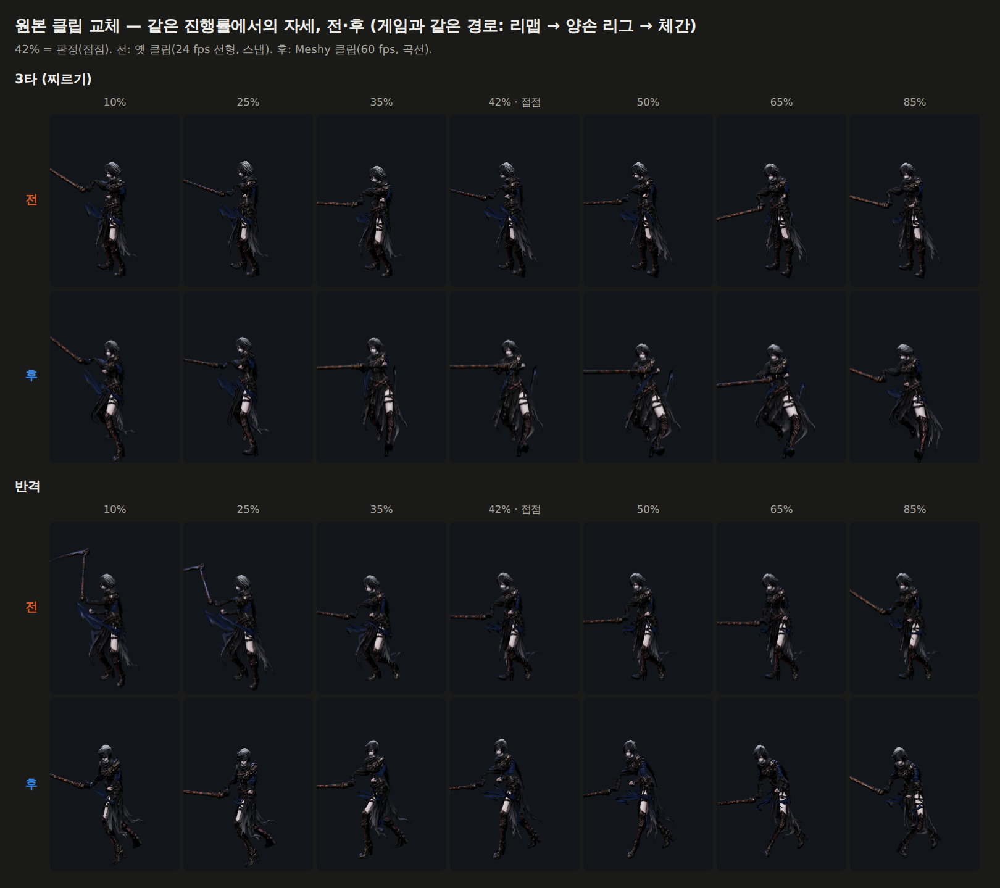
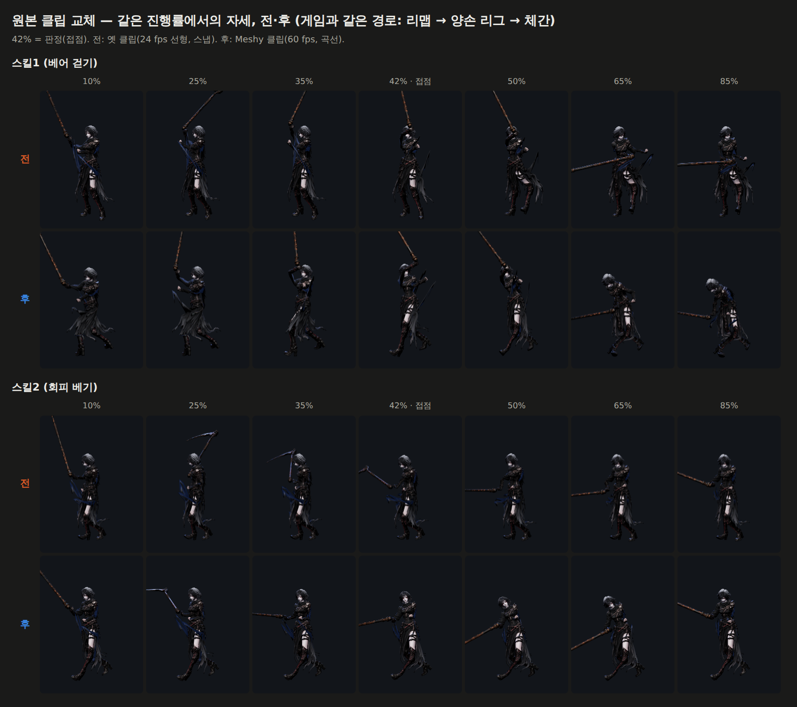

# 74 — 3타·반격·스킬1·2 몸 클립 교체 (Meshy)

디렉터 승인: 「진행해」 — 73번 «남은 것 1» (스냅이 박힌 원본 클립 4개를 새로 받기).

## 무엇을 했나

아인 몸 메시(`art/3d/ain_body.glb`)를 Meshy 로 리깅해 전문가 클립을 입혀 받고
(Higgsfield `3d_rigging`, 1건 8 크레딧, 이번 5건 = 40 크레딧), 우리 리그로 옮겼다.

| 우리 클립 | Meshy 동작 | 원본 구간 |
|---|---|---|
| 3타 `attack3` | 찌르기 (thrust) | 0.25 ~ 1.25 s |
| 반격 `counter` | Charged_Slash (242) | 0.75 ~ 1.65 s |
| 스킬1 `skill1` | 베어 걷기 (reap) | 2.95 ~ 3.95 s |
| 스킬2 `skill2` | 회피 (dodge) | 0 ~ 1.46 s |

반격은 처음에 올려베기(upslash)로 뽑았는데, 새 몸이 꼿꼿이 서 있어 날이 훈련 핵
(2.4 m)에 **어떤 보정으로도** 못 미쳤다(최소 0.44 m, 기준 0.39). 그래서 Charged_Slash 를
한 건 더 받았다 — 닿는다(0.25 m).

도구: `tools/3d/meshy-retarget.mjs` (월드 회전 변화량으로 옮김, 제자리 + 발 고정 IK,
60 fps), `tools/3d/glb-put-clips.mjs` (glb 안 클립을 이름으로 갈아 끼움).

## 몸 방향 — 이번에 새로 잡은 문제

처음 넣고 그림을 찍어 보니 **몸이 통째로 돌았다**. Meshy 클립은 동작 중 몸을 돌리는
연출이 들어 있다(3타 116°, 반격 가슴 172°, 스킬1 가슴 203°). 게임은 뿌리가 과녁을 보게 두고
클립을 제자리에서 트므로, 그대로면 치는 동안 옆·뒤를 보다가 대기로 돌아오며 **휙** 돈다
(공격 섞기 0.06초). 숫자(매끄러움)만 봤으면 놓쳤다.

`meshy-retarget.mjs --chest 접점,가슴각,g,시작,끝,w` 로 몸 전체를 수직축으로 돌려 다스린다:

- **접점 순간의 가슴 방향**을 정한다 — 두손 리그가 낫 경로를 가슴(Spine2) 기준으로 걸기
  때문에 이 각이 맞아야 날이 과녁에 간다. 옛 클립의 접점 각을 그대로 쓰면 오히려 못 닿았다
  (새 몸은 숙임·기울기가 달라서). 그래서 **닿는 거리를 쓸어서** 골랐다: 3타 20°, 반격 0°, 스킬1 40°.
- **시작·끝은 대기 자세** — 골반·가슴을 반반 섞은 방향으로 맞춘다. 반격은 원본이 처음부터
  골반·가슴을 50° 꼰 자세라, 가슴만 맞추면 골반이 51° 튄다. 반반이면 둘 다 26° 안쪽.
- 그 사이 원본의 흔들림은 절반(g 0.5)만 남긴다.
- 발 목표도 같이 돌리고, 딛는 발 판정은 원본에서 한다 — 몸이 덜 도는 만큼 다리가 덜 꼬일 뿐 발은 박혀 있다.

스킬2(회피)는 원래 거의 안 돌아(23°) 손대지 않았다.

## 판정 시각 — 캐릭터별로

`clipContacts` 는 카인·류·세라와 **같이 쓰는** 표라 아인만 바꾸면 그들 판정이 어긋난다.
`motion.clipContactsByChar.ain` 을 새로 두고 솔로(`js/combat.js`)·서버(`server/raid.cjs`)·
계측 도구가 캐릭터 값 → 공통 값 순으로 읽는다.

| | 3타 | 반격 | 스킬1 | 스킬2 |
|---|---|---|---|---|
| 공통(옛) | .50 | .48 | .50 | .50 |
| 아인(새) | .48 | .44 | .24 | .23 |

조준 기준점도 새 클립에 맞췄다(`js/ain-two-hand.js`): 옛 반격 기준(−.28, .80)이면 보정이
22 cm 나 끌어 왼팔이 가슴에 접힌 채 팔꿈치가 한 표본에 12.8° 튀었다(관절 게이트 8°).
반격 (0, 2.4, .65) · 스킬1 (0, 2.5, .6) 로 옮겨 7.2° 이하.

접점 감속(SEAM_BIAS, `js/swing-body.js`)도 다시 쓸었다: 반격 0.45 → 1.80 (새 클립은 맞은 뒤
되베기가 빨라 그대로면 감속 1.42 — **맞고 나서 빨라졌다**), 스킬2 1.50 → 0.60.

## 결과 (게임과 같은 경로로 잼)

| | 몸 거칠기 전 → 후 | 날끝 거칠기 전 → 후 | 접점 감속 전 → 후 (목표) |
|---|---|---|---|
| 3타 | 4.50 → **0.77** | 3.13 → **0.22** | 0.73 → 0.38 (0.70) |
| 반격 | 8.38 → **0.81** | 1.01 → **0.60** | 0.56 → 0.64 (0.80) |
| 스킬1 | 5.48 → **0.98** | 0.29 → **0.18** | 0.57 → 0.67 (0.62) |
| 스킬2 | 5.67 → **0.82** | 0.81 → **0.17** | 0.74 → 0.73 (0.74) |

- 3타 감속은 k 0.2~1.4 어디서도 0.30~0.46 — 찌르기가 박혀 서는 모양이라 목표보다 세게 멈춘다.
  목표값 자체가 **근거 없음** 이라 같이 조정할 부분.
- 클립이 60 fps 로 매끄러워 곡선화 정책도 `linear` 에서 풀었다(구르기만 남음).
- 균형: 봇 15 페이즈 결과 동일(판정 시각은 연출 쪽이고 피해는 그대로).

## 벤치마크 비교

- 몬헌 대검·태도, 명조의 큰 베기는 **동작 끝에 원래 방향으로 돌아와 선다** — 다음 입력이
  바로 이어져야 하기 때문. 몸이 도는 연출(회전베기)은 뿌리(root)를 같이 돌린다.
  그래서 몸만 돌고 뿌리는 그대로인 Meshy 원본은 그대로 못 쓴다 — 위 방향 보정이 그 차이.
- 마영전 연계기도 매 타 끝 자세가 다음 타 시작 자세와 맞물린다. 시작·끝 26° 이내(옛 반격 22°)는
  그 기준으로 **아직 크다** — 섞기 0.06초 동안 보인다. 근거 없는 느낌값이지만, 줄이려면
  섞기를 늘리거나(입력 반응이 늦어짐) 시작 구간을 더 앞에서 잘라야 한다.

## 테스트에서 바꾼 것 (이유)

- `tests/ain-contact-target`: 스킬1 접점 .24. 높은 과녁 음성 대조는 «옛 자세는 빗나가야
  한다» 였는데 새 스킬1 은 보정 없이도 0.384 까지 온다 → «보정이 거리를 줄인다(>5 cm)» 로.
- `tests/punch`: 아인의 새 클립 4개는 양손 리그가 팔을 다시 풀어 원본 손이 화면에 안 나온다 →
  원본 손 대신 위 날끝 계측으로 본다. 나머지 캐릭터·클립은 그대로.
- `tests/motion`: 옛 범용 어댑터 그립 검사에서 3타 제외 — 게임은 아인에게 늘 양손
  어댑터를 쓰고 그 그립(0.0005 mm)은 `tests/ain-two-hand` 가 3타 포함으로 잡는다.
- `tests/clip-smooth`: 선형 목록이 구르기만.

## 남은 것

1. 스킬1 은 가슴 회전 폭 95°(옛 42°) — 크게 휘두르는 베기라 두었다. 보고 과하면 g 를 낮춘다.
2. 시작·끝 26° 는 위 벤치마크 기준으로 더 줄일 여지.
3. 카인·류·세라 클립 → 75번.
