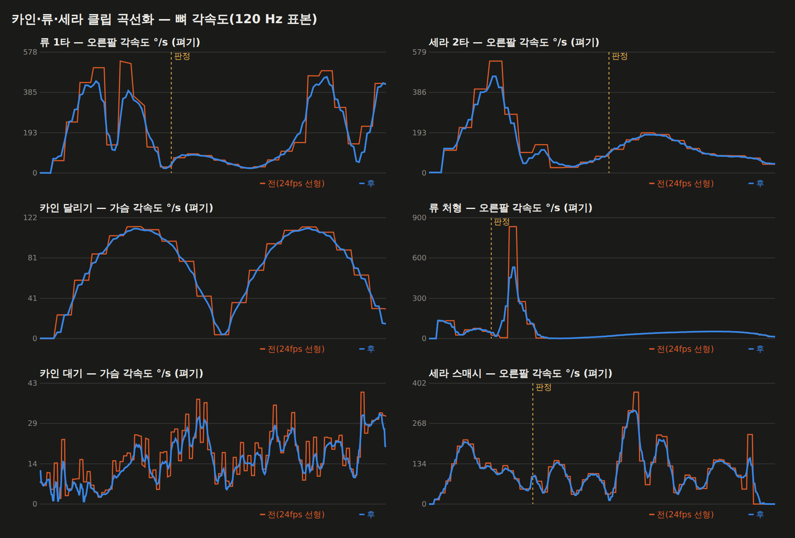

# 75 — 카인·류·세라 클립 곡선화

디렉터: 「진행해」 (73번 «남은 것 2» — 카인·류·세라 클립은 아직 곡선화하지 않았다).

## 아인과 다른 점

아인은 두손 리그가 팔을 매 프레임 다시 풀어서 몸 클립의 팔은 화면에 안 나온다.
카인·류·세라는 **몸 클립이 곧 화면**이다(범용 어댑터는 그립만 살짝 당긴다). 그래서

- 펴기(가우시안)를 공격에도 쓸 수 있으면 이득이 크지만, 자세가 바뀌면 그대로 보인다.
- 특히 **맞는 순간 자세**가 바뀌면 무기가 판정 자리에서 벗어난다.

→ `js/clip-smooth.js` 에 **고정점(pins)** 을 더했다. 처음·끝 자세를 고정하던 방식 그대로
판정 시각(`clipContacts × 클립 길이`)에서도 원래 자세로 되돌린다.

## 클립마다 재서 골랐다

`tools/3d/char-clip-policy.mjs` — 원본 / 곡선 / 접점 고정 펴기(σ 0.03초)를 각각 재서:

- **펴기**: 가장 매끄럽고, 원본 대비 자세 변화 ≤ 12° (판정 없는 고리 이동은 15°),
  판정 시각 자세 변화 ≤ 3°
- **곡선**: 원본보다 매끄러울 때 (키 자세 그대로)
- **선형**: 둘 다 원본보다 거칠 때 — 원본에 한 박자 스냅이 있어 곡선이 넘쳐 따라간다

| | 펴기 | 곡선 | 선형 | 평균 거칠기 전 → 후 |
|---|---|---|---|---|
| 카인 | 13 | 12 | 3 (구르기·스킬1·궁극기) | 2.41 → **1.94** |
| 류 | 20 | 3 | 5 (반격·좌우 회피·구르기·스킬4) | 2.66 → **1.78** |
| 세라 | 19 | 3 | 6 (반격·좌우 회피·구르기·스킬3·4) | 2.17 → **1.57** |

- 카인의 큰 휘두르기(1·2·3타·스매시)는 펴면 43~62° 달라져 동작이 지워진다 → 곡선만.
  (아인 1타에서 본 것과 같다 — 대검·낫처럼 0.1초에 100° 도는 팔.)
- 류·세라 1·2타·처형·스매시는 펴도 자세 변화 ≤ 9°, 판정 자세 ≤ 1° — 펴기.
- 카인 스킬1(9.22), 류 스킬3(8.36)은 여전히 거칠다 — 원본 스냅이 크다. 아인처럼 클립을
  새로 받아야 하는 후보 (74번 Meshy 파이프라인).

그림: 주황 = 24 fps 선형(키마다 계단), 파랑 = 후. 계단이 사라지고 봉우리는 남는다.
류 처형은 접점 직후 한 키(40 ms)짜리 900 °/s 스냅이 540 으로 눌렸다.

## 연결

- 솔로 `js/game3d.js` — 아인이 아니면 `smoothCharacterClips(CID, …, clipContacts)`.
- 온라인 `js/party-avatar.js` — 같은 함수 (party.html 은 dungeons.js 를 이미 읽는다).
- 실기 확인: game3d 에서 세 캐릭터 모두 로드 · 곡선화 적용 · 오류 없음.
  (타격 화면 캡처는 SwiftShader 타격 플래시로 검게 나온다 — 73번과 같은 한계.)
- `tests/clip-smooth`: 펴기 클립의 판정 자세 3° 이내, 정책표 개수(오타 방지).

## 같이 볼 것

- 곡선에서 **류 1타의 판정선이 오른팔 속도의 골짜기**에 걸린다(그림 왼쪽 위). 휘두르는
  봉우리는 판정 전·후에 있다 — 「최고속 = 접점」 을 그대로 쓰진 않지만(72번), 날끝으로
  다시 재 볼 후보. 근거 없는 추정이라 손대지 않았다.
