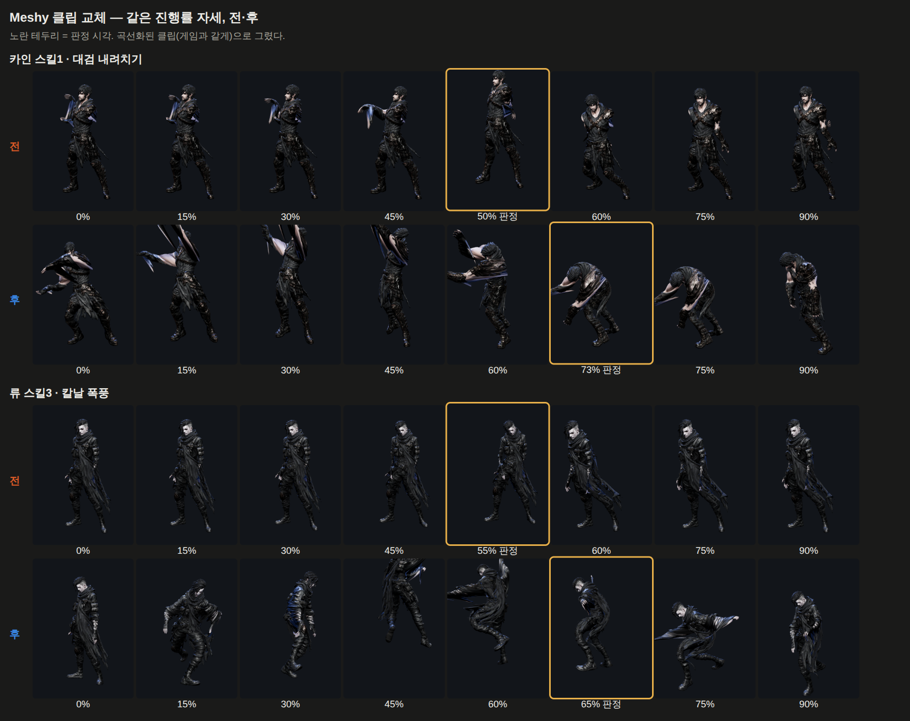

# 76 — 카인 스킬1 · 류 스킬3 새 클립 + 판정 시각 감사

디렉터: 「둘 다 진행해」 — 75번 «같이 볼 것» 두 가지.

## 1. 판정 시각 감사 (카인·류·세라 공격 전부)

75번 그림에서 «류 1타 판정이 팔 속도 골짜기에 걸린다» 고 적었다. 먼저 **지표부터 의심했다**
(CLAUDE.md §2): 「최고속 = 접점」 은 선형 키 보스 리그에서 틀렸던 지표다(24번). 그래서 손
하나의 최고속만 보지 않고, 주로 쓰는 손의 **휘두름 구간**(최고속 앞뒤로 속도가 25% 아래로
떨어지는 곳 — 시작 · 최고 · 도달)을 잡고 판정이 그 **안** 에 있는지를 봤다.
(곡선화된, 게임에서 실제로 트는 클립으로)

- **류 1타는 결함이 아니었다** — 휘두름 .20 → 최고 .28 → 도달 .42, 판정 .38 은 도달 직전.
  75번의 추정은 틀렸다.
- 휘두름 밖에 판정이 있는 것:

| | 판정 | 휘두름 (시작 → 최고 → 도달) | 뾰족함 | 처리 |
|---|---|---|---|---|
| 류 궁극기 | .22 | .27 → .46 → .59 | 3.8 | **.46 으로** — .22 는 아직 준비 자세(그림 확인) |
| 카인 3타 | .50 | .16 → .29 → .35 | 5.7 | 둠 — .50 에서 두 팔을 앞으로 내미는 찌르기 자세. 판단 불가 |
| 세라 2타 | .52 | .02 → .14 → .29 | 3.7 | 둠 — 손 속도 3 m/s, 던지는 동작이라 손이 거의 안 움직인다 |
| 세라 스매시 | .30 | .00 → .08 → .14 | 2.7 | 둠 — 같은 이유 |

판정 «시각»(피해가 뜨는 순간)은 그대로다. 바뀌는 건 그 순간에 보여 줄 클립 자세뿐이라
균형 불변 (봇 15 페이즈 동일). 캐릭터별 값은 74번에 만든 `clipContactsByChar` 에 넣었다 —
솔로·서버 모두 읽는다.

## 2. 새 클립 — Meshy (1건 8 크레딧, 2건)

| | 원본 동작 | 구간 | 거칠기 전 → 후 | 배속 전 → 후 |
|---|---|---|---|---|
| 카인 스킬1 «대검 내려치기» | Heavy_Hammer_Swing (128) | 0.70 ~ 1.87 s | 9.22 → **0.64** | 0.90 → 0.97 |
| 류 스킬3 «칼날 폭풍» | Double_Blade_Spin (91) | 0.30 ~ 2.00 s | 8.36 → **0.95** | 1.27 → **2.07** |

### 몸 방향

- **카인**: 해머 스윙은 옆으로 서서 휘두른다(가슴 −101° → 34°, 135° 돈다). 74번의 방향
  보정(`--chest`)으로 내려치는 순간 가슴이 앞(−13°)을 보게 했다. 다만 끝에서 90° 가까이 숙여
  «앞 축» 으로 잰 yaw 가 망가졌다(골반이 한 바퀴 도는 것처럼 보임) → `--yaw-x`(옆 축으로 잰다)
  를 새로 넣었다. 74번 아인 명령은 그대로 재현된다.
- **류**: 회전이 곧 기술이라 가슴 기준 보정은 쓰면 안 된다(회전을 지워 버린다). 원본은 428° 를
  돌아 끝에서 68° 더 돌아가 있었다 → `--face 1,0.849,168` 로 **정확히 한 바퀴(360°)** 로 맞춰
  대기 방향에서 시작해 대기 방향으로 끝난다.

### 끝 자세 — 새 도구 `tools/3d/clip-tail-blend.mjs`

Meshy 원본은 동작 뒤 한참 웅크리고 있다가 일어난다(류: 1.9~3.7초 웅크림, 3.7~5.1초 일어남 /
카인: 끝 프레임이 90° 숙인 자세). 넣으면 클립이 3배 길어지고, 빼면 웅크린 채로 0.15초 만에
대기로 «툭» 선다. → 길이는 그대로 두고 마지막 0.25~0.35초를 **그 캐릭터의 대기 첫 자세** 로
섞었다(류는 시작 0.15초도). 원본의 «선 자세»(5.5초)는 다리를 넓게 벌린 자세라(정강이 121°) 못 쓴다.

| 대기와의 최대 뼈각 | 시작 | 끝 |
|---|---|---|
| 카인 스킬1 옛 / 새 | 102° / 103° | 57° / **0°** |
| 류 스킬3 옛 / 새 | 37° / **0°** | 44° / **0°** |

### 판정

카인 스킬1 .73 (내려치는 순간), 류 스킬3 .65 (왼날 .62 · 오른날 .72 사이). 곡선화 정책에서
카인 스킬1 은 «선형» → «곡선» (60 fps 클립).

## 같이 조정할 것

1. **류 칼날 폭풍 2.07배속** — 한 바퀴(1.7초 클립)를 0.82초 행동에 넣는다. 몬헌 쌍검 회전베기처럼
   빠른 회전이라 어울릴 수도, 급해 보일 수도 있다(근거 없음). 폰에서 보고 판단 — 느리게 하려면
   류 스킬3 행동 시간을 늘려야 해서 **균형이 바뀐다**.
2. 카인 스킬3(강철 회전) 4.00 이 이제 카인에서 가장 거칠다 — 같은 방식(Axe_Spin_Attack 238) 후보.
3. 세라 투척 동작은 손이 거의 안 움직여 판정 감사가 안 된다 — 시약이 날아가는 연출과 같이 볼 문제.
