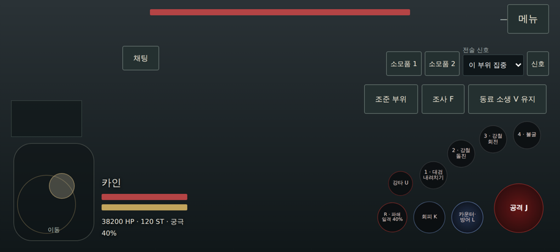
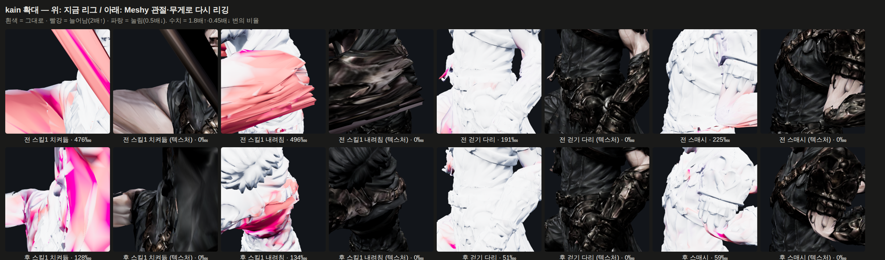
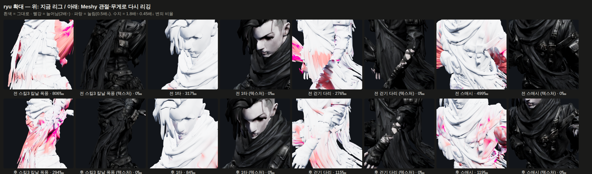
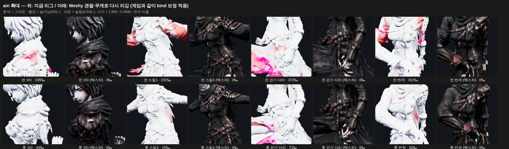
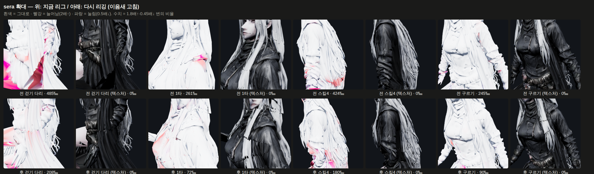
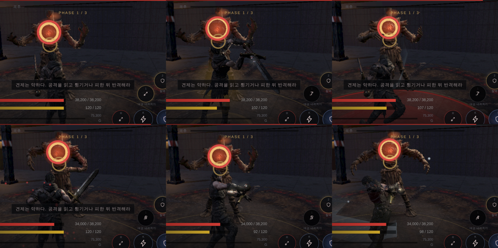
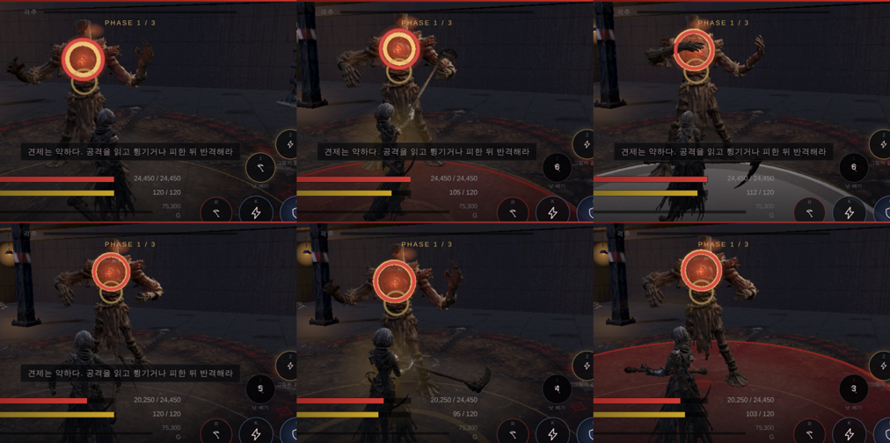

# 77 — 완벽 회피 · 조작 패드 · 카메라 뒤집힘 · 스킨 찢어짐 감사

디렉터: 「영상으로 캡처해서 학습하고 계속 진행」(유튜브 쇼츠 yDgHiJBMKbc) ·
「모션 진행할 때 꼭 확대해서 찢어지거나 늘어나는 거 확인」 · 「조작패드를 이런 식으로」(손 스케치).

## 1. 완벽 회피 (쇼츠에서 배운 것)

영상은 『검은 신화: 오공』의 **완벽 회피** 를 재현한 것이다 — 공격이 닿기 직전에 피하면
잔상이 남고 잠깐 느려진다. 유튜브는 봇 확인에 막혀 내려받지 못했고(로그인 쿠키로 우회하지 않음),
영상 분석 서비스로 내용을 받았다.

| | 오공 (영상) | 우리 |
|---|---|---|
| 조건 | 맞기 직전 회피 | 공격이 닿기 **0.14초 이내** 에 회피 (`R.dodge.perfect`) — 근거 없음, 폰에서 조정 |
| 보상 | 잔상 · 슬로모션 · 반격 기회 | 반격 창 +0.35초 · 회피 기력 되돌려 받기 |
| 연출 | 잔상 · 슬로모션 | 캐릭터 자세 그대로의 푸른 잔상 5장(70 ms 간격) · 0.18배 슬로 0.76초 · 푸른 비네트 · 안내 문구 |

- 솔로 `js/combat.js`, 온라인 `server/raid.cjs` 같은 규칙 (`evade {perfect:true}` 이벤트).
- 균형 봇 결과 동일 — 봇은 완벽 회피를 노리지 않는다.
- `tests/combat`: 0.1초 전 회피 = 완벽, 0.25초 전 = 보통, 기력 차이 확인.

그림: 구르는 동안 푸른 잔상(왼쪽 위) → 사라짐. 확대 캡처.

## 2. 카메라가 뒤집혀 돌던 버그 (캡처하다 찾음)

완벽 회피 캡처에 캐릭터가 안 나오고 바닥·천장만 찍혔다. 재 보니 카메라 `up` 벡터가 매 프레임
뒤집히고 있었다. 원인: 타격 흔들림(camKick) 스프링(ω=26)을 한 프레임에 한 번 오일러로 적분 —
ω·dt > 2 이면 발산한다. **한 프레임이 77 ms 를 넘으면**(끊김·저사양·백그라운드 복귀) 흔들림 값이
10¹³ 까지 커져 화면이 돈다. 73·75번에서 «타격 화면이 검게 나온다» 고 적은 것도 이것이었을 가능성이 크다.

| 프레임 간격 | 전 (최대 흔들림) | 후 |
|---|---|---|
| 16 ms | 0.0008 | 0.0010 |
| 50 ms | 0.0002 | 0.0010 |
| 80 ms | **3×10¹²** | 0.0007 |
| 100 ms | **9×10¹³** | 0.0004 |

→ 1/120초 단위로 나눠 적분. 60 fps 에서는 느낌 그대로.

## 3. 조작 패드 (디렉터 스케치)

- **왼쪽 «이동»**: 세로로 긴 둥근 사각형 패드. 누른 자리가 스틱 중심이 된다(떠 있는 스틱) —
  손가락이 패드 어디에 닿아도 바로 움직인다. 감도(44 px)는 그대로.
- **오른쪽**: 구석에 큰 공격(J) · 그 위로 올라가는 호에 **스킬 1 → 4** · 호 아래 줄에
  **카운터**(L — 예고 중 누르면 카운터, 길게 누르면 방어. 기능은 그대로, 이름만 드러냄) · 회피 · 궁극기.
- 폰(짧은 변 ≤ 640)에서는 묶음을 0.84배로.

스케치에 공격·회피·궁극기 자리는 없어서 위처럼 두었다.

**온라인(party.html)도 같은 배치** (`css/party-pad.css`, 떠 있는 스틱은 `js/party-online.js`). 온라인에만 있는
강타(U)는 호의 왼쪽 끝. 설정의 «버튼 크기» 는 그대로 곱해진다.

## 4. 스킨 찢어짐 — 확대 검수 → 카인·류 다시 리깅 (적용)

`tools/3d/stretch-view.html`: 삼각형 변 길이 ÷ 바인드 길이를 색으로(빨강 = 늘어남, 파랑 = 눌림).
수치 = 한 클립 13장면에서 1.8배↑·0.45배↓ 로 변한 변의 비율(‱).

### 원인

우리 자동 리그(bpy)의 관절이 틀려 있었다. 카인 기준:
- **손 관절이 손끝 근처** — 손목보다 13~16 cm 아래. 팔을 들면 손목이 아니라 손가락이 꺾인다.
- 발 관절이 실제 발보다 11 cm 안쪽, 넓적다리 관절이 11 cm 안쪽, 가슴 척추가 5 cm 아래.

무게만 바꿔서는(skin-transfer) 409 → 325‱ 로 거의 그대로였다 — 무게는 관절 자리를 전제로 한다.

### 고침 — Meshy 가 «우리 옷 입은 메시» 를 직접 리깅한 뼈대로 옮긴다

`tools/3d/rerig-meshy.mjs`: 관절 위치 · 무게 · 역바인드를 Meshy 것으로, 모든 클립은
«뼈마다 월드 회전 변화» 를 그대로 옮겨 다시 굽는다(원래 키 시각 그대로 — 곡선화 정책이 키 간격을 본다).
메시 맞추기는 **메시 상자** 로(메시 일치 중앙 0.0 mm). 처음엔 골반→머리 거리로 맞췄다가
메시가 2~4 cm 떠 있었다 — 틀린 관절로 배율을 재면 안 된다.

네 캐릭터 모두 (1.8배↑·0.45배↓ 변의 비율 ‱, 아인은 게임과 같이 bind 보정을 얹은 값):

| | idle | walk | 1타 | 스매시 | 스킬1 | 스킬3 | 스킬4 | 구르기 |
|---|---|---|---|---|---|---|---|---|
| 카인 전 → 후 | 75 → **20** | 227 → **81** | 204 → **76** | 219 → **65** | 419 → **122** | 242 → **55** | 274 → **131** | 254 → **54** |
| 류 전 → 후 | 50 → **21** | 186 → **78** | 236 → **59** | 256 → **47** | 145 → **37** | 530 → **170** | 227 → **110** | 78 → **37** |
| 아인 전 → 후 | 162 → **34** | 368 → **115** | 290 → **42** | 291 → **38** | 308 → **67** | 296 → **38** | 298 → **45** | 263 → **39** |
| 세라 전 → 후 | 98 → **34** | 428 → **204** | 185 → **52** | 188 → **53** | 177 → **47** | 217 → **73** | 325 → **125** | 221 → **83** |

위 = 전, 아래 = 후. 카인 스킬1 내려칠 때 팔이 칼날처럼 납작해지던 것(496‱)이 팔 모양으로 남는다(134‱).
류 칼날 폭풍 806 → 294‱. **남은 것**: 카인 스킬1 치켜들 때 겨드랑이가 아직 늘어난다(128‱) —
팔을 머리 위로 올리는 자세는 선형 스키닝의 한계라 보정 뼈(트위스트)나 듀얼 쿼터니언이 필요하다.

게임 화면(카인 스킬1·1타·스킬3): 대검을 손에 쥐고 있고 찢어짐이 안 보인다.

### 관절이 옮겨져도 전과 같게 둔 것

관절 자리를 기준으로 맞춘 값들이 있다. glb 가 뼈마다 «옛 관절 자리»(`rerigAnchor`, 뼈 로컬)를 남기고:
- 무기·방어구 (`js/looks.js`) — 옛 자리에 붙인다. 바인드 자세에서 메시에 대해 전과 같은 곳.
- 양손 IK 가 겨누는 손잡이 (`js/game3d.js`) · 온라인 무기 (`js/party-avatar.js`) — 같은 점.
- 바람 옷자락 판정 (`js/wind.js`) — 옛 관절 선분으로. (안 그러면 카인 코트 끝 흔들림 4.8 cm 로 줄었다)
- 시험 `tests/punch` — 같은 «메시 위 점» 을 잰다. 손목을 재면 반지름이 짧아 손이 20% 느리게 나와
  발이 «최고속» 을 가져갔다(지표 오류 — 동작은 같다).

- 아인: 게임이 불러올 때 아래팔·손·손잡이 자리를 잰 값으로 옮기는 보정(`js/ain-bind-repair.js`)이 그대로
  돈다. 그 뼈들은 절대 자리로 옮기므로 옛 자리(rerigAnchor)를 지운다 — 안 그러면 낫이 두 번 밀린다.

### 이음새가 벌어졌던 것 (6afdef2 에서 배포된 카인·류) — 고침

세라를 확대해 보다가 머리칼·등에 검은 금이 보였다. 재 보니 **UV 이음새에서 둘로 나뉜 정점**(같은 자리)이
움직일 때 3~5 cm 벌어졌다(카인·류 포함, 이음새 쌍의 18~40%). 무게를 펼 때 두 정점이 서로 다른 이웃을 봐서
무게가 달라졌기 때문. 변 늘어남 지표는 «이어진 변» 만 재서 못 잡았다 → 같은 자리 정점은 이웃을 합치고
무게를 똑같이 맞춘다. 네 캐릭터 모두 0.0 mm. `tests/skin-seam` 으로 못박았다.

세라 머리칼의 **톱니 같은 어두운 선** 은 이것과 다르다 — 머리칼이 여러 겹 껍질로 되어 있어 바깥 겹의
끝이 아래 겹 위에 보이는 것이고, 옛 리그에도 있다(늘어남 색 지도는 흰색). 메시 모양 문제라 리깅으로는 못 없앤다.

판정 시각·균형은 그대로(회전이 같다). 시험 349 통과.
