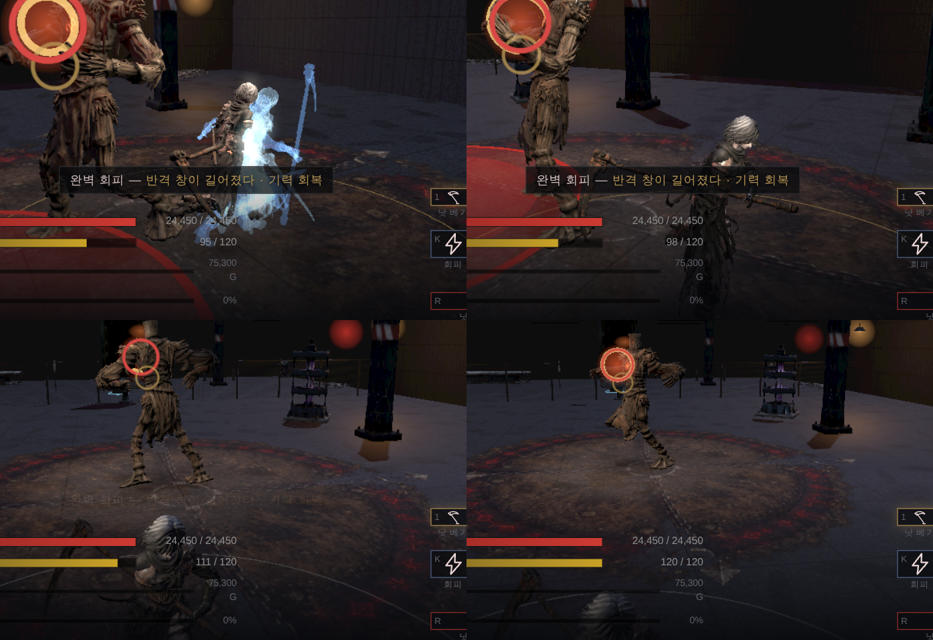
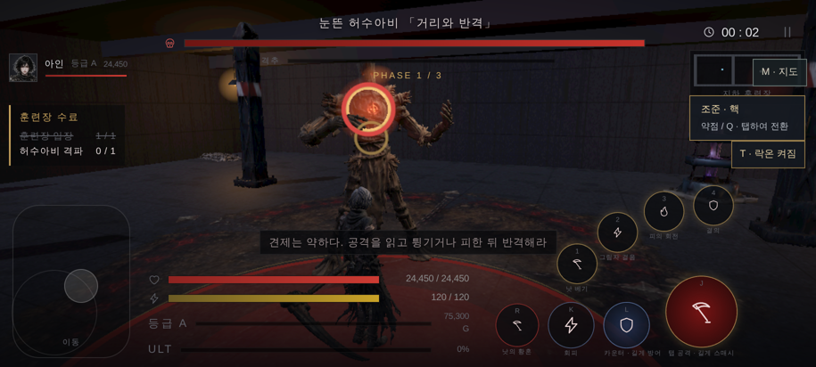

# 77 — 완벽 회피 · 조작 패드 · 카메라 뒤집힘 · 스킨 찢어짐 감사

디렉터: 「영상으로 캡처해서 학습하고 계속 진행」(유튜브 쇼츠 yDgHiJBMKbc) ·
「모션 진행할 때 꼭 확대해서 찢어지거나 늘어나는 거 확인」 · 「조작패드를 이런 식으로」(손 스케치).

## 1. 완벽 회피 (쇼츠에서 배운 것)

영상은 『검은 신화: 오공』의 **완벽 회피** 를 재현한 것이다 — 공격이 닿기 직전에 피하면
잔상이 남고 잠깐 느려진다. 유튜브는 봇 확인에 막혀 내려받지 못했고(로그인 쿠키로 우회하지 않음),
영상 분석 서비스로 내용을 받았다.

| | 오공 (영상) | 우리 |
|---|---|---|
| 조건 | 맞기 직전 회피 | 공격이 닿기 **0.14초 이내** 에 회피 (`R.dodge.perfect`) — 근거 없음, 폰에서 조정 |
| 보상 | 잔상 · 슬로모션 · 반격 기회 | 반격 창 +0.35초 · 회피 기력 되돌려 받기 |
| 연출 | 잔상 · 슬로모션 | 캐릭터 자세 그대로의 푸른 잔상 5장(70 ms 간격) · 0.18배 슬로 0.76초 · 푸른 비네트 · 안내 문구 |

- 솔로 `js/combat.js`, 온라인 `server/raid.cjs` 같은 규칙 (`evade {perfect:true}` 이벤트).
- 균형 봇 결과 동일 — 봇은 완벽 회피를 노리지 않는다.
- `tests/combat`: 0.1초 전 회피 = 완벽, 0.25초 전 = 보통, 기력 차이 확인.

그림: 구르는 동안 푸른 잔상(왼쪽 위) → 사라짐. 확대 캡처.

## 2. 카메라가 뒤집혀 돌던 버그 (캡처하다 찾음)

완벽 회피 캡처에 캐릭터가 안 나오고 바닥·천장만 찍혔다. 재 보니 카메라 `up` 벡터가 매 프레임
뒤집히고 있었다. 원인: 타격 흔들림(camKick) 스프링(ω=26)을 한 프레임에 한 번 오일러로 적분 —
ω·dt > 2 이면 발산한다. **한 프레임이 77 ms 를 넘으면**(끊김·저사양·백그라운드 복귀) 흔들림 값이
10¹³ 까지 커져 화면이 돈다. 73·75번에서 «타격 화면이 검게 나온다» 고 적은 것도 이것이었을 가능성이 크다.

| 프레임 간격 | 전 (최대 흔들림) | 후 |
|---|---|---|
| 16 ms | 0.0008 | 0.0010 |
| 50 ms | 0.0002 | 0.0010 |
| 80 ms | **3×10¹²** | 0.0007 |
| 100 ms | **9×10¹³** | 0.0004 |

→ 1/120초 단위로 나눠 적분. 60 fps 에서는 느낌 그대로.

## 3. 조작 패드 (디렉터 스케치)

- **왼쪽 «이동»**: 세로로 긴 둥근 사각형 패드. 누른 자리가 스틱 중심이 된다(떠 있는 스틱) —
  손가락이 패드 어디에 닿아도 바로 움직인다. 감도(44 px)는 그대로.
- **오른쪽**: 구석에 큰 공격(J) · 그 위로 올라가는 호에 **스킬 1 → 4** · 호 아래 줄에
  **카운터**(L — 예고 중 누르면 카운터, 길게 누르면 방어. 기능은 그대로, 이름만 드러냄) · 회피 · 궁극기.
- 폰(짧은 변 ≤ 640)에서는 묶음을 0.84배로.

스케치에 공격·회피·궁극기 자리는 없어서 위처럼 두었다. 다르게 원하면 알려 달라. 온라인(party.html)은 확인 후 같은 배치로.

## 4. 스킨 찢어짐 — 확대 검수 (진행 중)

`tools/3d/stretch-view.html`: 삼각형 변 길이 ÷ 바인드 길이를 색으로(빨강 = 늘어남, 파랑 = 눌림).
카인 계측(1.8배↑·0.45배↓ 변의 비율, ‱):

| | idle | walk | run | 1타 | 스매시 | 스킬1 | 스킬3 | 스킬4 | 구르기 |
|---|---|---|---|---|---|---|---|---|---|
| 지금 (우리 자동 리그) | 75 | 227 | 225 | 204 | 219 | 419 | 242 | 274 | 254 |
| Meshy 가 **옷 입은 카인 메시** 를 직접 리깅한 뼈대로 다시 리깅 | 27 | 83 | 78 | 85 | 74 | 136 | 66 | 138 | 65 |

원인이 드러났다: 우리 자동 리그의 **손 관절이 손끝 근처**(손목보다 16 cm 아래)에, 발 관절이
실제 발보다 12 cm 안쪽에 있었다. 팔을 들면 손목이 아니라 손가락이 꺾인다.
Meshy 관절(손목·발목 제자리)로 옮기고 무게도 Meshy 것을 쓰면 찢어짐이 1/3 로 준다.

- `tools/3d/rerig-meshy.mjs` — 관절 이동 · 무게 · 역바인드 · 모든 클립(원래 키 시각 그대로) 다시 굽기 · glb 쓰기.
- 장비 자리: 관절이 옮겨져도 무기·방어구가 제자리에 있도록 뼈마다 «옛 관절 자리» 를 glb 에 남기고
  (`rerigAnchor`) `js/looks.js` 가 거기에 붙인다. 이 파일이 없는 캐릭터는 전과 같다.
- **아직 게임 파일(kain_anim.glb)은 바꾸지 않았다** — 무기 쥔 자리·접점 시험·확대 그림 전후 확인 뒤에 교체.
