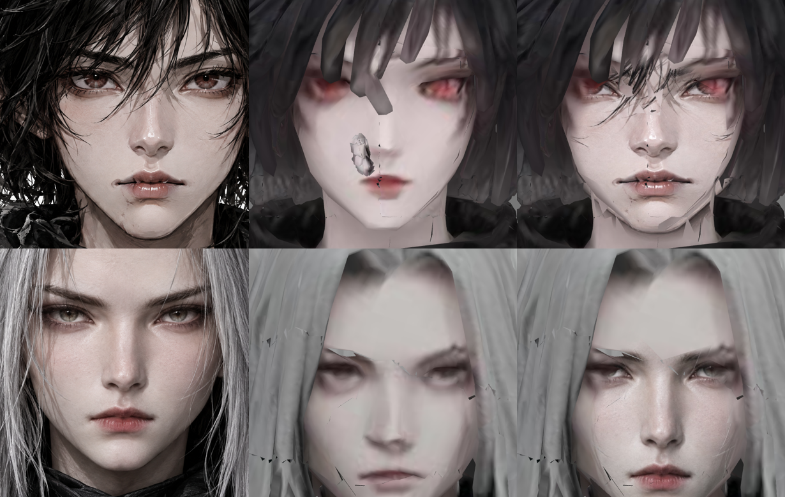
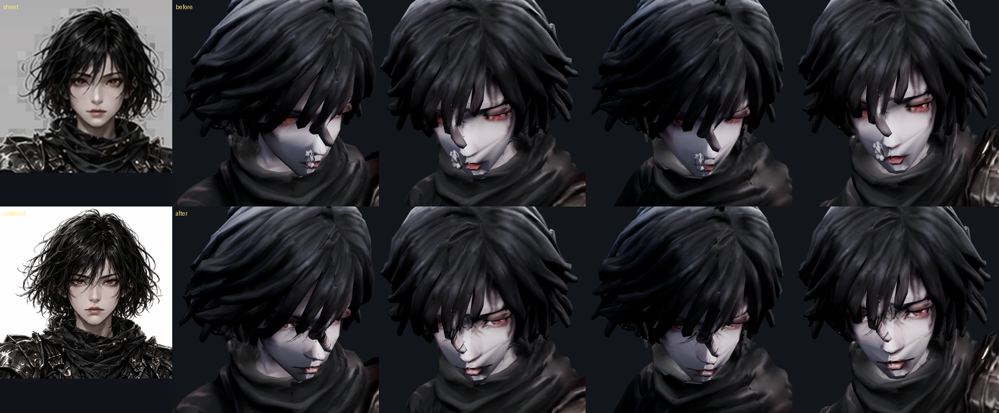
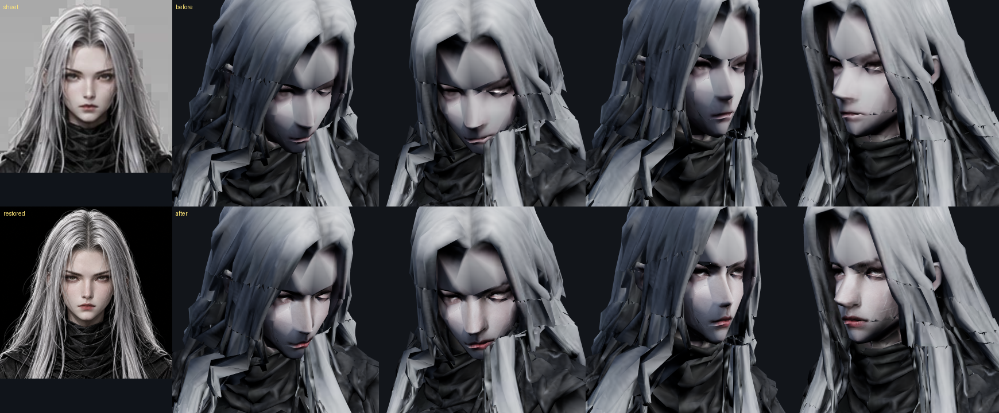

# 78 — 카운터 탭(방향 = 회피) · 카운터 뒤 일시 탭

디렉터: 「카인도 아인과 같은 패드 구성으로, 카운터 탭을 방향에 따라 회피로, 전진만 카운터로 (아인도).
아인은 보스 큰 스킬에 카운터가 제대로 들어가면 부분파괴 탭이 일시적으로, 카인은 보스를 잡는 일시적 탭,
세라·류는 카인·아인이 카운터를 치면 부분파괴 일시 탭」

## 바로잡은 것

77번에서 L 버튼 이름을 「카운터 · 길게 방어」 로 붙였는데 **틀렸다** — 코드에서 카운터는 «반격 창에서 공격» 으로만
나갔고 L 은 방어뿐이었다. 이번에 L 을 진짜 카운터 버튼으로 만든다.

## 카운터 탭 (L · 모든 캐릭터 같은 패드)

| 누를 때 스틱 | 결과 |
|---|---|
| 보스 쪽 ±60° (전진) 또는 중립 | **카운터** — 반격 창(예고 마지막 0.18~0.32초) 안이면 카운터, 밖이면 누르는 동안 방어 |
| 옆·뒤 | 그 방향으로 **회피** |

- 중립(스틱 안 댐)은 카운터로 뒀다 — 락온 중에는 캐릭터가 보스를 보고 있어 «전진» 과 같다. 회피로 바꾸려면 알려 달라.
- 공격 버튼으로도 여전히 카운터가 나간다(전과 같음).
- ±60° 는 근거 없음 (`R.counter.cone`).

## 카운터 뒤 일시 탭 (`R.opening`, 3초)

«제대로» = 맞부딪침(clash)·튕김(repel). 너무 이른 흘림(deflect)은 제외.

| 캐릭터 | 조건 | 탭 | 효과 |
|---|---|---|---|
| 아인 | **큰 기술**(순위 S, 또는 그 보스 최고 피해의 80% 이상)을 카운터 | 부위 파괴 | 조준 부위(없으면 아직 안 부서진 부위) 체력 **50%** + 강타 2배 |
| 카인 | 카운터 | 붙잡기 | 처형 동작으로 붙잡아 자세 +50, 보스 2.2초 묶음 |
| 류·세라 | **아군 아인·카인이 카운터** (온라인) | 부위 파괴 | 아인과 같음 |

- 부술 부위가 남아 있지 않으면 부위 파괴 탭은 뜨지 않는다 (허수아비 훈련장은 부위가 없다).
- 솔로에는 아군이 없어서 류·세라의 탭은 온라인에서만 뜬다.
- 모든 수치 근거 없음 — 폰에서 조정. 균형 봇은 탭을 쓰지 않아 기존 균형 그대로.
- 솔로 `js/combat.js` · 온라인 `server/raid.cjs` 같은 규칙. 시험: `tests/combat` 5건 · `tests/party-raid` 3건.


아인: PERFECT 카운터 → 금빛 «부위 파괴» 탭(링이 3초 동안 줄어든다) → 누르면 강타.


카인: «붙잡기» → 처형 동작 → 「붙잡았다 — 보스가 묶였다」, 자세 95 · 경직.


온라인 패드: 같은 자리에 탭(남은 초).

---

# 얼굴 — 아인·세라 (조사 → 수집 → 적용)

디렉터: 「아인과 세라 얼굴이 일그러졌는데 디자인시트대로 똑같이 구현방법을 찾아 적용. 일단 조사. 수집 먼저」

## 수집 (무엇이 있나)

| | 설정 시트 얼굴 | 3D 얼굴 |
|---|---|---|
| 원본 | `design-sheets/characters/*.webp` 3면도 — 얼굴 **50~60 px** · `art/face-*.webp` 160 px 확대(가장 깨끗) | Hi3D 가 3면도로 만든 메시, 6만 면으로 고르게 줄임(머리 보호 없음) |
| 텍스처 | — | 2048 한 장이 전신 — 얼굴 몫 아인 ~205 px · 세라 ~137 px |
| 리그 | — | (옛) 자동 리그: 눈에 가슴 무게 0.3 섞임 / (77번 Meshy) 턱·입에 목·어깨 무게 |

## 조사 (왜 일그러지나) — 확대해서 원인별로 쟀다

1. **움직일 때 얼굴이 휜다(가장 큼)** — «머리와 한 몸» 에서 벗어난 거리(mm):

   | | 눈 (옛 → 77번 → 지금) | 입·턱 (옛 → 77번 → 지금) |
   |---|---|---|
   | 아인 | 16~24 → 1~2 → **0** | 32~57 → 15~17 → **0** |
   | 세라 | 27~29 → 7~8 → **0** | 32~37 → 33~36 → **1** |

2. **대기 자세가 고개를 30° 숙인다** — 네 캐릭터 모두(가슴보다 20°). 얼굴이 머리칼에 묻혀 안 보였다.
3. **정적 결함** — 아인: 코 옆 덩어리·얼굴 세로 이음줄·머리칼 한 가닥이 눈 앞. 세라: 머리 껍질 조각이 얼굴을 뚫는 금.
4. **해상도** — 시트 얼굴 자체가 50~160 px. 확대기(업스케일)로 2160 px 로 키워도 **흐리다**(그림 4 오른쪽 원본 확인).

## 적용 (이번)

- **얼굴 = 머리와 한 몸** (`rerig-meshy.mjs --head-rigid --chin`): Meshy 가 매긴 «머리 몫» 을 다이얼로 —
  머리 몫 높은 정점은 Head 1.0, 낮은 정점(옷깃)은 그대로. 높이만으로 가르면 세라 목폴라 옷깃이 머리를 따라가
  턱선 밖으로 삐져나왔다(버림). 턱 아래 옷깃·목도리가 조금 늘어나는 대신 얼굴은 안 휜다.
- **대기 고개 20° 들기** (`tools/3d/clip-head-lift.mjs`) — 네 캐릭터. 머리 30° → 11° (가슴과 같게).
- **초상화 겨냥** — 머리 관절이 내려가 초상화가 턱을 찍던 것 → 옛 관절 자리를 겨눈다 (`js/portrait3d.js`).


그림: 왼쪽 = 설정 시트 얼굴, 위 = 옛 리그 / 아래 = 지금 (대기 정면 · 대기 30° · 1타 · 스킬1).


## 적용 2 — 시트 얼굴을 그대로 입히기

순서: **시트 얼굴 복원 → 정면 투영 굽기 → 부스러기 지우기**.

1. **복원** — `art/face-{ain,sera}.webp`(160 px)를 얼굴 복원 모델(Higgsfield `gpt_image_2_5`, 시트 얼굴을 참조로,
   «같은 사람 그대로, 흐림·깨짐만 없애라»)로 2048 px 로. 확대기(업스케일)는 흐림까지 키워서 버렸다.
   눈 모양·눈썹·입술·머리 가르마·목도리까지 시트와 같은지 눈으로 대조했다(그림 왼쪽 아래 «restored»).
2. **투영** — `tools/3d/face-project.py --island 512 --contrast 0` (대비는 시트 그대로, 평균 피부 톤만 맞춤).
3. 이번에 도구에 더한 것:
   - `--keep-dark 50` — 원래 텍스처가 검은 삼각형(아인 머리칼 가닥)은 칠하지 않고, 뒤 피부를 가리지도 않는다.
     (안 그러면 눈 앞 머리칼 조각에 피부·눈이 칠해졌다)
   - `--drop-debris 40` — 얼굴 가면 안쪽의 떠 있는 작은 덩어리를 지운다. **아인 코 옆 덩어리** 는 텍스처로
     덮어도 조명에서 은색 구김으로 남았는데, 재 보니 Hi3D 가 남긴 **2~22 면짜리 떠 있는 조각 43개(486 면)** 였다.
     눈 앞에 매달린 머리칼 덩어리도 이것이었다. 세라는 0 개.
   - 가면 안쪽(`--core 0.8`)은 옆을 보는 면도 끝까지 칠한다 — 코·눈두덩 옆면에 옛 얼굴이 조각으로 남던 것.
   - **거칠기·금속 텍스처에도 같은 띠를 붙인다** — 처음엔 얼굴 섬 UV 가 금속 텍스처의 엉뚱한 곳을 읽어
     뺨에 검은 얼룩이 생겼다. 칠한 곳의 재질은 피부 값으로.
4. 텍스처가 2048×2560 이 된다. 폰 상한(2048)에 걸려 몸 전체가 20% 줄지 않게, 한 변 1.25배(면적 같은 수준)까지는
   그대로 둔다 (`js/game3d.js` capTextures).

다시 굽는 명령 (리깅·고개 들기 **뒤에** 마지막으로 — 정점과 텍스처 띠를 더한다). 복원본은 `art/face-hires/`:

```
python3 tools/3d/face-project.py art/3d/ain_anim.glb art/face-hires/ain.jpg --mesh=-0.03,1.538,0.03,1.53875,0.00125,1.48875 \
  --img=958,895,1300,892,1120,1225 --mask=1129,1113,252,330,0.15 --island 512 --contrast 0 --keep-dark 50 --drop-debris 40
python3 tools/3d/face-project.py art/3d/sera_anim.glb art/face-hires/sera.jpg --mesh=-0.02175,1.58875,0.03075,1.58875,0.00625,1.53425 \
  --img=865,852,1205,852,1040,1180 --mask=1040,1069,252,336,0.15 --island 512 --contrast 0 --keep-dark 50 --drop-debris 40
```
(`--mesh` = 바인드 정면 좌표 m 왼눈·오른눈·입, `tools/3d/face-ortho.html` 로 찾음 · `--img` = 복원본 픽셀 같은 세 점)



그림: 왼쪽 = 복원한 시트 얼굴 · 가운데 = 전 · 오른쪽 = 후 (조명 없이 정면, 확대).




그림: 왼쪽 위 = 설정 시트, 왼쪽 아래 = 복원본. 위 = 전 / 아래 = 후 (대기 정면 · 대기 30° · 1타 · 스킬1, 조명).

### 남은 것 — 텍스처로는 못 고치는 «모양»

눈·눈썹·입술·피부는 시트대로 들어갔다. 시트와 아직 다른 것은 **메시 모양** 이다:
- 세라 이마의 V 자 머리 껍질·옆머리가 판자처럼 겹친 것, 아인 앞머리가 굵은 막대 묶음인 것.
- 얼굴 자체가 면이 큰 평면(광대·콧등)이라 비스듬히 보면 각이 진다.

«시트와 똑같이» 까지 가려면 머리(얼굴+머리칼)만 복원본으로 다시 만들어(이미지 → 3D, 머리만) 목에서 이어 붙이는
작업이 필요하다 — 따로 제안한다. 시험 357 통과 · 이음새 0 mm.


