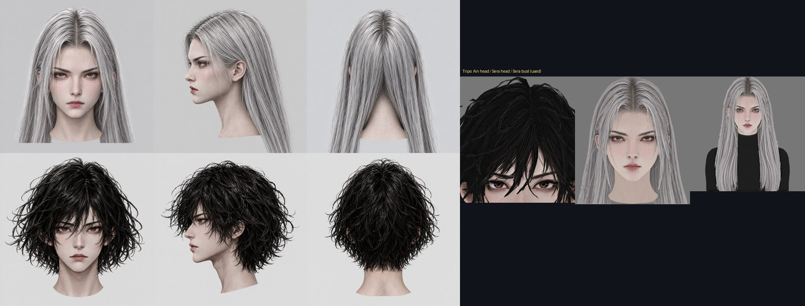
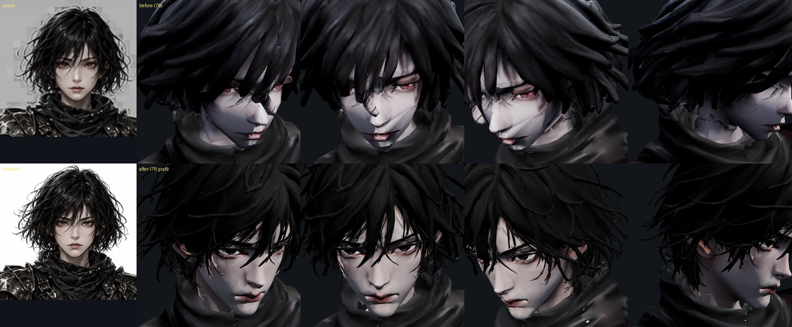
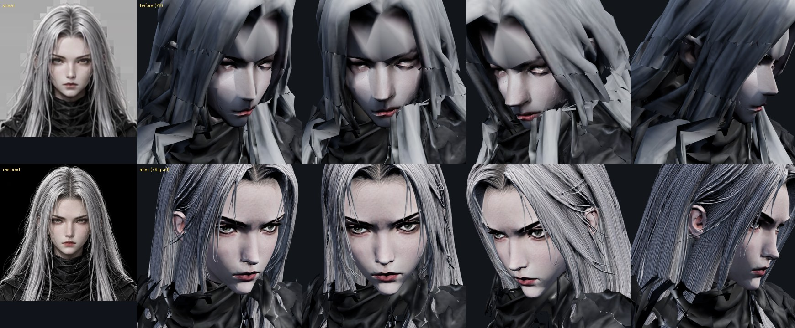
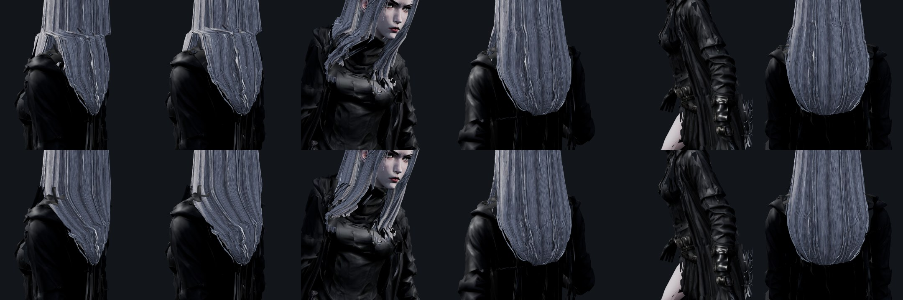
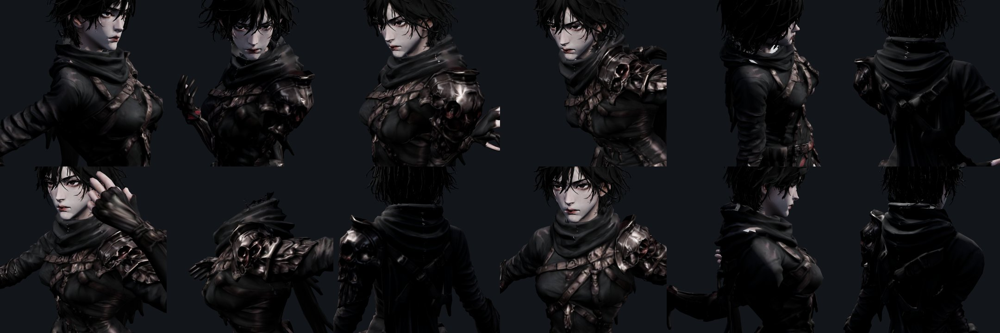

# 79 — 아인·세라 머리 교체 (설정 시트 얼굴로 새 3D 머리 → 목에 이식)

디렉터: 「세라 아인 얼굴 보정 더 해야될 거 같은데」

## 왜 텍스처로는 더 안 됐나 (78 의 한계)

78 에서 시트 얼굴을 텍스처로 입혔다(눈·눈썹·입술·피부). 눈높이에서 다시 보니 남은 것은 모두 **모양** 이었다:
- 얼굴이 큰 평면 몇 장이라 빛을 받으면 각이 진다(광대·콧등). 법선을 넓게 평균해 봤지만(`face-project --smooth-normals`) 조금 무뎌질 뿐.
- 세라 이마의 V 자 머리 껍질, 판자처럼 겹친 머리칼. 아인 앞머리의 굵은 막대 묶음.

→ 머리(얼굴+머리칼)를 **새로 만들어 갈아 끼운다.**

## 만든 순서



1. **4면 이미지** — 78 의 복원 얼굴(시트 얼굴을 같은 얼굴 그대로 2048 px 로)을 참조로 `gpt_image_2_5` 에서
   앞·옆·뒤 머리 이미지(맨목, 옷 없음, 평평한 조명). 세라는 **가슴까지 내려오는 긴 머리** 가 필요해 흉상(앞) 한 장을 더.
2. **이미지 → 3D** — 두 가지를 같이 돌려 비교:
   - Meshy 멀티뷰(앞·옆·뒤 3장): 얼굴에 구멍·뒤집힌 조각 → 버림.
   - **Tripo H3.1 (앞 한 장)**: 머리칼 가닥·피부가 깨끗 → 채택. 아인 = 머리 모델, 세라 = 흉상 모델(긴 머리).
3. **이식** — `tools/3d/head-graft.py` (새 도구).

## head-graft.py — 무엇을 하나

| 단계 | 방법 |
|---|---|
| 맞춤 | 눈·눈·입 세 점(몸 = 78 의 바인드 좌표, 머리 = `face-ortho.html ?glb=…&ry=-90` 정면)으로 **배율 + 이동**. Tripo 는 앞이 +x 라 `--rot-y -90`. 깊이는 정면에서 본 표면 높이로. 아인 배율 0.287 · 세라 0.410 |
| 옛 머리 지우기 | Head 무게 ≥ 0.5 인 면. 단 **어두운 목도리·옷깃은 남긴다**(`--keep-dark`), 옛 목 피부 윗동(`--drop-skin`), 지운 뒤 떠 버린 옛 머리칼 끝 조각(`--debris`) |
| 새 머리 자르기 | 목 아래(`--cut`)는 옷 속으로 — 단 세라는 **머리칼로 보이는 면은 남긴다**(`--keep-hair`, 밝고 채도 낮은 면) |
| 스킨 무게 | 턱 위 = Head 1.0(얼굴은 한 몸, 78). 아래 = 가장 가까운 옛 «머리·목·밝은(옛 머리칼)» 정점 무게 — 긴 머리는 옛 긴 머리처럼 가슴·등 뼈를 따른다 |
| 턱선 섞기 | `--blend` — 턱 아래 띠에서 Head 1.0 → 옛 무게로 서서히. **없으면 세라 뒷머리가 턱선 높이에서 꺾였다**(아래 그림 위 줄) |
| 재질 | 두 번째 프리미티브(자기 재질 `head_graft`, 텍스처 2048). 금속 0 · 거칠기 0.8 — Tripo 거칠기 맵을 쓰면 머리칼이 쇠처럼 번쩍여서 뺐다 |

몸 텍스처·UV·정점은 그대로다(78 의 얼굴 투영은 옛 얼굴에 했던 것이라 이번 원본은 투영 전 파일).

## 결과




왼쪽 위 = 설정 시트, 왼쪽 아래 = 복원본. 위 = 전(78) / 아래 = 후. 눈높이 대기 자세 정면·25°·50°·옆.

### 모션 확대 검수 (찢어짐·늘어남)



위 = 섞기 없음, 아래 = `--blend 0.14`. 스킬3 뒷모습에서 머리칼이 턱선 높이로 접히던 것이 이어진다.



1타·2타·스킬1~4·구르기·걷기·피격·스매시·대기. 옛 머리를 지운 자리의 구멍·조각 없음. 게임(훈련장)에서 두 캐릭터 모두 오류 0.

### 명령 (다시 만들 때)

원본 = 리깅·고개 들기까지 끝난 파일(`*_anim_pre-face`, 78 투영 전). 머리 glb 는 저장소에 넣지 않았다(8~15 MB) — Higgsfield 작업 번호:
아인 머리 `8de293f6-96f0-4fe2-8726-29f0c1229057`, 세라 흉상 `d69436c6-27bd-4003-8712-eb212d900573`.

```
python3 tools/3d/head-graft.py ain_pre.glb ain_tripo.glb --rot-y -90 \
  --body-lm=-0.03,1.538,0.03,1.53875,0.00125,1.48875 --head-lm=-0.0867,0.0244,0.1133,0.0244,0.0111,-0.1569 \
  --rigid-y 1.47 --blend 0.05 --keep-dark 1.50,60 --no-mr --drop-skin 1.41,60,0.09 --debris 300,1.38 --cut 1.40 --out art/3d/ain_anim.glb
python3 tools/3d/head-graft.py sera_pre.glb sera_bust.glb --rot-y -90 \
  --body-lm=-0.02175,1.58875,0.03075,1.58875,0.00625,1.53425 --head-lm=-0.0644,0.208,0.0667,0.208,0.0,0.0778 \
  --rigid-y 1.51 --blend 0.14 --keep-dark 1.52,60 --no-mr --drop-skin 0.95,60,0.22 --debris 300,1.0 --cut 1.45 \
  --keep-hair 90,60 --weights-light 60 --out art/3d/sera_anim.glb
```

### 코드 쪽

- `js/ain-bind-repair.js`: 목 위에만 있는 메시(이식한 머리)는 바인드 역행렬만 다시 잡고 손 보정은 건너뛴다
  (손 정점이 없어 «grip shape has no distal hand vertices» 로 멈췄다).
- 시험 3개가 «마지막 스킨 메시 = 몸» 을 가정했다 → «첫 스킨 메시 = 몸». 재질 시험은 이식 머리(이미 금속 0)를 뺀 몸 재질로.
- 시험 357 통과.

### 남은 것

- **세라 앞머리칼이 코트 깃 뒤로 들어간다** — 흉상은 얇은 목폴라 위에 그려졌고 우리 코트 깃은 두껍다. 표면 밖으로
  밀어 봤지만(`--push-out`) 3.5 cm 넘게 밀리는 곳에서 머리칼이 구겨져서 쓰지 않았다(깃 뒤로 넘긴 머리처럼 보인다).
- **후드를 써도 머리칼이 안 숨는다** — 얼굴과 머리칼이 한 메시(전에도 같았다, docs/design/45).
- 파일이 커졌다: 아인 4.1 → 6.3 MB, 세라 4.1 → 7.1 MB (머리 텍스처 2장).
- 대기 자세에서 고개가 여전히 약간 숙여져 있다(78 에서 10° 들었다).
