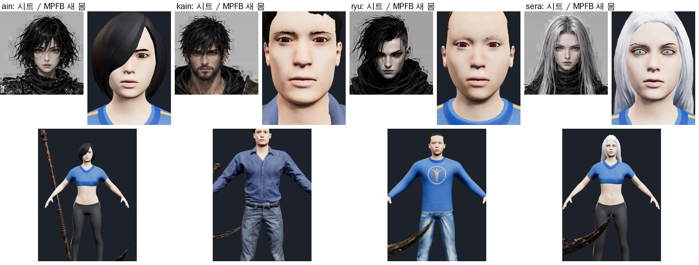

# 81 — 캐릭터를 «실제로 만드는 방식» 으로 바꾼다 (MPFB2 파라메트릭 인간)

디렉터: 「이대로는 한 달 내내 해도 얼굴 몸도 못 만들어. 조사해서 어떻게 하는지 학습하고 해」

## 1. 조사 — 왜 지금까지 안 됐나
- **AI 이미지→3D(Hi3D·Tripo·Meshy)는 주인공 캐릭터를 못 만든다.** 도구 회사 스스로도 «변형용 에지 흐름을 AI 가 모른다 ·
  얼굴 표정(블렌드셰이프)은 사람이 다시 만든다» 고 쓴다 ([3D AI Studio](https://www.3daistudio.com/3d-generator-ai-comparison-alternatives-guide/can-ai-generate-game-ready-3d-models),
  [Tripo](https://www.tripo3d.ai/blog/explore/blendshapes-facial-animation-for-ai-generated-heads)). 우리가 41~80번 문서에서 부딪힌 것이 전부 이것 —
  한 덩어리(몸·머리칼·옷), 두피 없음, 표정 없음, 텍스처에 구운 그림자, 관절에서 찢어짐, 손가락 뼈 없음.
- **실제 인디 개발은 «파라메트릭 캐릭터 생성기» 로 기본 인간을 만들고 옷을 같은 몸에 맞춰 입힌다.**
  애니풍 = VRoid ([공식](https://vroid.com/en/studio)) · 사실풍 = Character Creator ([Reallusion](https://www.reallusion.com/character-creator/game.html), 유료·GUI) ·
  오픈소스 = **MPFB2** (MakeHuman 의 Blender 판, [CG Channel](https://www.cgchannel.com/2025/03/check-out-open-source-blender-character-generation-plugin-mpfb-2/)).
- **MPFB2 를 고른 이유**: Blender 안에서 코드로 돌아간다(이 작업 환경에서 내가 끝까지 할 수 있다) · 만든 캐릭터는 **CC0** 이라 유료 게임에
  그대로 쓴다 ([MakeHuman FAQ](https://static.makehumancommunity.org/mpfb/faq/use_in_closed_source.html)) · 애니메이션용 토폴로지 · 눈·눈썹·속눈썹·이·혀·머리칼·옷이
  **처음부터 따로** · **Mixamo 이름 뼈대 52개(손가락 30개 포함)** · ARKit 표정 52종을 불러올 수 있다 · 체형이 바뀌면 옷이 따라 맞는다(MHCLO).
- 명조·원신 같은 애니풍 얼굴은 형상이 아니라 셰이더(SDF 얼굴 그림자·툰 램프)가 만든다 ([Genshin 얼굴 셰이더](https://github.com/NoiRC256/URPSimpleGenshinShaders)).

## 2. 한 것 (약 2 시간)
1. `tools/3d/mh/setup.sh` — MPFB2 를 pip bpy 에 확장으로 설치 + MakeHuman 기본 에셋(CC0, 267 MB) 연결.
2. `tools/3d/mh/specs/<c>.json` — 캐릭터마다 체형(성별·나이·근육·체중·키·비율·인종 섞기) · 얼굴 조절값 · 피부 · 눈썹 · 머리칼 · 옷 · 뼈대(mixamo).
3. `tools/3d/mh/build.py` → `mhlib.make/bake/export` — 체형을 메시에 굽고 옷 아래 가림·헬퍼를 지운 뒤 glb.
4. `tools/3d/mh/finalize.py` — Blender 가 모든 재질을 반투명(BLEND)으로 내서 three.js 에서 이·눈이 얼굴 위에 그려졌다 → 몸·눈·옷 불투명,
   머리칼·눈썹·속눈썹 알파 잘라내기. 머리색·홍채색 바꾸기. 텍스처 1024 → 13~18 MB → **2.6~3.1 MB**.

원본 `art/3d/src/mh/<c>_base_mpfb.glb` (게임엔 아직 안 넣음).

## 3. 솔직한 평가
- **구조는 이제 맞다.** 일그러짐·구멍·찢어짐이 없고, 부위가 다 따로이며, 손가락 뼈가 있다. 네 명을 다시 굽는 데 몇 분.
- **생김새는 시트와 거리가 멀다.** MakeHuman 얼굴은 «평범한 사실풍» 이고 기본 머리칼 에셋은 수가 적고 투박하다
  (류의 옆머리·카인의 수염·아인의 헝클어진 머리 없음). 옷은 임시 운동복.
- 다음 단계(순서대로): ① 시트 얼굴을 MPFB 얼굴 UV 에 입힌다(토폴로지·UV 가 일정해서 이번엔 된다 — 3D 눈은 그대로) ② 머리칼: 커뮤니티
  헤어(라이선스 확인) 또는 헤어 카드 제작 ③ 뼈대 52 → 우리 클립 리타깃(손가락으로 진짜 «쥔 손») ④ 옷은 MHCLO 로 몸에 맞춰 입힌다.
- 붉은사막·검은사막 급 얼굴은 전문 아티스트나 MetaHuman/CC4 Headshot 급 도구의 영역이다 — 이 방식으로는 «깨끗하고 일관된» 데까지다.
