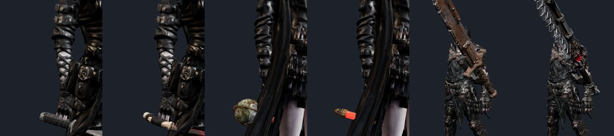
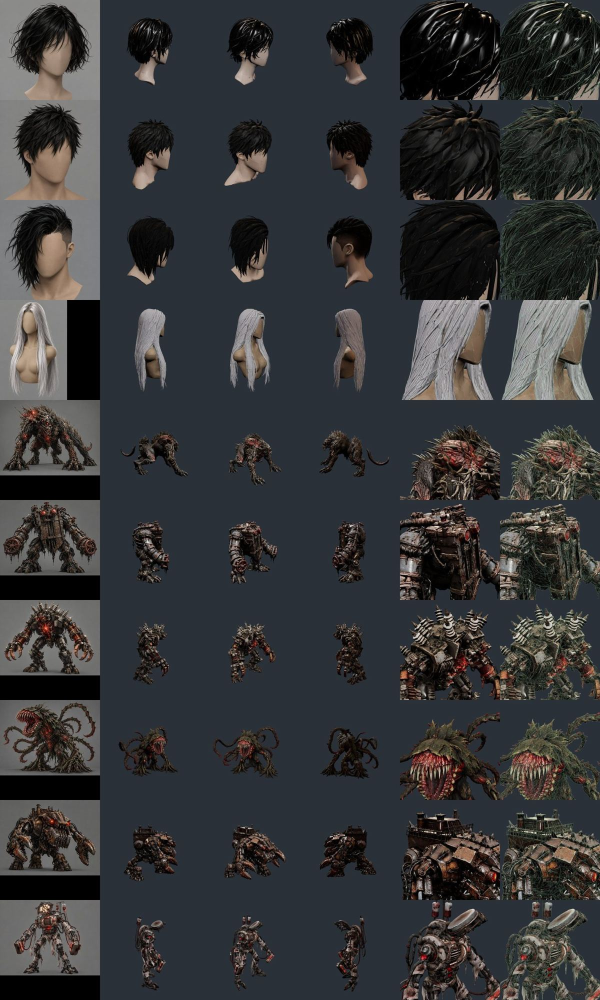
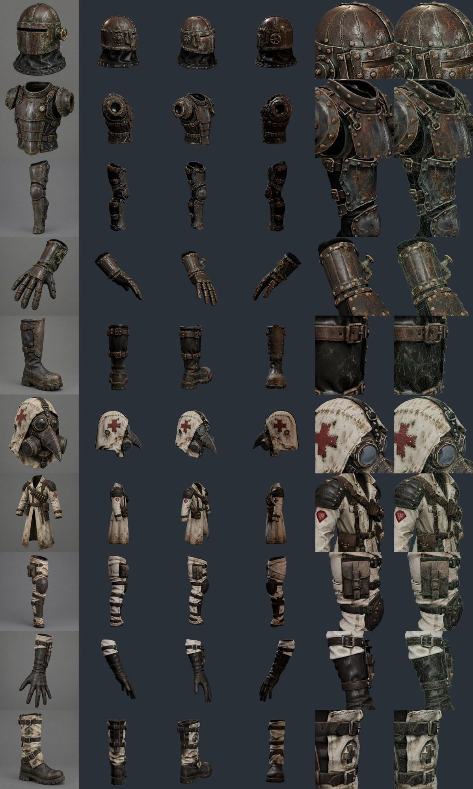
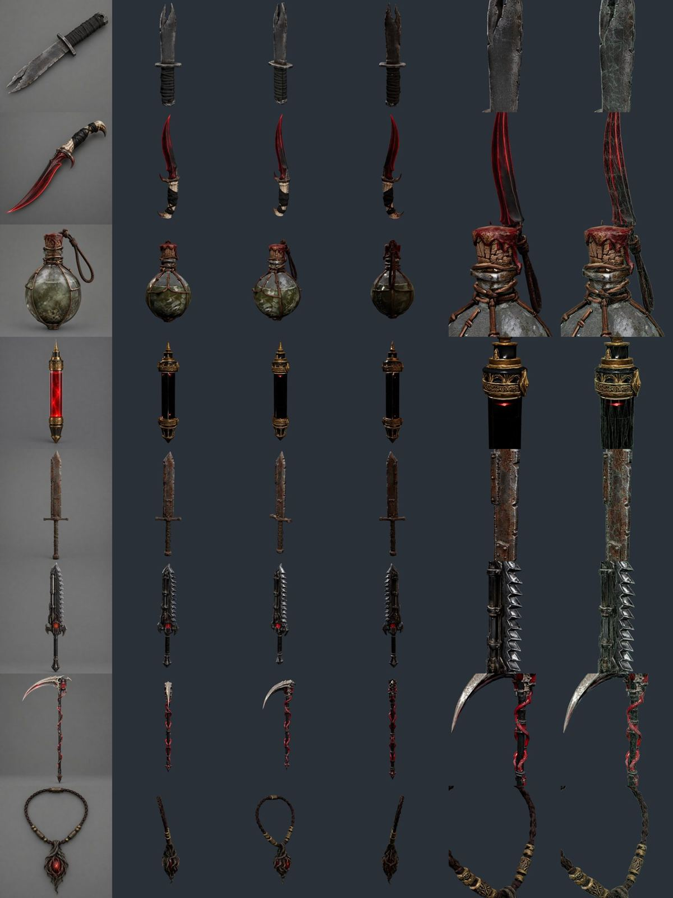
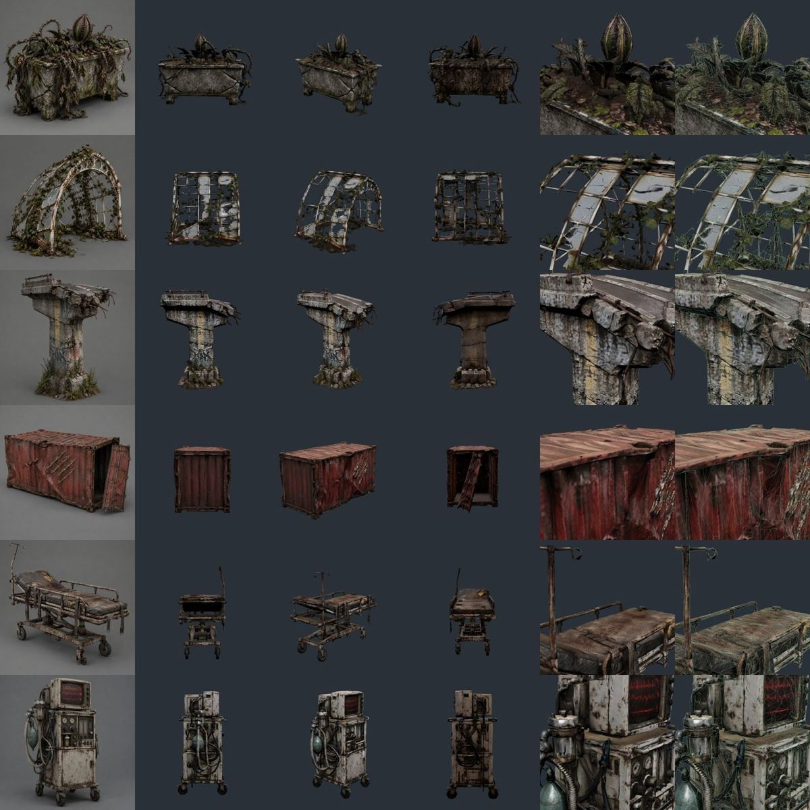
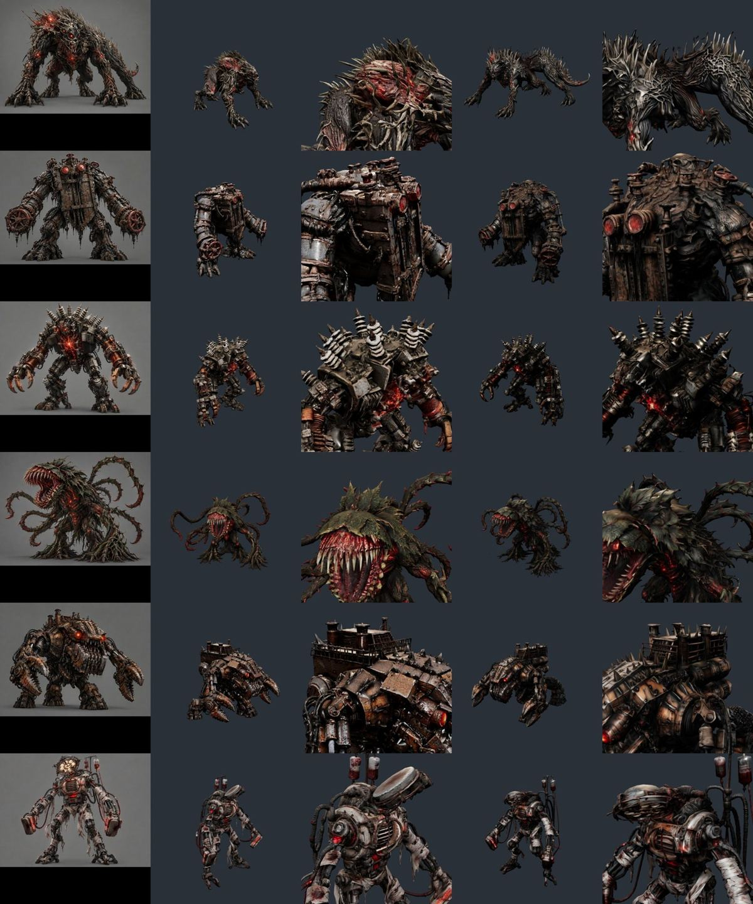
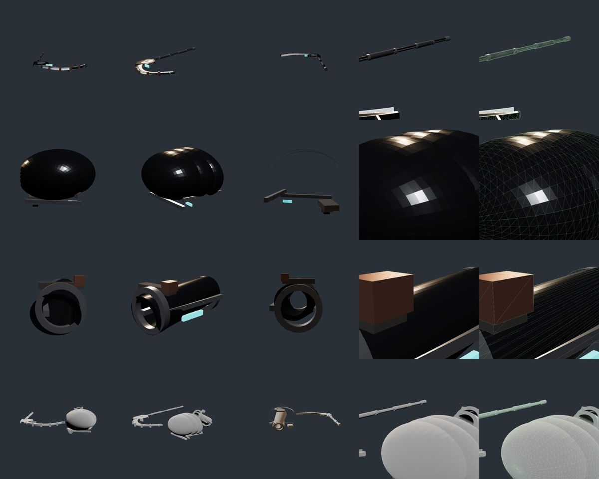

# 82 — 남은 크레딧 전부 쓰기: 보스 6(×2) · 방어구 2벌 · 전용 무기 7 · 머리칼 4 · 소품 6 (2026-09-25)

디렉터: 「다 만들고 힉스필드까지 활용해서.. 그리고 29일에 hi3d 이 초기화 되면 다시 시작하자. 지금 남은 크레딧은 다 쓰고.」

## 1. 쓴 것
| 서비스 | 시작 | 끝 | 들어간 곳 |
|---|---|---|---|
| Higgsfield | 630.75 | **0** | 컨셉 그림 34장(gpt_image_2_5, 장당 0.25) → 3D 34개(Tripo H3.1 «detailed», 개당 18) + 29일 이후용 옆·뒤 그림 41장 |
| Hi3D | 395 | **15** (최소 작업 55 에 모자라 못 씀) | 보스 6개 v3.0 고품질(개당 55) — Tripo 와 **같은 컨셉**을 넣어 비교 |

## 2. 게임에 바로 들어간 것 (배포)
| 아이템 | 전에는 | 이제 |
|---|---|---|
| 류 `w_ryu_shiv` 갈라진 쌍칼 · `w_ryu_twinfang` 쌍아 | 재의 단도 모델에 색만 섞음 | 전용 모델(끝이 갈라진 칼 · 핏빛 송곳니 칼) |
| 세라 `w_sera_vial` 흐린 시약병 · `w_sera_reagent` 정제 촉매 | 촉매 시약병에 색만 섞음 | 구리 철망 둥근 병 · 황동 캡 붉은 발광 원통 |
| 카인 `w_kain_scrap` 쇠판 대검(희귀 Lv12) · `w_kain_crusher` 파쇄 기갑의 턱(전설 Lv24) | **없음** — 카인만 무기가 하나뿐이었다 | 새 아이템 + 제작법 2종 + 아이콘. 류·세라와 같은 «희귀·영웅·전설» 세 칸 |

아이콘도 모델 색에 맞춰 다시 그렸다(쌍아 = 금색 → 핏빛 · 촉매 = 청록 → 진홍).

무기 규약(`gear_post.py`)에 맞추며 생긴 것:
- Tripo 는 칼을 컨셉 그림처럼 **비스듬히·바닥에 눕혀** 만든다 → `--pca`(3D 주축을 세움) 추가. 쌍칼은 자루가 위로 와서 `--axis=-y`
  (`--axis -y` 로 쓰면 argparse 가 `-y` 를 옵션으로 읽어 조용히 실패했다 — `=` 로 붙여 써야 한다).
- 손 위치: 0.08 m 에선 확대 그림에서 주먹이 코등이에 붙고 자루가 뒤로 삐져나왔다 → **0.05**. 대검은 모루의 대검과 같은 1.6 m · 손 0.75.
- **빛이 사라지는 문제**: Tripo 는 컨셉의 빛(촉매의 붉은 유리, 턱의 심장)을 «색» 으로만 굽고 그 자리를 금속 1 로 잡는다 →
  three.js 에서 거의 검정. `tools/3d/glb_glow.py` — 채도 높은 붉은 픽셀만 emissive 로 달고 그 자리 금속을 끈다. 촉매 33 %, 턱 3.4 %.
  쌍아(21 %)는 날 전체가 빛나 버려 적용하지 않았다.
- 아이템 효과 문구(예: «강공격 명중 시 보스 경직 누적 +10%»)는 **기존 아이템처럼 표시만** 된다 — 전투 계산에 아직 안 들어간다(기존 부채).

## 3. 보관만 한 것 — `art/3d/src/hf/` (다음 단계 재료)
컨셉 그림: `art/3d/src/hf/concept/<이름>.jpg` (정면) · `_side` · `_back` (75 장).

| 묶음 | 파일 | 게임 속 자리 · 남은 일 |
|---|---|---|
| 보스 6 × 2 | `tb_*` (Tripo) · `hb_*` (Hi3D) — morbus·sluice·relay·root·crusher·ward | d02~d07 보스. **뼈가 없다** — 부위 뼈 + 기존 연계 클립(18·64번) 옮기기 |
| 방어구 «수문지기» 5 | `a_sluice_{helm,cuirass,greaves,gauntlet,boots}` | d03 드롭 중갑 세트. 오른쪽만 → 거울 복제 + gearAnchor(80번) |
| 방어구 «방역» 5 | `a_ward_{mask,coat,greaves,gloves,boots}` | d07 드롭 경갑 세트 |
| 머리칼 4 | `hair_{ain,kain,ryu,sera}` | MPFB 몸(81번)에 얹을 것. 마네킹 머리 붙어 있음 · 정면이 +X · 너무 번들거림 |
| 아인 전설 낫 | `w_ain_ward_scythe` | 아인은 두 손 IK·쥔 손 모양(80번)이 낫 모델에 묶여 있어 따로 맞춰야 한다 |
| 장신구 | `acc_root_heart` | d05 전설 목걸이 |
| 소품 6 | `p_planter`·`p_greenhouse_arch`(d05) · `p_highway_pillar`·`p_container`(d06) · `p_gurney`·`p_life_support`(d07) | 던전 배치 |

줄이기: Tripo 결과는 개당 **190 만 삼각형 · 65 MB**. `tools/3d/hf_reduce.py` 로 모양·UV·텍스처만 지켜 줄였다 —
보스 6 만 · 방어구·머리칼 2 만 · 소품 1.5 만 · 무기 1.2 만 · 장신구 8 천 삼각형, 텍스처 보스 2048 · 나머지 1024.
(보스 6 만은 캐릭터 예산 — 80번 문서. 나머지 숫자는 **근거 없음**, 넣을 때 화면 크기로 다시 정한다.)
Blender 를 동시에 여러 개 돌리면 메모리(15 GB)가 모자라 죽었다 → 두 개씩.

## 4. 검수 그림 (컨셉 | 정면 | 3/4 | 뒤 | 2.6 배 확대 | 확대 + 선)
`tools/3d/glb-shot.html?glb=…` + `window.shot(방위, 고도, 확대, 높이)`.

확대에서 찢어진 면·구멍은 40 개 모두 안 보였다. 리벳·붉은 십자·버클·가시까지 2 만 삼각형에서 남았다.

## 5. Tripo vs Hi3D — 같은 컨셉

- 확대 표면은 **Hi3D 가 조금 더 날카롭다**(모르버스 두개골 얼굴, 수문기 붉은 눈).
- 덩어리 모양은 **Tripo 가 깔끔한 곳이 있다**(모근체의 입·이빨이 또렷, Hi3D 는 뭉개짐).
- 값: Hi3D 55 · Tripo 18 크레딧. 어느 쪽이 늘 낫다고 할 수 없다 → 보스마다 리그할 때 골라 쓴다.

## 6. Hi3D 제출 방법이 바뀌었다
웹 화면(Playwright)으로 올리던 방식은 정적 CDN(hitem3dstatic)이 막혀 이미지 업로드 단계에서 로그인 창이 떴다.
세션 쿠키로 `/aigc/api/generate/model3d/submit` 에 **공개 이미지 주소(컨셉의 Higgsfield 주소)** 를 넣으니 받아 줬다.
쿠키·세션 파일은 컨테이너 안에만 둔다(저장소에 넣지 않음).

## 7. 29일 Hi3D 초기화 뒤
- `concept/*_side.jpg`, `*_back.jpg` 를 멀티뷰(정면·옆·뒤)로 넣어 **보스·방어구를 다시 뽑는다** — 한 장보다 뒤·옆이 정확해진다.
- 그 사이: 보스 리그(부위 뼈 + 기존 클립) → 방어구 규약 맞춤·게임 연결 → 소품 배치 → 머리칼을 MPFB 몸에 → 기기 확인.

## 8. 디렉터가 올린 GPT 장비 «Night Current» v01 (2026-09-25) — `art/3d/src/gpt/`
낫 · 어깨 갑옷 · 팔뚝 보호대 · 세 개를 합친 세트(어깨 파일 두 개는 같은 파일).

| | 낫 | 어깨 | 팔뚝 | 세트 |
|---|---|---|---|---|
| 삼각형 | 4 116 | 4 667 | 1 404 | 10 187 |
| 크기(m) | 0.84 × 1.9 (Z 로 누움) | 0.42 × 0.33 × 0.33 | ⌀0.17 × 0.33 | — |
| 재질 | 색만 6종 | 색만 4종 | 색만 5종 | **없음(흰색)** |

- 코드(trimesh)로 상자·고리·타원체를 조립한 모델이다. **UV·텍스처·노멀이 없어** 무늬·마모·금속결이 없고 면이 각져 보인다.
  어깨는 매끈한 달걀 모양 세 겹이라 실루엣이 갑옷으로 읽히지 않는다.
- 같은 화면의 Tripo 방어구(3·4절)와 비교하면 품질 차이가 크다 — **그대로 게임에 넣지 않는다.**
- 쓸 수 있는 것: **설계도**로서. 부품 구성(자루 칼라 6개·그립 2곳·구리 브리지·청록 상태등), 치수(낫 1.9 m · 팔뚝 ⌀13 cm), 색 조합
  (검은 세라믹 + 브러시드 실버 + 구리 + 청록 발광). 29일 뒤 이 구성으로 컨셉 그림(정면·옆·뒤)을 만들어 Hi3D 멀티뷰로 뽑는다.
- 결정할 것: 청록 발광은 지금 게임의 «녹·핏빛» 톤과 다르다 — 아인 전용 «밤의 흐름» 계열로 따로 둘지.
