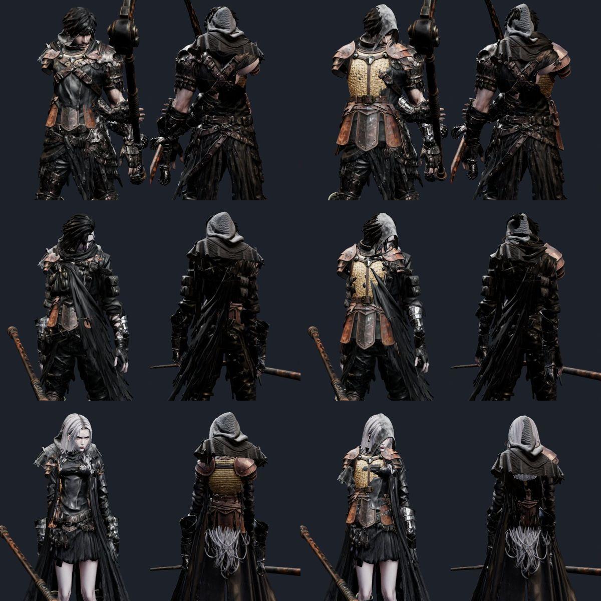
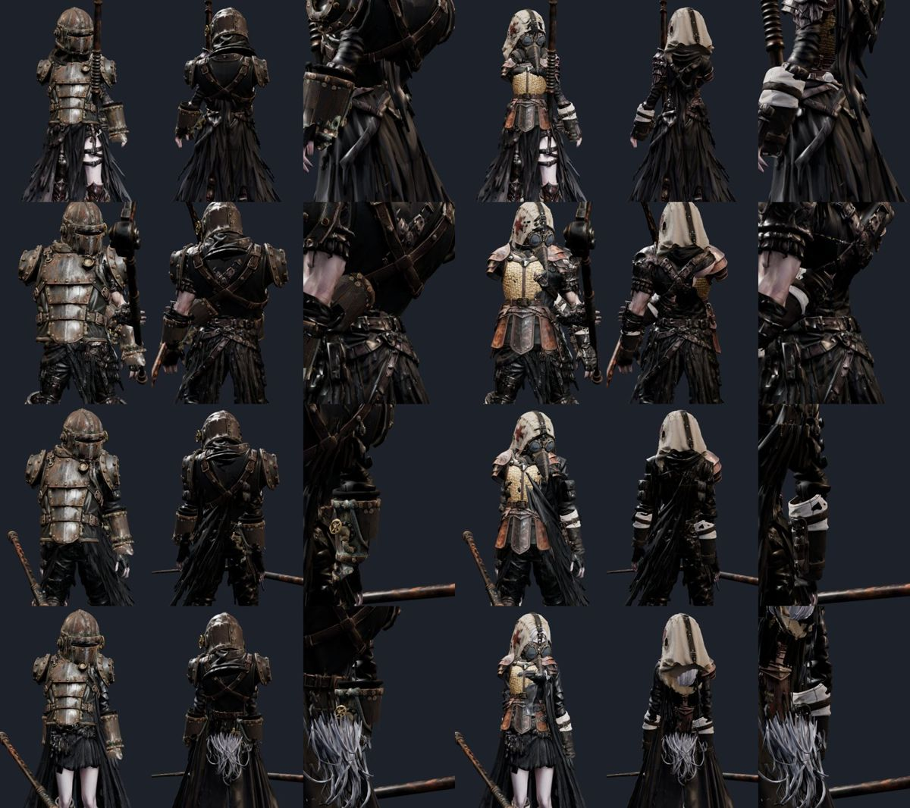
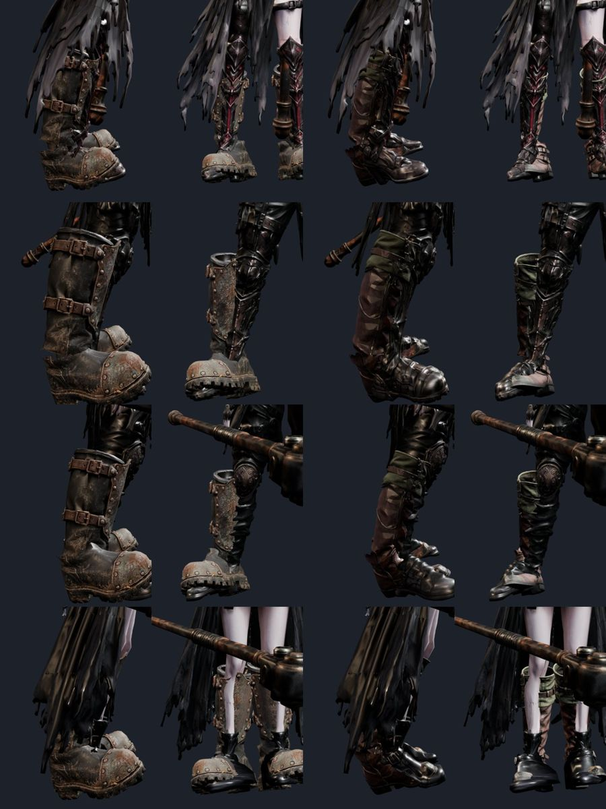
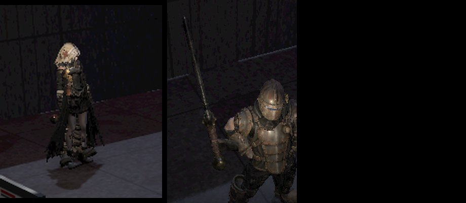

# 83 — 무기·방어구가 몸에 붙는지 보고 고치기 (2026-09-25)

디렉터: 「일단 무기 방어구가 몸에 잘 붙는지 보고 보완해」

## 1. 본 것 — 기존 세트(후드·갈대 흉갑·검은 각반·강철 건틀릿·순찰자 장화·부적)
아인은 맞았다(이 세트를 아인에 맞춰 만들었다). 카인·류·세라는 틀렸다:
- **후드가 뒤통수로 밀림** — 세 명 모두. 머리 뼈 기준 «머리+머리칼» 가운데가 아인보다 앞(+z)으로 카인 3 · 세라 7 · 류 8 cm.
- **흉갑이 몸 속에 묻힘(카인·류) / 등에 붙음(세라)** — 세라 몸통 가운데가 아인보다 5 cm 앞.
- 원인: 장비 자리는 아인 몸에서 잰 값이고, 다른 캐릭터는 부위별 배율 하나(CHARFIT)만 곱했다. 뼈에 대한 몸의 «위치» 차이를 몰랐다.

## 2. 고친 것 — 캐릭터마다 몸을 재서 옮긴다
- `tools/3d/armor-fit.html?char=…` — 게임과 똑같이 장비 자리(gearAnchor/rerigAnchor) 기준으로, 가만히 선 자세에서 실제로 그려지는
  정점(스키닝 적용)을 부위별로 모아 2~98 % 범위의 **가운데·폭**을 잰다. 몸통은 Spine·Spine1·Spine2·양 어깨를 함께
  (Spine1+Spine2 만 재면 무게가 흩어진 류는 깊이 8 cm, 세라는 폭 10 cm 로 나왔다). 뼈 방향은 네 명 모두 같았다(회전 문제 아님).
- `js/looks.js` `BODYFIT` + `fitPiece()` — 위치 = c캐릭터 + (p − c아인)·r, 크기 × r, r = 폭 비(0.85~1.4).
  머리 장비는 머리칼이 몸과 한 덩어리라 숨길 수 없어 **아인보다 줄이지 않고 6 % 여유** (카인 뻗친 머리칼이 후드 옆을 뚫었다).
- 새 세트도 같은 규칙으로 자동으로 옮겨진다 — 아인에 한 번만 맞추면 된다.

## 3. 새 방어구 두 벌을 게임에
Tripo 모델(82번) 9 조각 → `gear_post.py --armor` (정면을 +Z 로: 대부분 +X 로 나와 −90°, 장화는 −Z 라 180°) → 같은 부위 기존 조각 크기·자리.
- **수문지기**(d03 드롭, 중갑 5부위) · **방역**(d07 드롭, 경갑 4부위 — 코트는 아래 5절) — 아이템·드롭표·아이콘(3D 렌더를 담은 SVG).
- **장갑은 손목에서 잘라 팔 보호대만** (`tools/3d/glb_cut.py`). 뼈에 딱딱하게 붙는 장갑은 손가락을 편 채라 무기를 쥔 손과 안 맞아
  손가락이 손 밑으로 튀어나오고 손이 두 배로 보였다. 잘라 낸 보호대는 원래 장갑이 비스듬해(34.5°·15.9°) 손목 뒤로 컵처럼 튀어나와
  `--align` 으로 축을 세웠다.

## 4. 장화는 발목에서 둘로
대기 자세만 돼도 발목이 굽는다 — 다리 뼈에 붙은 한 덩어리 장화는 **아인까지 포함해** 코 위로 캐릭터 신발이 뚫고 나왔다.
- 정강이 쪽(발목 위)은 다리 뼈, 발 쪽(발목 아래)은 **발 뼈**. 겹치는 띠(5 cm)를 둬 틈이 안 벌어진다.
- 발 쪽 자리는 다리 뼈 기준 값을 바인드 자세 관계(`boneInverses`)로 발 뼈에 옮긴다(`via`). 애니메이션 중에 붙여도 같다.
- 장화 크기·높이는 정강이가 아니라 **발바닥**(Foot+ToeBase)으로: 바닥을 발바닥 아래 끝에, 길이·높이 비 중 큰 쪽으로 키운다.
  발바닥 기울기(아인 −17° · 세라 −22° · 류 −7° · 카인 −2°)로 돌려도 봤지만 발 뼈에 옮기면 이미 따라가서 ± 어느 쪽도 나빠졌다 — 뺐다.
- 기존 순찰자 장화도 같은 방식으로 바꿨다.

## 5. 실제 던전에서
세라(방역) · 카인(수문지기)을 입혀 d01 에 들어가 봤다 — 에러 없음(글꼴 CDN 은 이 환경에서 막힘).

## 6. 남은 것 (솔직하게)
- **방역 코트**는 무릎까지 오고 소매가 있어 뼈 하나에 딱딱하게 붙이면 걸을 때 다리·팔을 뚫는다. 몸 무게(스킨)를 옮겨 몸과 같이
  휘게 해야 한다 — 캐릭터마다 굽는 도구가 필요하다. 그때까지 방역 세트의 흉갑 칸은 비어 있다(갈대 흉갑과 섞어 입는다).
- 세라는 굽 높은 신발의 발목 끈이 장화 위로 조금 보인다(발 조각 1.12 배로 줄였지만 남음).
- 후드 뒤로 카인·류 머리칼 몇 가닥이 보인다 — 머리칼이 몸 메시와 한 덩어리라 숨기지 못한다(45번 문서).
- 무기: 류·세라·카인 새 무기는 82번에서 손에 쥐어 봤다. 아인 낫 계열은 양손 IK(80번)라 이번에 바꾸지 않았다.
- GPT «Night Current» 어깨·팔뚝은 어깨 칸이 없고 품질이 낮아(82번 8절) 붙이지 않았다.
