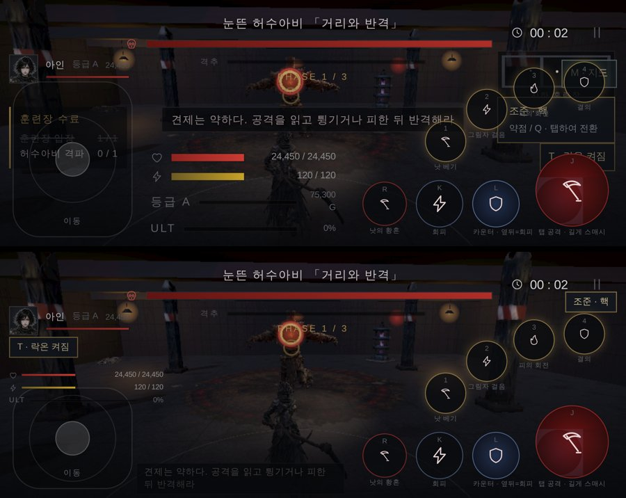
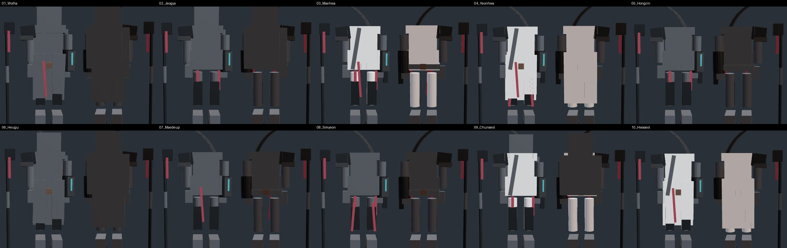
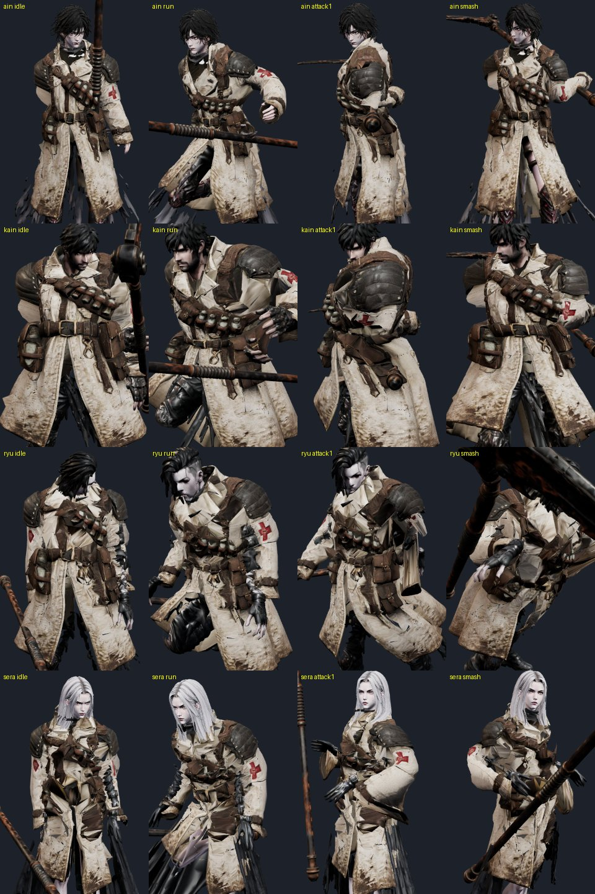
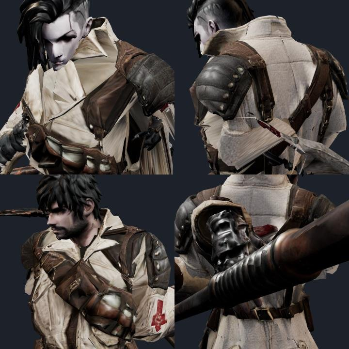

# 84 — 화면이 어지럽다 · 갓 오브 워와 비교 (2026-09-25)

디렉터: 「두 게임을 비교해봐. 화면 돌아가는 것도 너무 어지러워」 (우리 d01 폰 화면 · 갓 오브 워 쇼츠 화면)

## 1. 두 화면 비교

| | 갓 오브 워 (쇼츠 한 장) | 우리 (폰, 브라우저 안) |
|---|---|---|
| 캐릭터 | 화면 세로 약 45 %, 아래 가운데, 가린 것 없음 | 작고, **체력·기력 묶음이 몸 위에** 얹힘 |
| 화면 정보 | 거의 없음(모서리) | 15개 남짓 — 스킬 3·4 가 지도·조준 패널 위, 락온 버튼이 공격 버튼 밑, 의뢰 목록이 스틱 위 |
| 카메라 | 어깨 너머 «자유» 카메라, 스스로 거의 안 돎 | 스스로 돎(아래 2절) |
| 빛 | 낮, 실루엣이 또렷 | 어두운 벙커, 붉은 조명 — 윤곽이 묻힘 |
| 모델·재질 | AAA | 여기서 따라갈 수 없음(솔직하게) |

폰 화면이 좁은 이유: 브라우저 안이라 게임 영역이 **CSS 690×272** 밖에 안 된다(스크린샷 2000×923 에서 주소창을 빼고 dpr 2.6).
APK 로 전체 화면이면 조금 낫지만, 좁은 화면에서도 안 겹치게 해야 한다.

## 2. 어지러움 — 재 보고 원인부터

`보스까지 걸어가 30초 싸우는` 봇 플레이 동안 시선 방향이 «내가 돌리지 않았는데» 돈 각도를 쟀다(스크래치 dizzy.mjs).

| | 탐색 총 회전 | 탐색 p95 | 전투 총 회전 | 전투 p95 | 화각 |
|---|---|---|---|---|---|
| 전 | 451° / 54초 | 101°/s | 125° | 40°/s | 46.6~56.7° 출렁 |
| 후 | 364° (그중 279° 는 보스 등장 컷신) | 58°/s | 59° | 9°/s | 50° 고정 |

- **첫째 원인은 벽 미끄럼**이었다. 탐색 회전 432° 가운데 325° — 벽이 시야를 가리면 최대 72° 를 0.12초 만에 옆으로 틀어,
  통로에서 좌우로 계속 휙휙 돌았다. 이제 갓 오브 워처럼 **먼저 당기고**(최소 2.2 m), 당겨도 모자랄 때만 옆으로 34° 까지 초당 40° 이하로. → 0°.
- 따라 도는 카메라: 탐색은 옆 성분만 1.6초·최대 34°/s, 카메라 쪽으로 달리면 안 돎. 락온은 보스가 가운데 ±20° 안이면 안 돎,
  넘친 만큼만 최대 69°/s, 2.6 m 안으로 붙으면 멈춤(붙을수록 목표각이 요동친다). 락온 없는 전투는 스스로 안 돎.
- 화면 기울기(롤)·옆 튕김 없음, 위아래 튕김은 절반. 흔들림 세기 절반. 회피·타격 화각 변화(57°·46°·펌핑) 없음.
- 컷신 전환 0.45~0.55초 → 0.9초, 주시점을 위치와 같은 속도로(전엔 1.5배 빨라 휙 돌았다). 남은 279° 는 등장 연출이라 뒀다.
- 설정(일시정지)에 **카메라 자동 회전 · 화면 흔들림** 켜고 끄기 — 접근성 지침이 요구하는 것.

근거: Xbox Accessibility Guideline 117 (https://learn.microsoft.com/en-us/gaming/accessibility/xbox-accessibility-guidelines/117) —
«플레이어 입력 없이 시선이 바뀌는 것, 화면 흔들림·기울기» 가 멀미 원인, 자동 카메라 이동을 끌 수 있어야 한다.
Game Accessibility Guidelines (https://gameaccessibilityguidelines.com/avoid-or-provide-option-to-disable-any-difference-between-controller-movement-and-camera-movement/).
갓 오브 워(2018)는 어깨 너머 자유 카메라, «Ambient Camera Sway» 를 끄라고 권한다(https://en.wikipedia.org/wiki/God_of_War_(2018_video_game)).
기준 수치(34°/s·±20°·0.9초)는 **근거 없음** — 계측으로 잡은 우리 값.

## 3. 좁은 화면 HUD

- 체력·기력·궁극기: 가운데 아래(캐릭터 몸 위) → 왼쪽 위 초상 아래 가는 줄. 등급·경험치 줄은 던전에서 뺌
- 스킬 버튼은 오른쪽으로 돌려놓고, 미니맵은 숨김(M · 지도 버튼은 탐색에서 남음), 조준 칩은 시간 아래, 락온 칩은 왼쪽
- 의뢰 목록: 전투 중 숨김, 탐색 중엔 위 가운데. 안내 문구: 아래 왼쪽 작게
- `html.in-fight` 클래스를 붙여 전투 중에만 정리된다. 세로 360 px 넘는 화면은 그대로.

## 4. GPT 아인 착장 10벌 (v01)

GLB 는 상자 블록아웃(벌당 약 960 삼각형, 단색, 텍스처 없음)이라 게임에 못 넣는다 — README 도 «정적 블록아웃, 스킨 없음».
원본 컨셉 시트(`art/3d/src/gpt/outfit10_v01/concept_sheet.jpg`)는 좋다: 벌마다 앞·옆·뒤 턴어라운드가 있다.
29일 Hi3D 초기화 뒤 멀티뷰로 만들고, 방역 코트에 쓰는 옷 입히기·스킨 도구로 몸에 맞춘다.
단 시트 한 칸이 약 80×200 px 라 너무 작다 — 벌마다 앞·옆·뒤를 한 장씩(세로 1024 px 이상, A 자세, 단색 배경, 무기 없이) 다시 받아야 한다.

## 5. 방역 외투 — 몸 따라 휘게 (스킨)

디렉터: 「방역 코트도 몸 따라 휘게 스킨 작업 해줘」

`tools/3d/garment-fit.mjs` — 옷을 캐릭터마다 몸에 입혀 스킨 무게까지 구운 파일(`art/3d/gear/a_ward_coat_<캐릭터>.glb`, 각 1.6 MB)을 만든다.
게임(`js/looks.js` `garment`)은 그 파일을 몸 뼈대에 그대로 묶는다(뼈 이름으로 번호 맞춤) — 몸과 똑같이 휜다.

1. 아인에 한 번 맞춘다(정면 +X → +Z, 배율 1, 0.99 m 올림 — 소매가 팔과 이미 1 cm 안으로 맞았다).
2. 다른 캐릭터는 뼈마다 «아인 뼈 → 그 캐릭터 뼈» 변환을 아인 무게로 섞어 옮긴다. 몸통은 키 비 하나로(축별로 키우니 가슴이 구겨졌다), 팔·다리는 뼈 길이 비.
3. 몸 밖으로 밀어낸다(여유 1.2 cm, 최대 3 cm, 여섯 번). 밀어낸 양은 반경 5 cm 안에서 고르게.
4. 몸 무게를 옮긴다: 가까운 몸 정점 8 개 → 코트 이웃(용접)으로 고르게 → **반경 4 cm 안 공간으로도 고르게**.
   코트는 겉감·안감·탄띠·주머니가 따로 떨어진 여러 겹이라, 겹마다 다른 무게를 받으면 움직일 때 벌어져 안감이 검은 금처럼 보였다.
5. 소매/몸판 구분: 치마는 팔 뼈를, 소매는 다리 뼈를 못 받는다(허리 아래). 카인은 손이 치마 옆에 닿아 있어 팔을 들면 한 판이 뜯겨 나왔다.
6. **코트 밑 몸을 숨긴다**: 몸 표면 바깥 1~10 cm 에 코트가 있거나 코트 겉에서 6 cm 안이면 그 삼각형을 입고 있는 동안만 숨긴다(손·머리·발은 빼고).
   캐릭터 자기 옷(아인 너덜 치마, 류 긴 코트, 세라 드레스·부푼 소매)이 코트를 뚫고 나왔다. 앞섶처럼 벌어진 곳은 안 숨는다.

남은 것 (솔직하게):
- 팔을 어깨 높이로 들면 겨드랑이 아래 소매가 늘어난다(류 1타) — 선형 스킨의 한계. 보정 모양(corrective)이나 소매 전용 뼈가 필요하다.
- 세라 가슴 앞 탄띠가 가슴 둘레를 따라 조금 비틀린다.
- 아인·카인은 코트 아래로 자기 옷(너덜 치마·바지)이 보인다 — 밑단 아래라 겹옷처럼 보여 뒀다.
- 아이템: 방역 외투(영웅, 요구 25) — d07 폐병원 드롭. 방역 세트가 다섯 부위가 됐다.

## 6. 새 컨셉 시트 — 네 명 × 10벌

`art/3d/src/gpt/outfit40_v1/concept_sheet.jpg` — 아인·카인·세라·류 각 10벌. 톤(검정·흰색·붉은 천)과 세계관이 한결같다.
만드는 길은 4절과 같다: 앞·옆·뒤 고해상도 → Hi3D 멀티뷰 → garment-fit 으로 몸에 입히기. 한 칸이 약 100×250 px 라 먼저 만들 벌부터 따로 받아야 한다.
