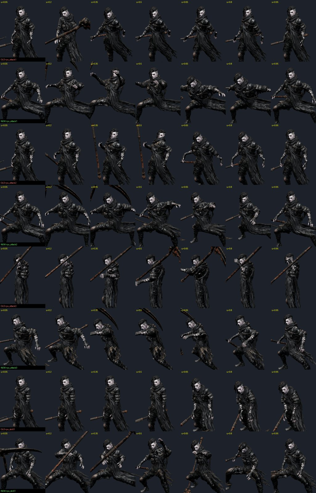
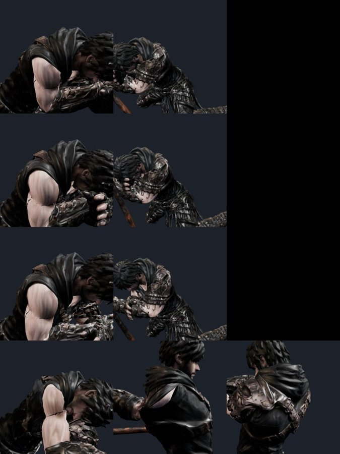
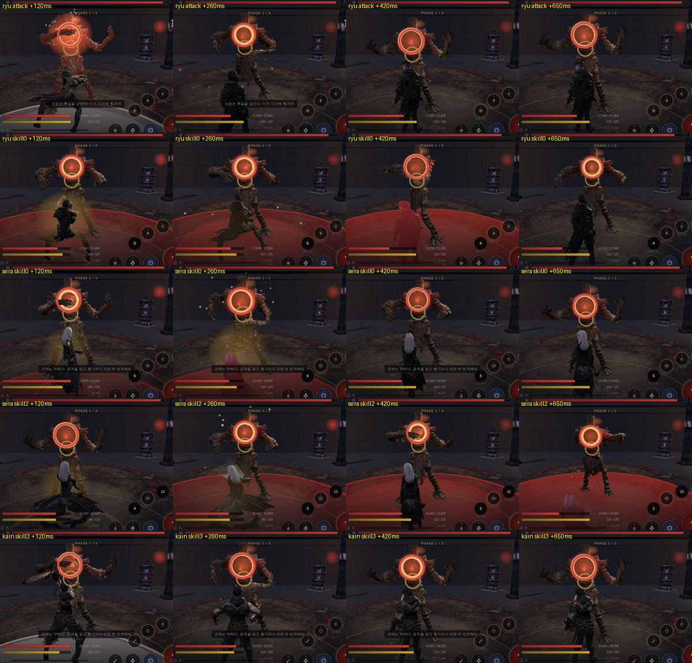

# 85 — 레퍼런스를 보고 스킬·공격 모션 넣기 (2026-09-25)

디렉터: 「유투브나 블로그 영화등등 봐서 스킬 모션을 보고 스킬과 공격 모션을 넣어줘」

## 1. 무엇을 봤나

- **유튜브는 봇 확인에 막혔다** — 로그인 쿠키로 우회하지 않았다(77번과 같음).
- 대신 위키 공식 API(api.php)로 **움직이는 그림 78개**를 받아 프레임을 뽑았다 — 마영전 스킬 미리보기 40(이비 낫·린 쌍검·허크·카록·피오나),
  엘든 링 전기 17, 세키로 8, 명조 9, 오공·다크소울·DMC 4. 콘택트 시트 156장(스크래치, 게임 저작물이라 저장소엔 안 넣는다).
- **숫자 근거는 엘든 링 프레임 데이터**(https://er-frame-data.nyasu.business/ , 게임 파일 TAE 추출, 30 fps): 낫 R1 1~4 판정 시작 14/18/18/22f,
  차지 R2 44f·2타, 대검 R1 슈퍼아머가 판정 7f 전부터, 단검 R1 판정 8~10f, 퀵스텝 무적 0~15f, 패리 4~10f.
  몬헌은 모션값·차지 1초/단계만(MHWiki), 세키로 튕겨내기 0.2초. 일반 원칙: 약공격 스윙 0.2~0.4초·예비 0.1~0.2초, 히트스톱 1~4f(MoCap Online),
  예비 동작은 반응 0.25초 이상(GDKeys), 히트스톱은 피해에 비례·상한(사쿠라이 칼럼).
- **쓸 수 있는 무료 클립 (CC0, 상업 가능, 이 망에서 받아짐)**: Quaternius UAL 1·2(UE 마네킹 뼈대 — 손가락까지), KayKit Character Animations 1.1(Medium·Large 리그).
  반다이남코 모션 데이터셋은 CC BY-NC 라 **못 쓴다**, Mixamo 는 로그인이 필요해 뺐다.

스킬별 레퍼런스·단계 시간 제안은 `docs/design/ref/skill-motion-research-v1.md`(모바일 압축값은 전부 「근거 없음」).

## 2. 먼저 찾은 것 — 스킬과 몸짓이 안 맞았다

처음 굽기(rig_char.py) 때 KayKit 기본 클립을 칸만 채워 둔 스킬이 남아 있었다:

| | 스킬 | 이름 | 있던 몸짓 |
|---|---|---|---|
| 카인 | 4 | 지면 강타 | **두 손 드는 주문**(Spellcast_Raise) |
| 카인 | 2 | 철벽 | **점프**(Jump_Full_Short) |
| 세라 | 1 | 부식 시약(투척) | **총 쏘기**(1H_Ranged_Shoot) |
| 세라 | 3 | 연쇄 폭발 | **총 연사**(1H_Ranged_Shooting) |
| 류 | 기본 1~3 | 쌍단검 | **한손** 베기·내려치기·찌르기(왼손 단검은 놀고 있었다) |
| 류 | 1 | 쌍날 난무 | 쌍수 찌르기 한 번 |

## 3. 바꾼 것

`tools/3d/meshy-retarget.mjs` 를 일반화했다 — `--rig meshy|ual|kk|mixamo`, `--clip 이름`.
UAL·KayKit 은 **T 자세**라 «쉬는 자세 대비 회전 변화» 를 그대로 옮기면 팔이 몸 속으로 들어간다.
원본 뼈 방향을 우리 뼈(A 자세) 방향으로 돌리는 최소 회전을 기준 자세에 곱해 맞췄다(비틀림은 상대 변화라 상쇄).
KayKit 에 없는 목·쇄골·Spine1 은 부모를 따라간다. 휴대폰 영상 AI 모캡(Mixamo 뼈대로 내보내기)도 `--rig mixamo` 로 바로 들어온다.

| 캐릭터 | 칸 | 새 소스 | 옵션 | 판정 시각 |
|---|---|---|---|---|
| 세라 | skill1 부식 시약 | UAL2 `OverhandThrow` | 척추 0.75 | .29 (손 놓는 순간) |
| 세라 | skill3 연쇄 폭발 | KayKit `Ranged_Magic_Shoot` | — | .20 |
| 카인 | skill4 지면 강타 | KayKit Large `Melee_2H_Slam` | 팔 55° 상한·웅크림 0.75·척추 0.7 | .33 |
| 류 | attack1·2·3 | KayKit `Melee_Dualwield_Attack_Slice/Chop/Stab` | 팔 60° | .50 / .43 / .24 |
| 류 | skill1 쌍날 난무 | KayKit Large `Melee_Dualwield_SlashCombo` | 팔 60° | .65 (마무리 왼날) |

판정 시각은 오른손 최고속으로 잡고 `tests/punch.test.mjs`(최고속 ↔ 판정 0.12 안)로 확인 — 류 난무는 연타라 두 손 중 최고속(마무리 왼날 .65)으로.

![세라 — 위 옛 · 아래 새 (부식 시약, 정제 안개[안 씀], 연쇄 폭발)](../img/85-sera.jpg)
![카인 — 철벽[안 씀], 지면 강타](../img/85-kain.jpg)

**안 쓴 것**: 카인 철벽 ← KayKit `Melee_Block`(방패 막기라 두 팔을 활짝 벌려 어색), 세라 정제 안개 ← `Dodge_Backward`(제자리로 바꾸니 허공에 앉은 모양).

## 4. 확대 검수 · 실제 던전

- 류 넓은 자세(1타 u .65) 확대 — 찢어짐 없음.
- 카인 지면 강타(u .35~.55) 확대 — 두 주먹을 머리 앞으로 모을 때 **위팔 텍스처가 줄무늬로 늘어나고 겨드랑이 쪽 금**이 보인다.
  척추·웅크림을 줄여도 남았고, **기존 카인 스킬1(Meshy 해머)에도 같은 금**이 있다 — 새 클립 탓이 아니라 카인 위팔 텍스처 이음새·무게의 한계. 남은 일로 적는다.

실제 d01 에서 류 기본공격·쌍날 난무, 세라 부식 시약·연쇄 폭발, 카인 지면 강타를 발동 — 모두 명중, 에러 0 (카인은 첫 발 명중 뒤 쿨타임).

## 5. GPT 모캡 기획팩 v1

`docs/design/ref/mocap_plan_v1/` — «모캡 → 무기 제약 정리 → 게임용 과장 → 이벤트 태깅 → GLB» 하이브리드, 40 스킬 단계·이벤트 규격, 촬영 목록.
우리 흐름과 같다. 여기서 할 수 없는 것은 **촬영** 하나다: 디렉터가 폼·PVC 대용 무기로 휴대폰 영상을 찍어 Rokoko Video·DeepMotion 같은
영상 모캡에서 Mixamo 뼈대로 내보내 주면 `--rig mixamo` 로 옮기고, 3절처럼 판정 시각·확대 검수까지 한다.
먼저 할 넷(아인 낫 베기·카인 내려치기·류 난무·세라 투척) 가운데 류·세라는 이번에 바꿨고 아인·카인은 Meshy 전문가 클립이다.

## 6. 남은 것

- 카인 철벽·세라 정제 안개·아인 결의 — 맞는 무료 클립이 없다(방패 막기·백점프뿐). 촬영하거나 손으로 키포즈를 잡아야 한다.
- 세라 기본 2·3타는 아직 주문 몸짓이다(투척 계열로 바꿀 후보: KayKit `Throw` 좌우).
- 카인 위팔 이음새(4절).
- 새 클립은 KayKit 특유의 넓은 자세가 남아 있다 — 캐릭터 성격(류: 낮고 빠르게)에 맞춘 과장·타이밍 워프(`tools/3d/punch.py`)는 다음 차례.
