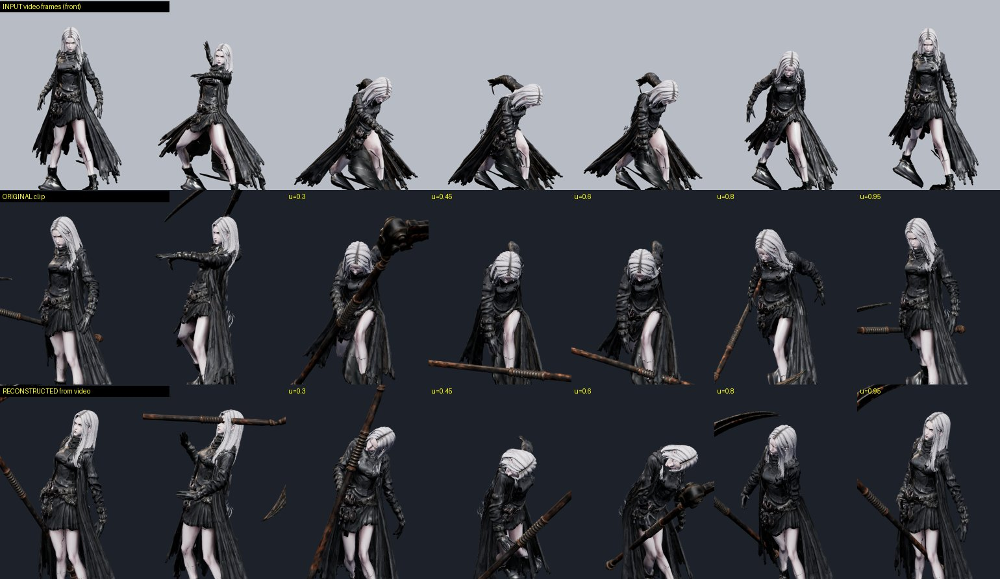

# 86 — 영상에서 모션 뜨기 (MediaPipe) · 정확도 검증 (2026-09-25)

디렉터: 「내가 애니메이션을 만들어서 올려주면 그걸 보고 모션캡쳐라던가 애니메이션을 딸 수 있나. 미드저니로 스킬의 대략적 분위기를 만들어서 보여주려고 하는데」

## 도구
1. `tools/3d/video-pose.py <영상.mp4|프레임폴더> <pose.json>` — MediaPipe Pose Landmarker(heavy, 구글, Apache-2.0)로 프레임마다 33 관절 3D(미터) + 화면 위치.
   모델 파일은 저장소에 넣지 않는다(30 MB): `pose_landmarker_heavy.task` 를 받아 `--model` 로. 이 컨테이너는 `libegl1 libgles2` 가 필요했다.
2. `tools/3d/pose-to-clip.mjs <pose.json> <클립이름> --target art/3d/<캐릭터>_anim.glb > clip.json` — 우리 뼈대 회전으로.
   빈 프레임 메우기 · 좌우 뒤바뀜 되돌리기(앞 프레임과 비교) · 가우시안 펴기 · 정면 +Z 맞추기 · 골반/가슴 틀 · 팔다리 방향 · 첫 프레임 머리 보정 · 낮은 발 바닥에.
3. `tools/3d/glb-put-clips.mjs` 로 넣고, 85번처럼 판정 시각·확대 검수·실전.

## 검증 — 정답이 있는 영상으로
우리 세라 부식 시약(85번 새 클립)을 고정 카메라로 «영상»(30 fps, 41 장)으로 렌더 → 뜨기 → 원본과 뼈 방향 각도 차(골반 기준 공간).

| 카메라 | 사람 잡힘 | 평균 오차 | 메모 |
|---|---|---|---|
| **정면 0°** | 93 % | **29.8°** | 가장 낫다 |
| 45° | 90 % | 35.8° | 깊이 숙인 프레임에서 윗몸을 반대로 꼰 것으로 읽음 |
| 옆 90° | 85 % | 46.5° | 왼팔·오른팔이 겹쳐 헷갈림 |
| 정면 + «뼈 길이로 깊이 다시 세우기» | — | 31.1° | 오히려 나빠 뺐다 |

- 어두운 옷 + 어두운 배경에서는 깊이 숙인 프레임 8 장을 놓쳤다(80 %) → 밝은 배경 90 %.
- 가만히 선 프레임도 17~21° — 한 대의 카메라로 깊이를 추정하는 한계. 카메라 쪽으로 숙이기·돌기는 약하다.
- **타이밍(예비·정점·회복의 시점)과 큰 자세는 맞는다** — 초안(블로킹)으로 쓰고 다듬는 용도.

## 미드저니 영상에 바라는 것
1. 머리~발 전신이 처음부터 끝까지 화면 안
2. 카메라 고정(줌·회전 없음), **정면** 또는 정면에서 조금 비낀 각도
3. 한 사람, 단색·밝은 배경, 몸과 대비되는 옷 색, 컷 없음
4. 동작 하나에 영상 하나(3~5초)
- AI 영상은 팔다리가 프레임마다 녹거나 바뀌어 사람 영상보다 더 흔들릴 수 있다 — 받으면 먼저 위 표처럼 잡힘 % 와 겹친 그림으로 보여 드린다.
- 무기는 추적하지 않는다(손에 붙인다). 도는 동작(회전 베기)은 약하다.
