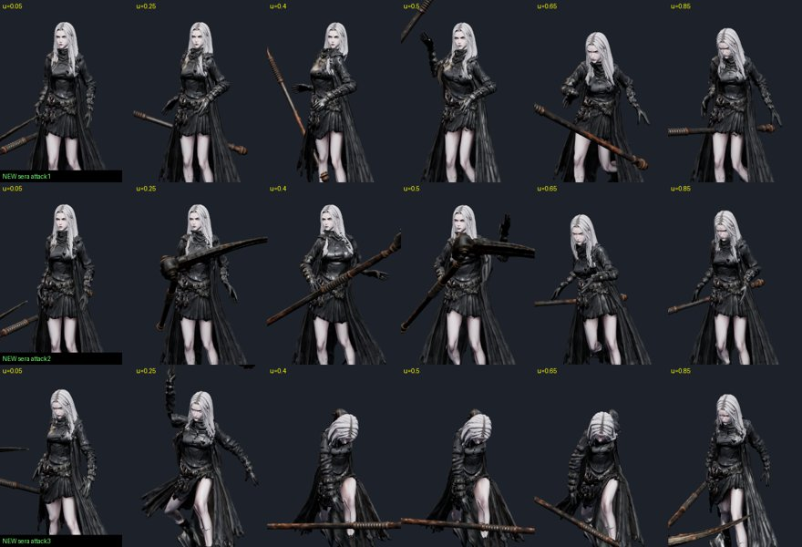
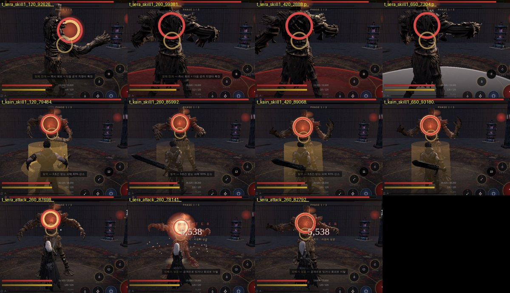

# 87 — 남은 모션 칸 채우기 · 회피 방향 버그 (2026-09-25)

디렉터: 「다음 진행해」 「게임에 적용시켜줘」 — 85번에서 «맞는 무료 클립이 없다» 고 남긴 칸들.

## 바꾼 것
| 캐릭터 | 칸 | 예전 | 이제 | 방법 |
|---|---|---|---|---|
| 카인 | skill2 철벽 | 점프 | 막기 올림(`guardUp`) | `tools/3d/clip-copy.mjs` 로 자기 클립을 skill2 칸에 복사 — 솔로·온라인 둘 다 «skill2» 로 부르므로 |
| 세라 | skill2 정제 안개 | 점프 | 누른 방향 회피(뒤·옆·앞) | 스킬 데이터 `dirClip:true` — 전용 도약 클립이 없으면 일반 회피처럼 방향 클립 |
| 세라 | 기본 2타 | 주문(Spellcast_Shoot) | **왼손 투척** | 1타(오른손 투척)를 `meshy-retarget --rig mixamo --mirror` 로 좌우 반전 |
| 세라 | 기본 3타 | 주문(Spellcast_Raise) | 크게 던지는 마무리 | UAL2 `OverhandThrow`, 척추 0.55(스킬보다 덜 숙임) |
| 아인 | skill4 결의 | — | 그대로 | 이미 낫을 가로로 세운 막기 자세였다 |

판정 시각: 세라 1·2타 .54(예전 1타는 공통 .38 이라 어긋나 있었다) · 3타 .29, 카인 철벽 .18(피해 없음, 검사용).

## 새 도구
- `tools/3d/clip-copy.mjs <캐릭터.glb> <원본> <새 이름>` — glb 안 클립을 다른 이름으로(→ glb-put-clips).
- `meshy-retarget.mjs --mirror` — 좌우 반전. 뼈의 «쉬는 자세 대비 회전 변화» 를 X 거울(q → x,−y,−z,w)로 반대 뼈에 준다(뼈 축 규약과 무관). 발 박기도 반대 발을 반전.
- `--rig ual1`(Quaternius UAL 1, Rigify `DEF-` 이름) 추가.

## 회피 방향 버그 (원래 있던 것)
방향 입력 없이 회피하면 **앞(보스 쪽)으로 이동하면서 «뒤로 빠지기» 클립**을 틀었다 — 몸은 뒷걸음질하는데 보스 품으로 미끄러져 들어갔다.
이제 방향 없이 피하면 뒤로 빠진다(백스텝, 다크소울 방식) — 실전: 보스와 거리 64 → 277, 보스를 계속 바라봄(0°). 아인 그림자 걸음(전용 클립)은 그대로.

## 실전 확인 (d01)
세라 1·2·3타 모두 명중(3/3), 정제 안개·카인 철벽 발동, 에러 0. (자동 봇은 이 환경에서 화면이 느려 «동작이 끝난 뒤» 다음 입력을 줘야 했다 — 게임 문제가 아니라 측정 방법.)

