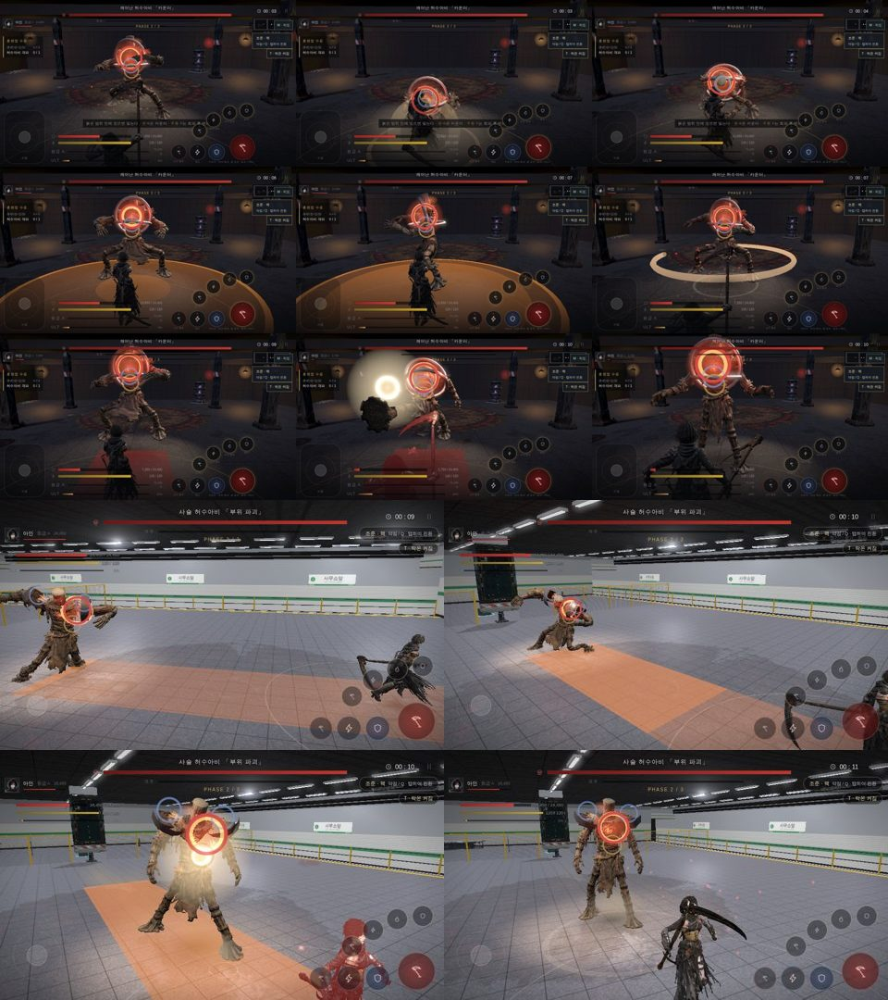
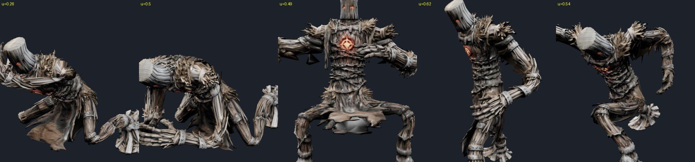
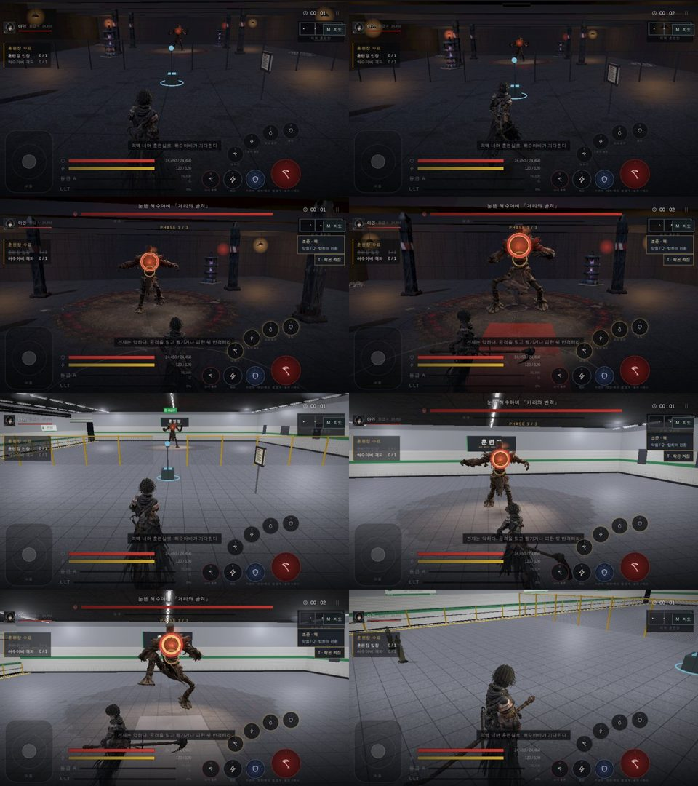
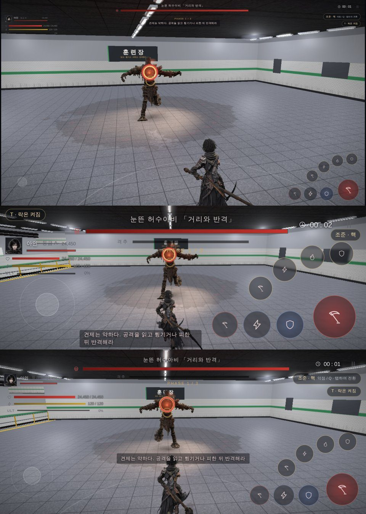

# 88 — 허수아비를 진짜 보스로 · 지하철 개조 훈련장 · 깔끔한 전투 UI (2026-09-25)

디렉터: 「던전을 허수아비 보스를 진짜 보스처럼 만들자. 서서 원만 생기는게 아니라 스킬 구현도 좀 하고 기본 공격도 있고.
던전도 이게 지하철을 개조한 공간이잖아. 너무 어두울 필요도 없고 전에 벤치마킹했던 게임들처럼. 조작패드도 그렇고 ui도 깔끔하게 하고. 맵은 필요없어.」

## 1. 보스 — 기본 공격 + 기술

예전엔 팔을 벌리고 선 채 몸짓이 거의 없는 클립 셋(내려찍기·회전·찌르기)이 바닥 원만 띄웠다.
CC0 라이브러리(KayKit·Quaternius UAL2)에서 맨손 공격을 골라 `tools/3d/meshy-retarget.mjs` 로 보스 뼈대에 옮겼다(`art/3d/boss_anim.glb`).

| 클립 | 원본 | 판정 시각 |
|---|---|---|
| `atk_hookR` / `atk_hookL` | Quaternius UAL `Melee_Hook` (왼손은 좌우 반전) | .54 |
| `atk_kick` | KayKit Large `Melee_Unarmed_Kick` | .35 |
| `atk_slam` | KayKit Large `Melee_Unarmed_Smash` (3.47초) | .26 |
| `atk_charge` | UAL2 `Shield_Dash_RM` | .62 |
| `atk_spin` | KayKit Medium `Melee_2H_Attack_Spin` | .49 |

| 단계 | 기본 공격 | 기술 |
|---|---|---|
| 1 | 앞차기(단발 — 카운터를 먼저 배운다) · 원투 훅(두 번째를 튕긴다) | 양손 내려찍기 |
| 2 | 원투 훅 | 양손 내려찍기(2.2초마다) · **돌진**(튕기기·막기 불가, 옆으로 피한다) |
| 3 | 앞차기 · 훅·훅·내려찍기 3연계 | **회전 후려치기**(막기 불가) · **도약 내려찍기**(멀리서 뛰어든다) · 돌진 |

- 판정 모양(`js/dungeon.js` d01 zones)과 전진 거리(`js/dungeon-content.js` attackMotion): 돌진은 460 px 들이받고, 도약은 360 px 뛰어든다.
- 2·3단계는 **멀리서도 공격을 시작**한다(시작 거리 300 → 520·560). 먼 거리 기술(range far = 240 px 밖)이 240~300 사이에서만 골라져서 사실상 안 나왔다.
- 맞는 순간의 이펙트(`bossSwingFx`): 내려찍기는 충격파 두 겹과 흙먼지, 돌진은 몸 충돌 섬광과 먼지, 앞차기는 발끝 섬광, 회전은 허리 높이 원호, 훅은 주먹 섬광. 빠르게 움직이는 동안 발밑에 먼지 꼬리가 남는다.
- 온라인 레이드(`server/raid.cjs`)도 같은 패턴 데이터를 쓴다.

**수치 조정(근거 없음, 테스트로 확인)**
- 1단계 피해 4,000~5,200: 이보다 낮으면 «막 누르기» 가 1단계를 깼다(`tests/balance.cjs` 는 막 누르기가 실패해야 한다).
- 회전 후려치기 예고 0.95초 → 1.45초(예전 값): 3연계에 기력을 쓴 뒤 곧바로 오는 막기 불가 공격이라 2인 봇이 전멸했다. 봇에 맞춘 것이 아니라 예전에 맞춰 둔 예고 길이로 되돌린 것이다.

**확대 검수**: 내려찍기(.26·.50)·돌진(.62)·훅(.54)은 찢어짐·늘어짐이 없다. 회전(.49)은 다리를 넓게 벌려 **치마 밑면이 회색 판처럼 펴져 보인다** — 전투 카메라 높이에서는 거의 안 보이지만 남은 일로 적는다.

## 2. 지하철 승강장을 개조한 훈련장 (`env:'subway'`)

`js/game3d.js` `buildSubway` — 충돌 격자는 그대로 두고 그림만 바꿨다.
- 흰 타일 벽 + 초록 노선 띠 + 검은 걸레받이, 60 cm 화강석 바닥.
- 북쪽 벽 한 줄은 **승강장 끝**이 된다: 흰 선, 노란 점자 블록, 노란 안전 난간, 그 너머로 1.25 m 아래 선로(자갈·침목·레일), 건너편 타일 벽에 역명판 「사무소앞」, 양 끝은 어두운 터널.
- 천장 형광등 줄(인스턴스), 흰 형광 점광원 4개, 반구광 1.3배. 붉은 비상등·보라 탱크·환풍기는 뺐다.
- 동쪽 벽에 「훈련장」 현판, 남쪽 벽에 옛 노선도·훈련 수칙, 격벽 위 비상구 표지, 대기실 벤치.
- 3단계 «비상등이 들어왔다» 분위기 변화는 그대로 남겼다.

## 3. 전투 UI (전 던전 공통)

- **지도 없음** — 미니맵과 「M · 지도」 버튼을 뺐다.
- 체력·기력·궁극기: 아래 가운데 → **왼쪽 위 초상 밑** 가는 줄. 등급·골드 줄은 던전에서 뺐다.
- 이동 스틱: 상자와 「이동」 글자를 없애고 옅은 원만 둔다. 누르면 그 자리에 뜨고 진해진다.
- 버튼: 글자 이름을 빼고 아이콘만(키 표시는 PC 에서만 작게). 쿨타임은 **부채꼴로 줄어든다**.
- 조준·락온: 오른쪽 위 작은 알약. 의뢰 목록은 탐색 중에만 작게.
- 좁은 폰(세로 272 px): 락온은 왼쪽 맨 위, 체력은 초상 밑.

## 4. 남은 것
- 보스 회전 공격의 치마 밑면(1절).
- 역명판·현판은 캔버스 글씨다 — 나중에 미술 텍스처로 바꿀 수 있다.
- 벙커(d03·d04·d07)는 이번에 안 건드렸다.
