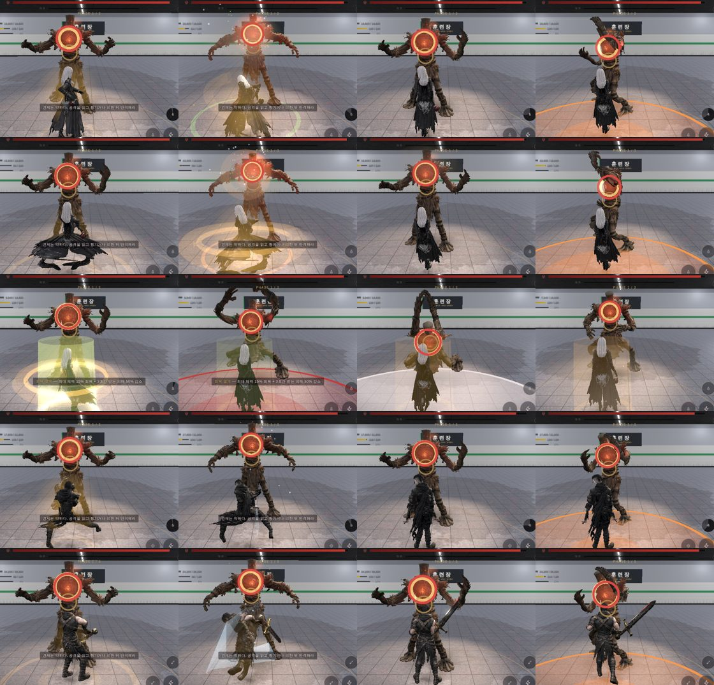

# 89 — 스킬 20종 모션 이벤트 (GPT 설계 → 반영) (2026-09-25)

디렉터: 「깃허브 배포할 스킬 지피티한테 받은거 … 이거보고 하면돼」 (ChatGPT 공유 대화 + 구글 드라이브 파일)

## 1. 받은 것

- **ChatGPT 대화** — GPT 는 «4캐릭터 × 스킬4 + 궁극기 = 20종» 을 «버튼 → 한 번 맞음» 에서 **모션 이벤트 기반**으로 바꾸는 코드를 짰지만,
  GitHub 쓰기에서 `403 Resource not accessible by integration` 으로 막혀 **한 줄도 반영하지 못했다**고 적었다(브랜치 `gpt/skills-complete-20260925`).
  설계 요지: 아인 피의 회전 2접점, 카인 대검 내려치기 파괴 보너스·강철 회전 2접점·지면 강타 자세 피해, 류 쌍날 난무 3타·칼날 폭풍 3타·붉은 그림자 5타,
  세라 부식 시약 release → detonate → hit, 연쇄 폭발 투척 + 2폭발, 회복 결계 회복 + 방어. **총 배율은 올리지 않고 나눈다.** 온라인에도 같은 판정. 테스트 실패 시 배포 막기.
- **구글 드라이브 파일** — 로그인이 필요한 비공개 공유라 받지 못했다(401). 그래서 GPT 코드를 붙인 게 아니라 **위 설계를 지금 코드(ae0673c)에 새로 구현**했다.
  GPT 초안은 d39c9c5 기준이라 그 뒤 바뀐 보스·던전·UI 와 어차피 충돌했을 것이다.

## 2. 구현

`js/skill-events.js` — 솔로(`js/combat.js`)와 온라인(`server/raid.cjs`)이 같이 쓰는 사건표.

| type | 뜻 |
|---|---|
| `hit` | `hits:[[클립 비율, 가중치]…]` — 가중치 합 1. 한 스킬 안에서 여러 번 맞는다 |
| `throw` | `at`(손을 떠나는 클립 비율) · `flight`(초) · `blasts:[[지연, 가중치]…]` — release 에 겨냥, detonate 에 피해 |
| `dodge` · `buff` · `heal` | 판정 없음. heal 은 최대 체력 비율만큼 회복 + 버프 |

클립 비율 → 행동 시각: 판정 시각(hitAt)이 클립 접점(clipHit)에 못 박혀 있으므로 앞뒤를 곧게 편다.

| 캐릭터 | 스킬 | 사건 |
|---|---|---|
| 아인 | 낫 베기 · 결의 · 그림자 걸음 · 낫의 황혼 | 1타 · 버프 · 회피 · 1타(출혈 3) |
| 아인 | 피의 회전 | **2타** .55 / .80 (55 : 45) |
| 카인 | 대검 내려치기 | 1타 + **부위 파괴 피해 ×1.5** |
| 카인 | 강철 회전 | **2타** .38 / .60 |
| 카인 | 지면 강타 | 1타 + **자세 +30** |
| 카인 | 모루의 심판 | **2타** .22 / .89 — 두 번째가 본타(35 : 65) |
| 류 | 쌍날 난무 | **3타** .37 / .47 / .65 |
| 류 | 칼날 폭풍 | **3타** .41 / .61 / .74 |
| 류 | 붉은 그림자 | **5타** .30 ~ .68 |
| 세라 | 부식 시약 | **투척 .29 → 0.28초 비행 → 폭발** |
| 세라 | 연쇄 폭발 | 투척 .20 → **폭발 2번**(0.26초 · +0.2초) |
| 세라 | 회복 결계 | **최대 체력 15% 회복** + 3초 50% 감소 |
| 세라 | 촉매 폭발 | 큰 병 투척 .22 → 0.36초 → 대형 폭발 |

- 접점 비율은 클립의 손 속도 봉우리를 재서 골랐다(류·카인·세라). 류 칼날 폭풍·카인 강철 회전은 골반이 한 바퀴 도는 구간 안의 봉우리다.
  **아인 피의 회전 두 번째(.80)·비행 시간·회복 15%·파괴 ×1.5·자세 +30 은 「근거 없음」** (아인 Meshy 클립은 원본 손이 화면 손이 아니라 잴 수 없다).
- 다단의 규칙: 배율은 가중치만큼, 반격·자세·잡기·궁극기 게이지는 **첫 타에만**, 출혈은 **마지막 타에만**, 무작위 출혈도 첫 타에만(타수가 늘었다고 출혈이 늘지 않게).
- 던진 병은 던진 뒤 구르거나 다른 행동을 해도 날아가 터진다. 던지기 전에 맞아 동작이 끊기면 안 던져진다.
- 솔로에서 빠져 있던 스킬 분기 B 의 출혈·자세 보너스가 이제 솔로에도 들어간다(온라인은 원래 들어갔다).
- 화면(`js/game3d.js`): 다단 앞 타는 작은 섬광·흔들림, 마지막 타에 큰 연출. 세라 병은 손에서 포물선으로 날아가 터진다(시약 초록 · 연쇄 주황 · 촉매 보라). 회복은 초록 기둥 + «+숫자».
- 온라인 화면(party-online.js)은 아직 release/detonate 연출이 없다 — 판정·피해는 서버가 같은 규칙으로 낸다.

실제 d01 에서 발동해 센 명중 수: 류 쌍날 난무 3, 카인 강철 회전 4(2타 × 2부위), 세라 연쇄 폭발 4(2폭발 × 2부위), 세라 시약 1, 에러 0.

## 3. 테스트 · 배포 관문

- `tests/skill-events.test.cjs` 8개: 20종 계약, 다단 타수·순서, 나눠 맞아도 총 피해가 같음(±5 %), 시약 비행·던진 뒤 구르기,
  연쇄 폭발 2회, 회복량·최대치, 카인 파괴 ×1.5·자세 +30, 온라인 서버도 같은 사건표.
- `.github/workflows/pages.yml`·`android.yml` 에 `test` 작업을 넣고 배포·APK 가 `needs: test` — **테스트가 하나라도 실패하면 배포하지 않는다.**
  서버 테스트가 Node 22 기능을 써서(Node 20 에서 9개 실패) 관문은 Node 22 로 돈다. 새로 받은 저장소에서 `npm ci && npm test` 17초.

## 4. 남은 것
- 20종 전용 모캡 클립은 아직이다 — 지금 클립 위에 사건만 얹었다. 클립을 바꾸면 `ev` 의 비율만 다시 잰다.
- 온라인 화면의 투척·폭발 연출.
- 드라이브 파일을 «링크가 있는 모든 사용자» 로 열어 주면 GPT 초안과 이번 구현을 대조한다.
