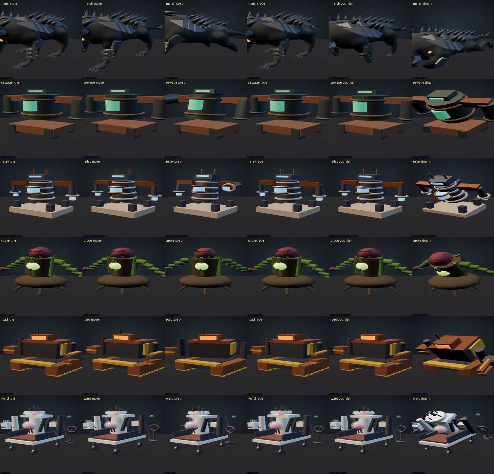

# 90 · 보스 전투 언어 — 대기부터 공격준비·반격·격추까지

> 2026-09-26 · 디렉터 지시: 프로젝트 안의 보스 정보를 기준으로, 보스별 전투 행동을 실제 전투에 넣는다.
> 범위: d02 모르버스 · d03 오염 수문기 · d04 과부하 계전기 · d05 모근체 · d06 파쇄 기갑 · d07 소생기.

## 1. 이번에 바꾼 핵심

기존 전투는 `chain / hold / counter window / break` 판정은 있었지만, **전투 상태가 보스 몸에 충분히 드러나지 않았다.**
이번 변경은 수치 판정을 갈아엎지 않고 그 위에 보스별 전투 언어를 얹는다.

```
IDLE
  ↓ 거리 조정 / 배회
POSITION
  ↓ 패턴 선택
TELEGRAPH (공격 준비)
  ↓ 공격 목적지 확정
COMMIT / CONTACT
  ↓ 연계가 있으면
LINK → TELEGRAPH → CONTACT
  ↓
RECOVER
  ↓
IDLE

중간 분기: HIT / DEFLECT / REPEL / CLASH / BREAK / STAGGER / DOWN
```

중요한 계약은 **판정은 `combat.js` / `raid.cjs`, 그림은 `boss-motion.js`** 가 가진다는 것이다.
보스 몸을 더 크게 움직여도 타격 시각·피해량·카운터 창을 몰래 바꾸지 않는다.

## 2. 공통 상태 표현

- **대기**: 숨, 엔진 떨림, 코어 박동, 덩굴 흔들림처럼 보스의 재질/생물학에 맞는 작은 2차 운동.
- **거리 조정**: 접근만 하지 않고, 너무 가까우면 물러나고, 선호 거리에서는 좌우 배회한다.
- **공격 준비**: 아이콘별 공용 동작이 아니라 보스별 노드(머리·꼬리·배관·접점·덩굴·턱·주사기)를 실제로 감아 읽히게 한다.
- **공격 이동**: 공격 시작 때 목적지를 확정한다. 플레이어가 피한 뒤 추적 보정하지 않는다. `rush/heavy/snap/glide` 네 곡선과 lateral 오프셋을 사용한다.
- **반격 반응**: 흘림(deflect) < 튕김(repel) < 맞대기(clash) 순으로 반동을 크게 한다.
- **부위 파괴**: 해당 파츠의 공격이 빠지거나 범위/속도/예고가 바뀌는 기존 데이터를 유지하고, 몸 전체가 한 번 크게 반응한다.
- **격추**: `stagger → down → up` 을 별개 상태로 유지한다. 평소 피격과 같은 움찔로 처리하지 않는다.

## 3. 보스별 전투 성격

### d02 모르버스 — 짐승, 추격과 꼬리의 원심력
- 대기: 등·머리 호흡 + 꼬리 끝의 작은 좌우 운동.
- 이동: 가장 적극적으로 배회하고 측면을 잡는다. 광란에서는 배회 속도가 더 커진다.
- 돌진 베기: `rush`. 낮게 웅크렸다가 앞다리로 밀고 들어간다.
- 대지 강타: `heavy`. 위로 들고 0.35초 버틴 뒤 체중을 떨어뜨린다.
- 꼬리 휘두르기: lateral + `snap`, 회피 전용. 꼬리 파괴 시 패턴 자체가 빠진다.
- 부위: 등 견갑=자세 손실, 앞다리=추격 감속, 꼬리=범위 축소.

### d03 오염 수문기 — 압력 기계, 반복과 압력 해제
- 대기: 압력 핵 박동, 흡입/배출관의 미세 진동.
- 이동: 거의 앵커형. 플레이어가 너무 붙으면 조금 밀어내고 다시 정면을 잡는다.
- 압력 망치: `heavy`, 흡입관이 살아 있으면 되돌림 2타.
- 고압 분사: `snap` 3연속. 앞 두 타는 회피를 강제하고 마지막 비트에 반격 기회를 준다.
- 배출관 쓸기: lateral 지연타. 배출관 파괴 시 제거.
- 과압 폭발: 전역 회피 전용. 압력 핵 팽창이 공격 준비 신호다.

### d04 과부하 계전기 — 충전과 방전, 좌우 접점
- 대기: 좌우 접점 chatter + 코일 충전 호흡.
- 이동: 중거리 유지, 작은 궤도 이동으로 각도를 바꾼다.
- 접점 내려찍기: 좌→우→중앙 연계. 파괴된 접점에 해당하는 비트가 빠진다.
- 모선 방전: 가장 긴 hold(0.45초), 코일이 부푼 채 정지한다.
- 접점 쓸기: lateral `glide`, 두 번째 회전이 반격 타이밍.
- 과부하 방전: 전역 회피 전용.

### d05 모근체 — 식물, 휘어짐과 되튐
- 대기: 줄기와 좌우 덩굴이 서로 다른 위상으로 흔들린다.
- 이동: 뿌리 자체는 느리지만 몸을 기울여 측면 압박을 준다.
- 덩굴 후려치기: `snap`, 좌우 덩굴 연계. 파괴된 덩굴 비트가 빠진다.
- 아가리 내려찍기: `heavy` hold. 꽃받침/머리가 열렸다 닫히는 것이 준비 신호.
- 뿌리 쓸기: lateral 회피 전용.
- 포자 분출: 코어 팽창 후 전역 분출. 막을 수 없다.

### d06 파쇄 기갑 — 중량 기계, 낮은 차체와 관성
- 대기: 엔진 진동 + 파쇄 턱/평형추의 작은 유격.
- 이동: 직진 압박이 강하고 배회는 최소.
- 파쇄 물기: `snap` 2~3타, 턱 파괴 시 후속 비트 축소.
- 차체 돌진: `rush`, 가장 큰 전진 커밋. 피한 뒤에는 추적하지 않는다.
- 평형추 강타: `heavy` hold, 큰 원심력 후 지면 접촉.
- 과부하 배출: 동력로 팽창 → 전역 방출.

### d07 소생기 — 의료기계, 인공호흡과 견인
- 대기: 인공호흡 2박 + 심박 코어 2회 후 쉼.
- 이동: 중거리에서 상대를 돌며 펌프/견인 팔의 각을 만든다.
- 주사 연타: `snap`, 주사기 다발이 뒤로 당겨졌다 연속 찌르기.
- 견인 후려치기: `rush`, 갈고리/견인줄이 먼저 열리고 몸이 따라온다.
- 압박: `heavy` hold, 가대 전체가 올라갔다 멈춘 뒤 내리누른다.
- 약물 분무: 코어와 약물계가 팽창 후 전역 분무. 회피 전용.

## 4. 구현 파일

- `js/boss-motion.js`: `BOSS_PROFILES`, `createBossBehavior()` — 보스별 idle/prep/recover/reaction additive layer.
- `js/world-sim.js`: 접근 + 너무 가까울 때 후퇴 + 선호 거리 배회.
- `js/boss-director.js`: 공격 이동 곡선 `rush/heavy/snap/glide`, lateral 커밋.
- `js/dungeon-content.js`: 보스별 `ai`와 `attackMotion` 성격표.
- `js/game3d.js`: 솔로 보스 상태에 behavior 적용, 카운터/파괴/경직 반응 연결.
- `js/party-online.js`: 온라인도 같은 behavior를 재생.
- `boss-combat-review.html`: 실제 보스 자산을 대기/배회/공격 준비/광란/카운터/격추로 즉시 비교하는 QA 화면.

## 5. 검수 계약

1. **프레임 누적 금지**: additive 보정은 매 프레임 `restore → mixer → apply` 순서로 한 번만 적용한다.
2. **실제 노드에 붙는가**: 여섯 보스 실제 자산을 로드해 profile 노드의 80% 이상이 존재하는지 검사한다.
3. **수치 불변**: 이 작업은 boss HP/damage/counterWindow를 조정하지 않는다.
4. **공격은 커밋**: 돌진 중 플레이어가 옆으로 피했다고 보스가 곡선을 틀어 다시 맞추면 실패다.
5. **반격 단계가 읽혀야 함**: deflect < repel < clash 시각 반동이 단계적으로 커야 한다.
6. **부위 파괴가 전투 문법을 바꿔야 함**: 파츠가 부서졌는데 같은 패턴/범위/속도로 계속 싸우면 실패다.

## 6. 자동 검수

- `tests/boss-combat-language.test.mjs`
- `tests/boss-ai-personality.test.cjs`
- `tests/boss-behavior-bind.test.mjs`
- 기존 `boss-director / boss-readability / dungeon / marsh / pump` 회귀 검사와 함께 실행한다.

현재 패치 환경의 보스 관련 묶음은 **35/35 통과**했다. 전체 `npm test`는 Pages 배포 artifact에 `node_modules/ws`가 없어 서버 테스트가 시작 단계에서 실패한다. 이건 보스 패치 회귀와 분리해서, 실제 저장소에서 `npm ci` 후 전체 테스트로 최종 확인한다.

## 7. 적용 기록 (Claude, 2026-09-26)

인수인계 `boss-v01.patch`(SHA256 `a11d7ce6…4f018` 확인, 기준 `d39c9c5`)를 최신 main `7495901` 에 적용했다.
패치에 blob 정보(index 줄)가 없어 `--3way` 가 불가능해 `git apply --reject` 로 넣고, 거부된 한 곳만 손으로 병합했다.

- `js/dungeon-content.js` 첫 hunk: 최신 main 의 d01(지하철 허수아비, 88번) 공격 이동을 유지하고 d02 `ai`·`attackMotion` 만 반영.
- 문서 번호: `88-boss-combat-language.md` → `90-…` (88번은 이미 허수아비·지하철·UI 문서).
- **d06 평형추 강타의 `lateral:28` 을 뺐다.** 이 문서 3절의 d06 설계(「직진 압박, 배회 최소」, 평형추 = heavy hold 후 지면 접촉)에 옆걸음이 없고,
  이 값 때문에 `tests/party-raid.test.cjs` 의 2인 봇이 d06 2단계에서 전멸했다(과부하 배출 4회 피격, 기존 1회). 곡선 `heavy` 는 유지.
  보스 HP·피해·카운터 창은 건드리지 않았다.
- `boss-combat-review.html`: `let holder=…;scene.add(holder),mixer=null,…` 에서 선언이 끊겨 `mixer is not defined` 로 화면이 뜨지 않던 것을 고쳤다.

검수: `npm ci` 뒤 보스 관련 묶음 37/37, 전체 `npm test` 372/372 통과. 검수 화면에서 d02~d07 × 대기·배회·준비·광란·카운터·격추 36장, 오류 0.
d06 실제 보스전에서 대기 → 공격 준비 전환, `boss.behavior` 연결(프로필 «파쇄 기갑») 확인.


