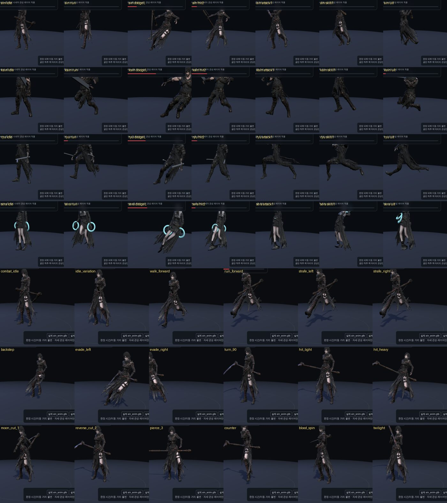
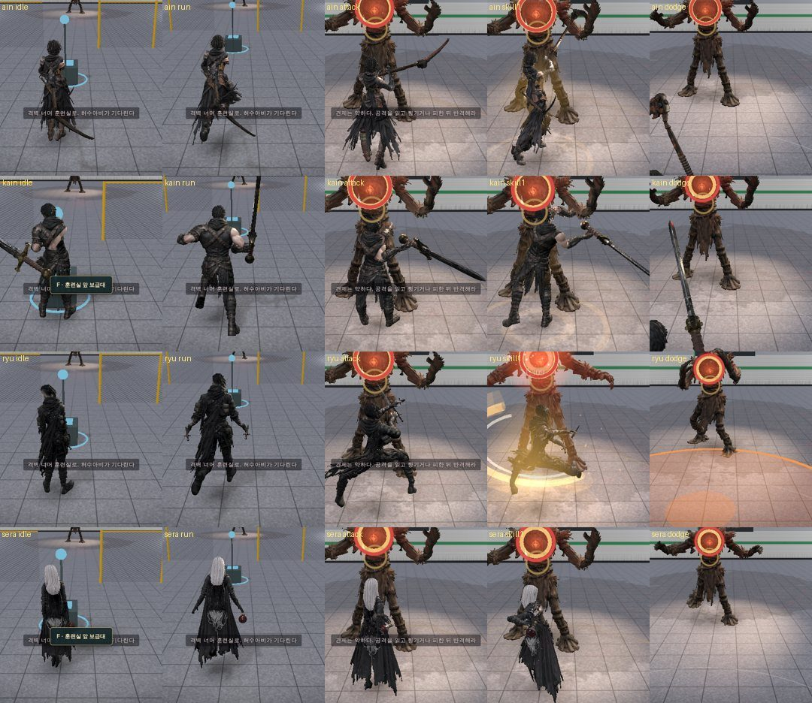
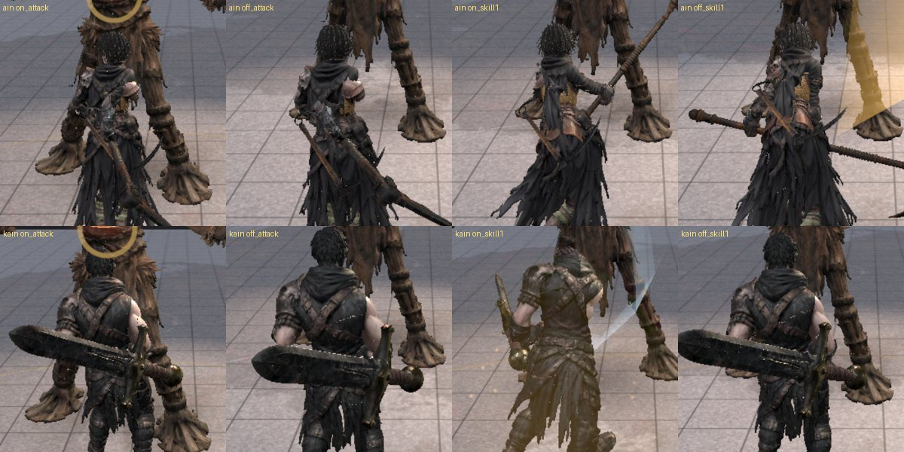

# 91 · 4캐릭터 시네마틱 전투 모션 v01 — 영화 액션 + 무협식 흐름

> 디렉터: “전투모션을 매끄럽고 영화 액션씬·무협씬처럼. 캐릭터 특성에 맞는 모션부터 완성될 때까지.”

## 원칙
빠르게 재생하는 걸 영화 액션이라고 보지 않는다. 모든 전투 동작은 `준비 → 가속 → 접점 → 여운 → 복귀`가 보여야 한다.
이 레이어는 전투 판정 시간, 공격 배율, 이동 거리, 무적 시간을 바꾸지 않는다. AnimationMixer와 기존 무기/IK가 만든 자세 위에 골반·척추·목·머리의 작은 관성만 더하고 다음 프레임 전에 정확히 되돌린다.

## 캐릭터별 전투 언어
- **아인 · 월광 유도형** — 낮은 중심, 큰 원호, 흘림 회피, 시선 선행. 가장 무협적인 흐름.
- **카인 · 철괴 압축형** — 발이 버티고 골반·등·대검이 뒤따른다. 준비와 여운이 가장 길고 피격 반응은 작다.
- **류 · 연속 탄성형** — 발이 먼저 튀어나가고 공격 복귀가 짧다. 다음 접점으로 바로 연결되는 빠른 탄성.
- **세라 · 정밀 제어형** — 몸의 흔들림을 억제하고 장치/투척 동작만 선명하게. 머리 안정이 가장 크다.

## 베이스 12종
`combat idle / idle variation / walk / run / strafe L/R / backstep / evade L/R / turn 90 / hit light / hit heavy`를 공통 언어로 정의하고, 같은 상태라도 캐릭터별 진폭·관성·전환 시간을 다르게 둔다.

## 공격·스킬
`attack1~3 / smash / skill1~4 / counter / ult / exec` 전체에 캐릭터별 프로필을 둔다. 손뼈를 직접 수정하지 않아 아인의 양손 낫 IK와 카인·류·세라의 기존 무기 애니메이션을 깨지 않는다.

## 전환 리듬
- 아인: 공격 진입 65ms, 피니셔 회복 220ms — 선명한 접점 + 부드러운 여운.
- 카인: 공격 진입 85ms, 피니셔 회복 260ms — 중량감을 위해 가장 느린 연결.
- 류: 공격 진입 45ms, 피니셔 회복 150ms — 연속 접점을 위해 가장 빠른 연결.
- 세라: 공격 진입 60ms, 피니셔 회복 190ms — 정확하고 절제된 연결.

## 구현 파일
- `js/character-cinema.js` — 4캐릭터 시네마 프로필 + additive motion layer + transition table.
- `js/game3d.js` — mixer → 기존 무기/IK → cinema 순서로 적용. restore는 역순.
- `tests/character-cinema*.test.mjs` — 프로필 완전성, 누적 변형 없음, 전환 차이, wiring 검증.
- `ain-cinematic-motion-review.html` — 아인을 실제 `ain_anim.glb` + 실제 낫으로 자세히 확인하는 검수 페이지.
- `character-cinematic-motion-review.html` — 아인·카인·류·세라를 실제 각 캐릭터 GLB로 바꿔가며 idle/run/dodge/hit/attack/skill/ult를 확인하는 통합 검수 페이지.

## 검수
선택 모션 테스트 16/16 PASS. 전체 `npm test`는 337 중 330 PASS이며 실패 7개는 GitHub Pages artifact에 `ws` node_module이 빠진 서버 테스트뿐이다. 모션/클라이언트 회귀 실패는 없다.
QA 파일은 실제 GLB 뼈대 샘플을 읽어 생성했다.

## 적용 기록 (Claude, 2026-09-26)

인수인계 `character-cinematic-v01-final.patch`(기준 `7495901`)를 최신 main `9f69ce1` 에 적용했다.

- **해시**: 받은 파일 SHA256 `06a30955…c153f` 는 페이지 상단 「Patch SHA256」과 일치, 지시문 3번의 `2d558357…de82` 와는 다르다. 디렉터 승인 후 적용.
- **파일 끝 잘림**: 마지막 줄 줄바꿈이 없어 `corrupt patch` 로 거부됐다. 적용 뒤 새 파일 6개가 패치의 `+` 줄과 글자 단위로 같은지 대조했다.
- 문서 번호 88 → 91 (88·90 은 이미 있음). `sw.js` 에 `js/character-cinema.js` 추가.
- **발 꺼짐 수정**: 골반만 내려 «중심을 낮추면» 다리 IK 가 없어 발까지 바닥 아래로 들어갔다(백스텝 중간 — 카인 12 · 아인 8.5 · 류 7.4 · 세라 5.7 cm).
  골반을 옮기거나 돌린 프레임에는 끝에서 두 다리를 `solveLimb`(js/combat-motion.js)로 원래 발 위치에 되돌리고 무릎을 굽힌다 → 최대 카인 1.7 · 아인 1.3 · 류 0.7 · 세라 0.4 cm.
  `tests/character-cinema-feet.test.mjs` 가 실제 GLB 로 3 cm 이하를 지킨다.
- **검수 페이지 두 곳 수정**: 아인 상세 — 상태를 바꿀 때 이전 클립이 섞여 걷기·달리기·옆걸음·백스텝이 대기 자세로 보였다(페이드 없을 때 이전 클립 정지).
  4캐릭터 — 캐릭터를 바꾸는 동안 준비 전 프레임이 돌아 `restore`/`duration` 오류(프레임 루프에 준비 확인).

검수: `npm ci && npm test` 379/379. 4캐릭터 × 대기·달리기·좌 회피·강 피격·1타·스킬1·궁극기, 아인 18상태 캡처 오류 0.
게임(d01)에서 네 캐릭터 대기 → 달리기 → 1타 → 스킬1 전환, 무기 그립 정상. 몸통·목 확대(레이어 켬/끔) — 찢어짐·늘어짐 없음.
전투 판정 시각·피해량·이동 거리·무적 시간은 바뀌지 않는다(`combat.js` 무변경, wire 테스트가 action 시각 재기록 금지를 확인).

