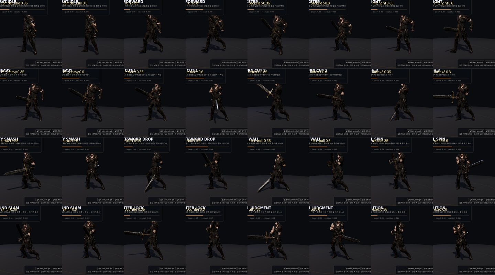
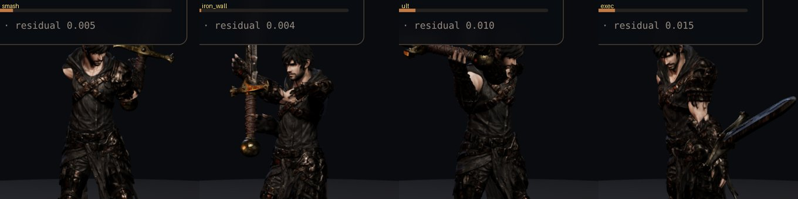
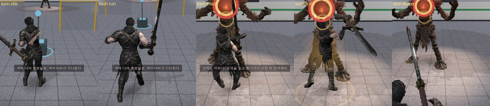

# 92 · 카인 시네마틱 중량 전투 모션 v02

> 목표: 카인을 “느린 캐릭터”가 아니라 **무게를 압축해 한 번에 전달하는 캐릭터**로 보이게 한다.
> 전투 판정 시간, 피해량, 이동 거리, 무적 시간은 바꾸지 않고 화면에 보이는 몸의 흐름만 강화한다.

## 핵심 전투 언어

- **발/골반 선행**: 팔로 대검을 휘두르는 게 아니라 골반에 하중을 모으고 흉곽이 뒤늦게 따라온다.
- **접점 동기화**: v01의 고정 46% 리듬이 아니라 실제 `action.hitAt / duration`에 압축·충격을 맞춘다.
- **철벽**: `skill2`는 피해 행동이 아니므로 별도 액션 타이머를 만들지 않는다. 현재 클립 위에 낮은 골반·앞쪽 압축만 얹는다.
- **카운터**: 받아낸 접점에서 잠깐 잠기는 시각적 hold를 만들고 곧바로 체중으로 밀어낸다.
- **여운 기억**: 대검을 멈추자마자 몸이 0으로 리셋되지 않도록, 접점 이후의 작은 yaw/pitch/drop을 상태로 기억했다가 5.4/s로 감쇠한다.
- **양손 보존**: 손·팔 뼈는 v02 레이어가 건드리지 않는다. `makeRigAdapter`의 양손 그립 보정이 마지막 권한을 가진다.

## 모션별 방향

| 모션 | 시각 언어 |
|---|---|
| attack1 | 발 고정 → 몸통 감기 → 대검 끌어내기 |
| attack2 | 반대 발로 하중 이동 → 역방향 회수 베기 |
| attack3 | 짧은 압축 → 전진 체중 마무리 |
| smash | 가장 큰 하체 압축, 접점 직후 긴 회수 |
| skill1 | 긴 준비를 버틴 뒤 실제 판정 시각에 몸 전체가 같이 내려간다 |
| skill2 | 대검을 방패처럼 세우고 골반을 낮춘 철벽 |
| skill3 | 팔만 도는 회전이 아니라 골반·흉곽이 대검을 끌고 돈다 |
| skill4 | 넓게 심은 중심 → 지면 강타 → 무거운 복귀 |
| counter | 접점 잠금 → 체중 밀어내기 |
| ult | 가장 긴 압축 + 가장 강한 접점 + 가장 긴 여운 |
| exec | 수직축을 완전히 심고 끝내는 확정 피니시 |

## 구현

- `js/character-cinema.js`
  - `KAIN_CINEMA_V02` 프로필 추가
  - 실제 `hitAt` 기준 접점 압축
  - 대검 follow-through momentum memory
  - run/walk 시 작은 하중 bob
  - iron wall / counter lock 전용 자세
  - model visual offset도 `restore()`로 정확히 복구
- `tests/kain-cinematic-v02.test.mjs`
  - contact sync
  - 손뼈 무변형
  - iron wall restore
  - follow-through 감쇠
- `kain-cinematic-motion-review.html`
  - 실제 `kain_anim.glb` + 실제 `w_kain_greatsword.glb`
  - base / attack / skill / counter / ult 검수

## 검수

선택 회귀 + 신규 검사 `20/20 PASS`.

QA:
- `qa/kain_cinematic_base12_v02.png`
- `qa/kain_cinematic_combat10_v02.png`
- `qa/kain_cinematic_weight_v02.mp4`

다음 단계는 류. 카인의 반대축으로 **짧은 접지 → 탄성 진입 → 빠른 재연결**을 강화한다.

## 적용 기록 (Claude, 2026-09-26)

인수인계 `kain-cinematic-v02.patch`(누적본, 기준 `7495901`)를 최신 main `9523350` 에 적용했다.

- **해시**: 받은 파일 SHA256 `66685801…a40a` 는 페이지 상단 값과 일치, 지시문 3번의 `3cd5e812…6960` 과는 다르다(v01 때와 같은 양상).
- **누적본 처리**: v01 부분(검수 페이지 2 · 테스트 2 · 문서 · `game3d.js` 연결)은 main 에 이미 들어간 것과 같아 건너뛰었다.
  바뀐 것은 `js/character-cinema.js` 하나뿐이라 v01 을 공통 조상으로 `git merge-file` 3-way 병합했다.
  충돌 한 곳(선언부) — main 의 발 재고정(91번 적용 기록)과 v02 의 `modelShift`·여운 상태를 둘 다 살렸다. `modelShift` 도 발을 옮기므로 재고정 대상에 넣었다.
- 새 파일: `kain-cinematic-motion-review.html`, `tests/kain-cinematic-v02.test.mjs`, 이 문서(89 → 92, 번호 중복).
- 게임의 `battle.snapshot().player.action` 에 `hitAt` 이 들어 있어 v02 의 «실제 판정 시각에 압축» 이 게임에서도 그대로 동작한다.

검수: `npm ci && npm test` 384/384. 발 꺼짐(실제 GLB) 카인 최대 1.1 cm. 카인 검수 페이지 16상태 × 2시점 오류 0, 4캐릭터 검수 페이지 오류 0.
손·팔 뼈는 v02 가 건드리지 않고(테스트), 두 손이 같은 척추 사슬 아래라 몸통을 돌려도 대검 그립은 유지된다. 게임(d01) 카인 대기·달리기·1타·스킬1·회피 오류 0.
확대(스매시·철벽·모루의 심판·처형) 찢어짐·늘어짐 없음. 판정·피해·이동·무적 수치는 그대로(`combat.js`·`raid.cjs` 무변경).

