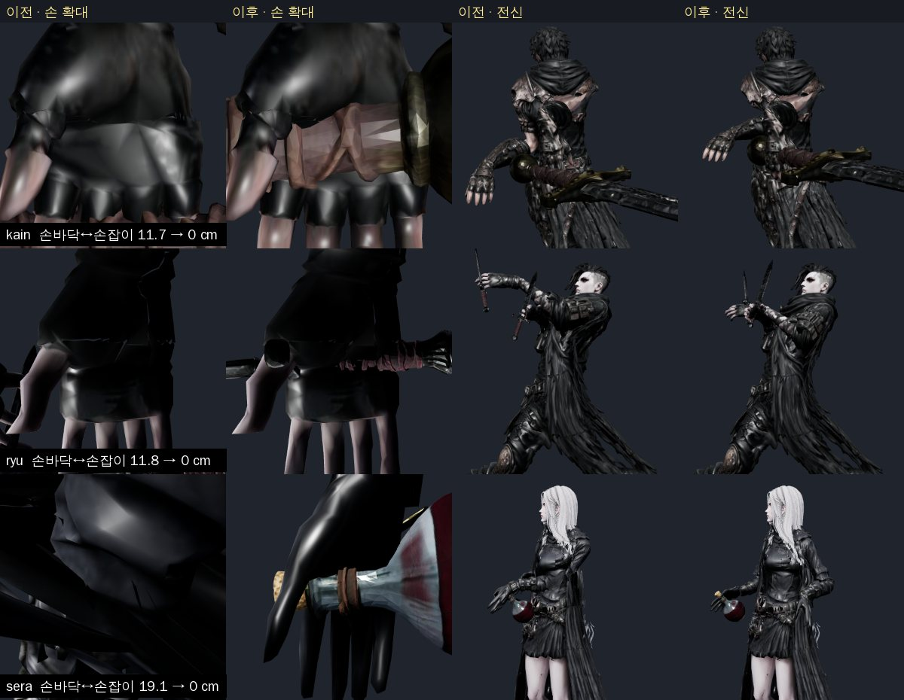
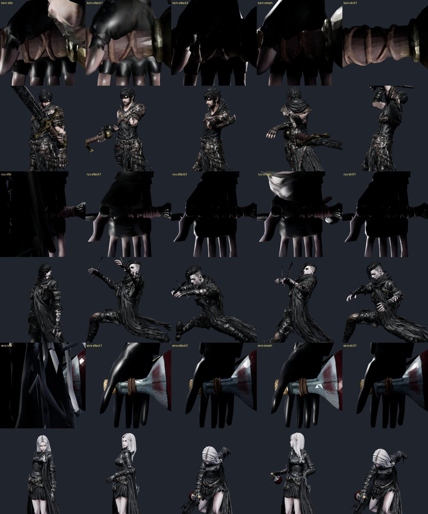
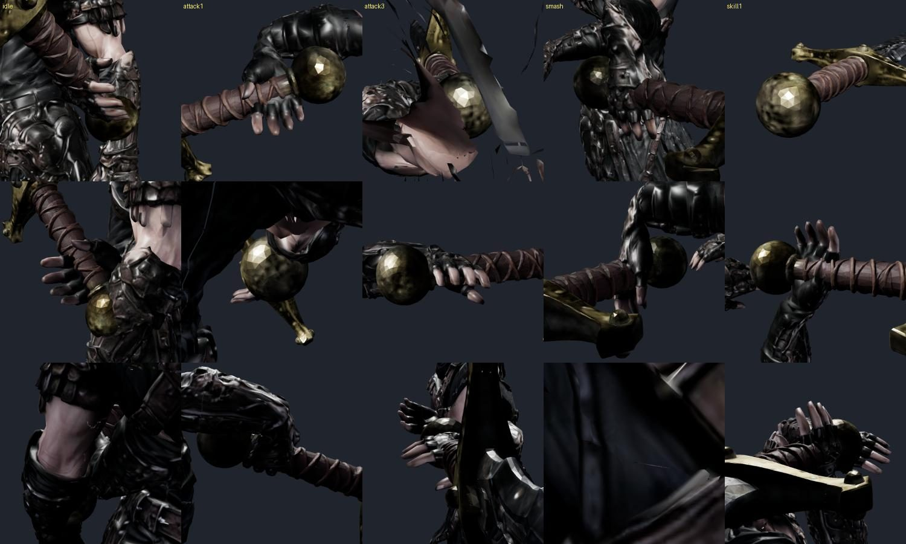
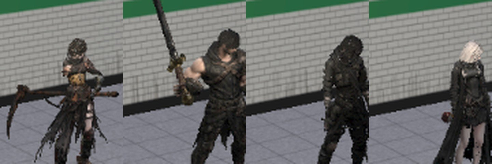

# 93 — 무기 그립 선행 확정: 4캐릭터 손 소켓 (2026-09-26)

디렉터: 「근데 검이 안 붙었잖아. 미리 잡고 가야지. 캐릭터 전부 미리 잡고 가자」

## 1. 무엇이 틀렸나

- 카인·류·세라는 다시 리깅(docs/design/77)할 때 손 관절이 손목 쪽으로 옮겨졌다. 무기는 «옛 관절 자리»(`rerigAnchor`)에 달았는데,
  이 자리가 **손바닥에서 11.7 cm(카인) · 11.8 cm(류) · 19.1 cm(세라)** 떨어져 있었다. 무기가 손 밖에 떠 있었다.
- 손 자리 뼈(`HandSlot`)는 클립이 **회전**을 준다. 옛 자리는 그 뼈의 16 cm 앞이라, 뼈가 돌면 무기가 지렛대처럼 손 밖으로 휘돌았다.
- 양손 보정(IK)이 **캐릭터를 가리지 않고** 공격 중 왼손을 오른손 무기 축으로 끌어왔다 — 류(쌍단검)·세라(시약)도. 또 손 관절을 댔기 때문에 손바닥은 13~29 cm 떠 있었다.
- 온라인(`js/party-avatar.js`)은 무기마다 쥐는 자리를 무시하고 전부 0.75 m 로 달았다 — 42 cm 단검·22 cm 병이 손에서 멀리 떨어졌다. 류 왼손 단검도 없었다.
- 아인은 따로 잰 쥐는 자리(`ain-grip-shape.js`, 손가락 말기 포함)가 이미 있어 4.3 cm — 이번에 바꾸지 않았다.

## 2. 고친 것

| 곳 | 내용 |
|---|---|
| `js/looks.js` `palmOf` | 손바닥 중심 = 손 뼈 무게 0.6 이상 정점의 바인드 자세 중심(손 뼈 로컬). 0.6 은 「근거 없음」(손목 소매를 빼려고 고른 값) |
| `js/looks.js` `gripOf` | 손 **그립 노드** = 손 뼈 자식, 자리는 손바닥 중심(고정), 방향은 매 프레임 `HandSlot` 의 손 기준 회전을 따른다. 이제 무기는 손바닥을 중심으로 돈다 |
| `js/looks.js` `anchorOf` | `HandSlot` 에 옛 관절 자리가 있으면 그립 노드를 준다 → `attach`(주무기·쌍수 왼손)·`TW_LOOKS.anchor`(게임 IK)·외형 화면이 모두 같은 점을 쓴다. 아인은 옛 자리를 지웠으므로 그대로 |
| `js/looks.js` 시약 | 병 **목**을 쥔다(던지는 손). 흐린 병 0.05 → 0.17 m (목 반지름 2.7 cm, 몸통 6.7 cm 는 손을 삼켰다) · 시약병 0.19 · 촉매 관 0.12 — 병 모델 높이별 반지름을 재서 골랐다 |
| `js/combat-motion.js` | `makeRigAdapter(…, {twoHand})` — 양손 그립은 **카인 대검만**. 왼손은 손 관절이 아니라 **손바닥**을 손잡이 축에 댄다(팔을 돌리면 손 방향이 바뀌어 세 번 되풀이) |
| `js/game3d.js` · `js/party-avatar.js` | 같은 그립 노드 · 무기별 쥐는 자리 · `twoHand: 카인`. 온라인 류 왼손 단검 추가 |
| 검수 페이지 | `kain-cinematic-motion-review.html` · `character-cinematic-motion-review.html` 도 같은 그립 노드(전에는 옛 자리·손 뼈에 바로) |
| `tools/3d/grip-audit.html` | 게임과 같은 경로로 붙여 손바닥(빨강)·그립(초록)·왼손(파랑)을 표시, 손 뼈 축 기준 근접 촬영 `hshot`, 거리 `metrics()` |

## 3. 결과

| 캐릭터 | 손바닥 ↔ 손잡이 | 왼손 손바닥 ↔ 손잡이 축 (공격 중, u=.35) |
|---|---|---|
| 아인 | 4.3 cm (변경 없음) | 3.6 cm (변경 없음) |
| 카인 | 11.7 → **0 cm** | 15~17 → **1.3~7.7 cm** (공격1 7.7 · 공격3 3.5 · 스매시 1.3 · 스킬1 5.5) |
| 류 | 11.8 → **0 cm** | 양손 보정 끔 — 왼손은 자기 단검을 쥔다 |
| 세라 | 19.1 → **0 cm** (병 목) | 양손 보정 끔 |

클립 5종 손 확대 + 전신: 

카인 대검 주변 90 cm 세 방향(대기·공격1·공격3·스매시·스킬1): 

실제 d01 화면(아인·카인·류·세라): 

- 확대 검수: 손 메시는 건드리지 않았다(무기 자리만 옮김) — 찢어짐·늘어남 없음. 몸 스키닝 변경 0.
- `tests/weapon-grip.test.mjs` 2개(실제 GLB): 그립이 손 정점 상자 안 + 가장 가까운 정점 3 cm 이내, 5개 자세에서 그립 방향 = 손 × HandSlot 회전, 그립 = 손바닥 중심;
  카인만 양손 — 왼손 손바닥이 대검 축 10 cm 이내(잰 값 최대 7.7), 류·세라는 가슴 기준 왼손이 1 cm 이상 움직이지 않음. 옛 코드로 돌리면 실패하는 것을 확인. `npm test` 386/386.

## 4. 남은 것

- **손가락**: 카인·류·세라 손은 손가락이 펴진 채 조각됐고 손가락 뼈가 없다. 손잡이는 이제 손바닥을 지나지만 손가락이 감싸지는 않는다.
  아인처럼 손 정점을 말아 쥔 모양(모프)을 캐릭터마다 만들면 확대 화면까지 «쥔 손» 이 된다 — 다음 단계로 제안. 손가락 말기는 찢어짐 확대 검수가 필수.
- 카인 공격1 왼손 7.7 cm 는 팔 길이 한계(어깨→손잡이가 팔보다 멀다). 클립 쪽에서 오른손을 몸에 붙여야 줄어든다.
- 세라 왼손은 비어 있다(원래 설계). 두 병 투척 연출을 쓰려면 왼손 소켓도 같은 그립 노드로 바로 달 수 있다.
