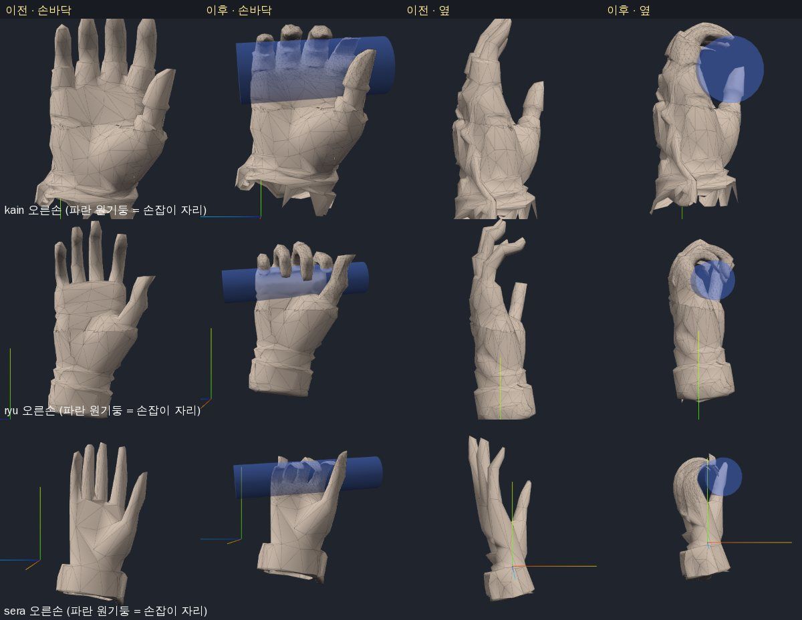
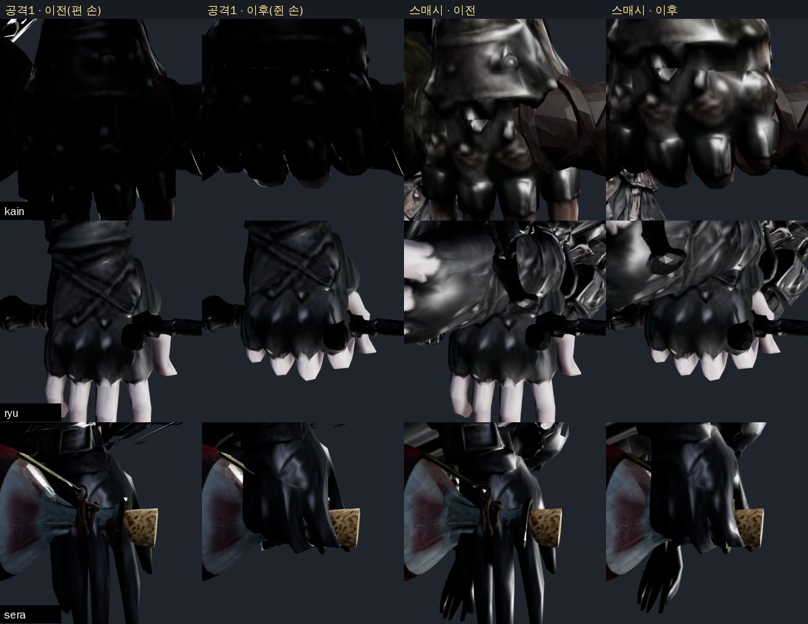
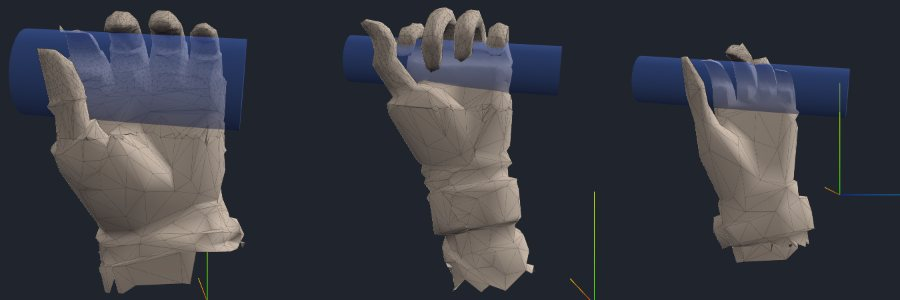
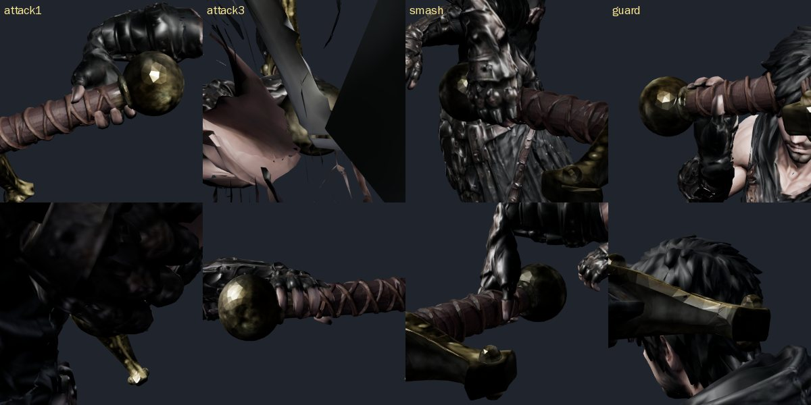
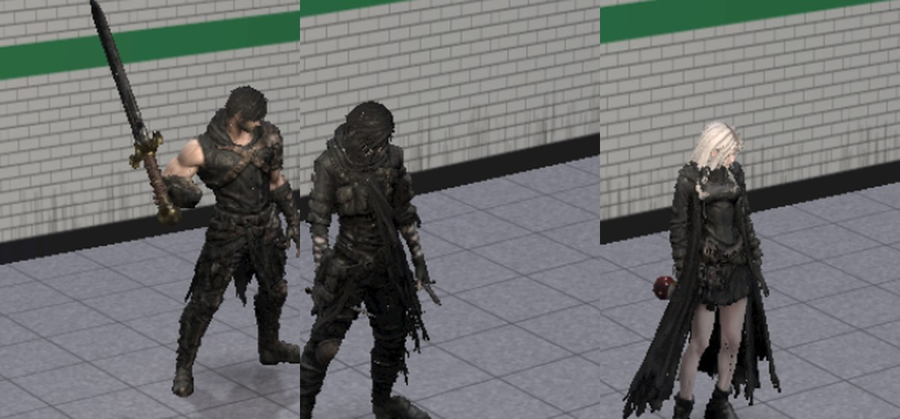

# 94 — 손가락 말기: 카인·류·세라 쥔 손 (2026-09-26)

디렉터: 「손가락 말기도 진행해. 캐릭터 전부」 (93 에서 무기를 손바닥에 넣은 다음 단계)

## 1. 문제

- 세 캐릭터는 손가락을 **편 채** 조각됐고 손가락 뼈가 없다. 93 에서 손잡이를 손바닥 가운데로 옮겼지만 손가락은 펴져 있었다.
- 아인은 이미 손 정점을 말아 쥔 모양(모프, `ain-grip-shape.js`)이 있다 — 같은 방식으로 세 캐릭터 양손을 만든다. 뼈는 만들지 않는다.

## 2. 방법 — `js/hand-grip.js`

손 뼈 로컬(바인드)에서 캐릭터 손마다 틀을 **메시에서 잰다** (`fitHandGrip`):

| 축 | 뜻 | 어떻게 |
|---|---|---|
| a | 무기 축 = 주먹 구멍 방향 | HandSlot 바인드 +Y. 클립이 카인 오른손 자리를 돌리는 폭은 전투 12° 이하(사망 41°), 류·세라 0° — 바인드 축으로 감아도 된다 |
| f | 손가락 방향 | 물갈퀴 바로 위 손가락 중심 → 손끝 중심. 손바닥 평면으로 잡으면 뒤로 젖혀 조각된 류·세라 손가락이 큰 고리로 감겼다 |
| n | 손바닥 쪽 | a × f, 오른손 +X · 왼손 −X (손만 떼어 렌더해 확인) |
| 뿌리 | 물갈퀴 − 1.2 cm | 물갈퀴 = 손 삼각형을 손바닥 평면에 그려 잰 손가락 사이 홈 바닥(엄지 홈 제외). 1.2 cm 는 「근거 없음」 |
| 손바닥 면 | 손가락 자체의 손바닥 쪽 면 | 뿌리 조각 전체로 재면 엄지 두덩이 잡혀 축이 손가락 앞 2 cm 에 떴다 |
| r | 손잡이 반지름(손 뼈 로컬) | 무기 모델에서 잼: 카인 대검 3.4~3.9 cm → 3.2 · 류 단검 1.2~2.6 → 1.8 · 세라 병 목 2.0 → 1.8 |

| 캐릭터 | 물갈퀴 높이(손 뼈 Y) 오른손 / 왼손 |
|---|---|
| 카인 | 19.0 / 18.8 cm |
| 류 | 15.3 / 19.6 cm (왼손 메시가 4 cm 위에 조각됨) |
| 세라 | 7.8 / 8.5 cm — 뿌리선이 기울어(검지 6.5 · 약지 8.8 cm) 가운데 값 |

- 뿌리 앞 r 거리의 축 C 둘레로 손가락을 **호 길이 그대로** 감는다(최대 3.5 rad, 「근거 없음」 — 넘으면 손끝이 손바닥을 뚫는다).
- **손가락 쪼개기**: 세라 손가락은 한 손에 정점 45 개(손가락 하나 = 뿌리·끝 두 점)라 감으면 곧은 현(지붕 모양)이 됐다. 손 영역의 7 mm 넘는 모서리를 나누고(「근거 없음」),
  이웃 삼각형도 나뉜 모서리 수대로 나눠 **T 자 이음이 없다**. 정점 카인 35 952 → 40 577 · 류 40 965 → 44 209 · 세라 69 825 → 73 775. 만드는 데 한 캐릭터 약 0.5 초(노드).
- 손가락 살이 손잡이 속으로 들어가면 굽는 만큼 손잡이 면에 눌러 붙인다(20 % 만 파고듦, 「근거 없음」).
- 손바닥 면보다 반지름 이상 앞(엄지 두덩, 뿌리 4 cm 위까지)은 감지 않는다 — 감으면 반대편으로 넘어가 류에서 6.5 배 늘어났다.
- **엄지는 곧게 둔다**: 같은 축으로 감아 봤으나 엄지는 손바닥 면보다 4~7 cm 앞에 있어 엄지 두덩이 최대 30 배 늘어났다 → 되돌림.
- 몸 지오메트리는 복제해 모프만 더한다(원본 GLB 불변). 온라인 파티 복제본은 쪼갠 지오메트리를 같이 쓴다(모프 세기는 따로).

## 3. 게임 연결

| 곳 | 내용 |
|---|---|
| `gripHands(model, char)` | 게임3D · 온라인(party-avatar) · 로비 · 초상 · 검수 페이지. 바람 준비와 무기 부착보다 **먼저** |
| 무기 그립 노드 | 손바닥 중심 → **주먹 구멍 가운데**(손 뼈 `gripPoint`, looks.js `palmOf`) |
| 세기 | 오른손 늘 1 · 류 왼손 늘 1(쌍단검) · 세라 왼손 0(빈손) · 카인 왼손은 양손 잡기 때 1(초당 14 로 따라감) |
| 카인 왼손 IK | 끝점을 손목 관절이 아니라 **주먹 구멍 점**으로 두고 푼다(`solveLimbPoint`). 관절+오프셋 되풀이로는 손목→주먹 20 cm·손목 각도 때문에 17 cm 남았다 → **0.0~0.1 cm** |
| 못 닿는 자세 | 오른손을 22 cm 당겨도 3~9 cm 넘게 모자라면 두 손 잡기를 풀고 왼손을 편다(억지로 허공에서 쥐지 않게) |

## 4. 결과

손만 떼어 본 모양(파란 원기둥 = 손잡이 자리): 

실제 캐릭터·클립에서 손등 쪽 확대 — 이전(편 손) · 이후(쥔 손): 

왼손(카인·류·세라): 

카인 두 손 잡기(공격1·공격3·스매시·가드, 두 방향): 

실제 d01 화면: 

| 계측(`tests/hand-grip.test.mjs`, 실제 GLB) | 카인 | 류 | 세라 |
|---|---|---|---|
| 쪼갠 뒤 열린 모서리 길이 변화(틈) | 0 | 0 | 0 |
| 8 mm 넘게 늘어난 모서리 | 0 | 0 | 0 |
| 모서리 최대 늘어남(오/왼) | 1.5 / 1.8 배 | 1.5 / 1.7 배 | 3.9 / 1.2 배 |
| 뿌리 1 cm 위 손가락의 손잡이 축 거리 ÷ r (최소) | ≥ 0.5 | ≥ 0.5 | 0.61 (손끝 살이 병 목에 파고듦) |
| UV 이음매 벌어짐 | 0 | 0 | 0 |
| 카인 왼손 주먹 ↔ 대검 축 (공격1·공격3·스매시·가드) | 0.0~0.1 cm | — | — |

- 확대 검수: 이음매·T 자 틈 0, 손가락 찢어짐 없음(손등·옆·손만 렌더). 뿌리 주름 5 mm 안쪽은 손잡이가 손바닥을 누르는 자리라 손잡이 반지름 안에 든다.
- `npm test` 389/389. 검수 도구: `tools/3d/hand-curl.html`(손만, 게임과 같은 코드) · `tools/3d/grip-audit.html`(`?grip=0` 편 손 비교).

## 5. 남은 것

- **엄지**: 곧게 서 있다. 엄지를 감으려면 엄지 두덩을 따로 옮기는 틀(엄지 뿌리 회전)이 필요하다.
- 카인 왼손은 주먹 구멍 **가운데**를 축에 댈 뿐, 주먹 방향을 손잡이 방향에 맞추지는 않는다 — 자세에 따라 손잡이가 주먹을 비스듬히 지난다.
- 무기마다 손잡이 굵기가 달라(류 단검 1.2 cm vs 쌍단검 2.6 cm) 캐릭터당 반지름 하나로 쥔다 — 가는 손잡이는 주먹과 몇 mm 뜬다.
- 휴대폰에서 모프 만드는 시간은 아직 재지 않았다(노드 0.5 초).
