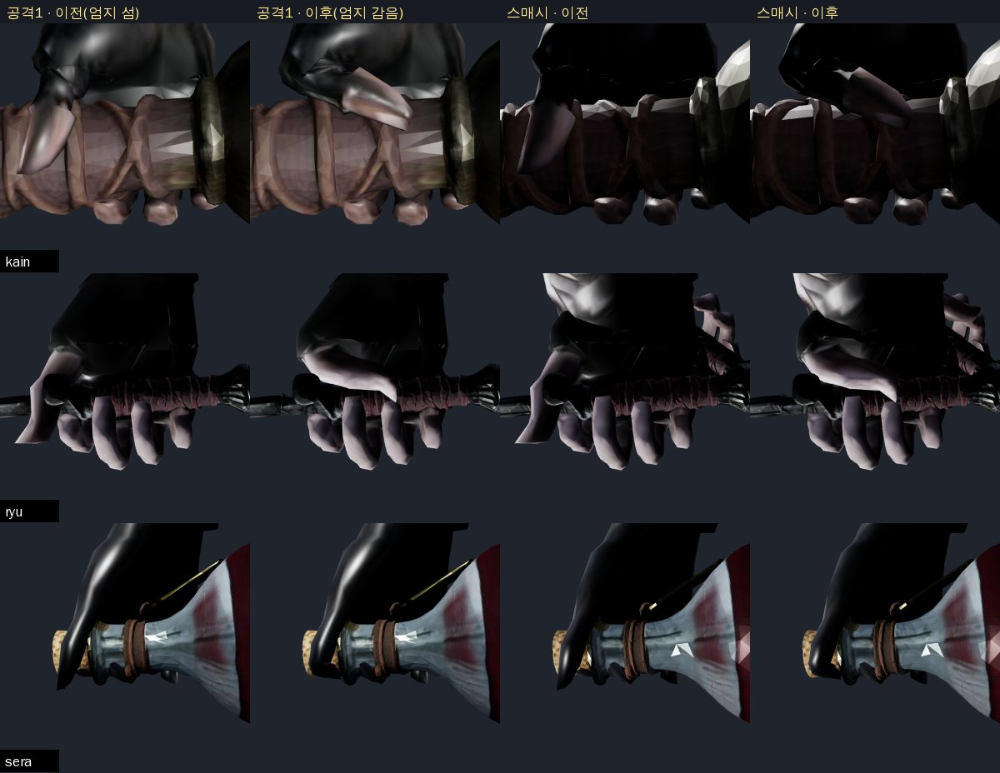
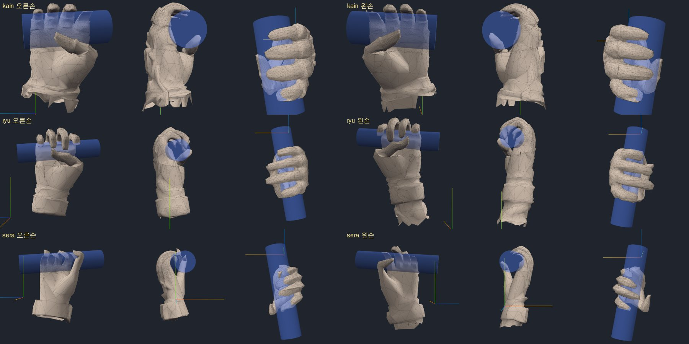
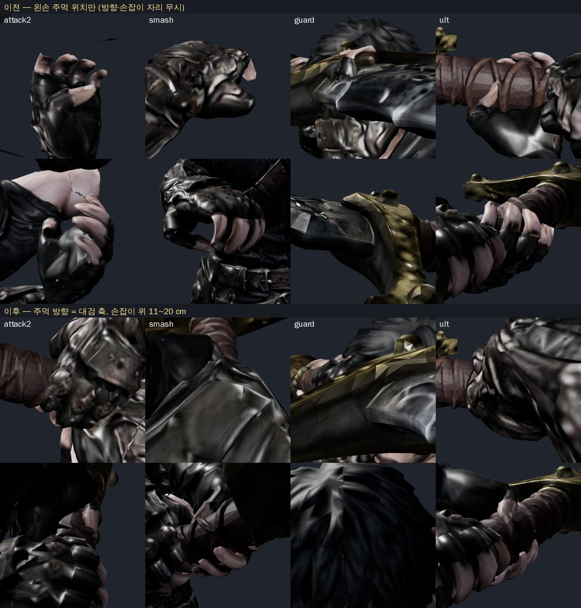

# 95 — 엄지 감기 · 카인 왼손 방향 (2026-09-26)

디렉터: 「엄지도 감아. 카인 왼손 방향도 맞추고」 (94 의 남은 것 두 가지)

## 1. 엄지 — 가상 엄지 마디 (`js/hand-grip.js` `fitThumb` · `thumbWeight`)

94 에서 엄지를 손가락처럼 손바닥 면 기준으로 감았더니 엄지 두덩이 30 배 늘어나 되돌렸다. 이번엔 엄지를 **따로** 다룬다.

- **엄지 찾기**: 손바닥 면보다 r+1 cm 넘게 **앞으로 나온** 덩어리(뿌리 3.5 cm 위까지, 검지 쪽 절반).
  손가락 폭 바깥(q)으로 찾으면 엄지가 손바닥 앞에 붙어 있어 카인·세라는 0 개였다. 손 정점을 (손가락 방향 × 손잡이 축) 지도로 그려
  앞 오프셋을 재 보니 카인 7~8 · 류 5~7 · 세라 4~6 cm — 거기가 엄지였다.
- **엄지 축**: 그 덩어리의 주축(거듭제곱법). **마디 J** = 엄지 축에서 손잡이 가운데 높이(엄지 길이 30~60 %).
  - 엄지 전체를 뿌리에서 돌리면 카인(엄지 11 cm, 뿌리가 손잡이 9 cm 아래)은 손바닥을 가로질러 손잡이 밑으로 삐져나왔다 → 마디에서만 꺾는다.
  - 세라 엄지는 끝까지 손잡이보다 낮아 마디를 60 % 에서 멈춘다(끝 40 % 는 늘 꺾임).
- **방향**: 망치 쥐기 — 끝마디가 주먹 앞을 가로질러 새끼 쪽(−a)으로 25° 들려 눕는다(「근거 없음」, 렌더로 확인).
  처음엔 «손잡이 둘레 115° 자리»를 겨눴는데 카인 엄지 끝이 이미 거기 있어 거의 안 움직였다 — 자리가 아니라 **방향**이 틀렸던 것.
- **꺾는 폭**: 마디 아래 35 % ~ 위 45 % (끝마디 길이 기준)에 걸쳐 서서히. 짧게 꺾으면 마디 바깥 살이 1~2 cm 늘어났다.
- **엄지만**: 엄지 축에서 엄지 굵기(축 거리 90 %)의 1.4 배 밖은 돌리지 않는다 — 세라 검지 앞 살이 같이 돌아 1 cm 늘어났었다.

손만 떼어 본 양손(파란 원기둥 = 손잡이): 

| 계측 | 카인 | 류 | 세라 |
|---|---|---|---|
| 엄지 끝마디 방향·손잡이 축 cos (바인드 → 쥔 손) | 위 → −0.9 이하 (가로) | 〃 | 〃 |
| 엄지 마디 바깥 최대 늘어남 (오/왼) | 0.9 / 0.8 cm | 0.9 / 1.7 cm | 0.7 / 0.5 cm |
| 손가락 8 mm 넘게 늘어난 모서리 · 틈 · 이음매 | 0 | 0 | 0 |

엄지 마디 늘어남은 두꺼운 엄지를 70° 쯤 꺾을 때 바깥 살이 늘어나는 것(실제 손도 그렇다) — 시험은 2 cm 로 막는다.

## 2. 카인 왼손 방향 (`js/combat-motion.js` `planLeftGrip` · `applyLeftGrip`)

94 는 왼손 **주먹 구멍 점**만 손잡이 축에 댔다 — 주먹 방향은 클립 그대로라 손잡이가 주먹을 비스듬히 지났다.

- 주먹 구멍 축(새끼→엄지)을 대검 축(칼날 쪽)에 맞춘다 — 오른손과 같이 엄지가 칼날 쪽.
- 남는 자유도 둘을 **재서 고른다**: 손잡이 둘레 돌림 φ(36) × 팔꿈치 돌림 ψ(13, ±120°). 값 =
  손목 꺾임(쉬는 자세 34° 넘는 만큼)² + 손목 비틀림² + 팔꿈치 비틀림(클립 대비)² + 팔꿈치 돌림² + 못 닿음².
  - 최소 회전만: 손목이 쉬는 자세보다 90~130° 더 꺾였다. 꺾임만 줄이면 아래팔 대비 비틀림 172°(손목 살이 꼬인다).
  - 손목 비틀림이 30° 넘으면 넘는 몫의 절반을 아래팔이 나눠 진다(실제 팔도 아래팔 전체가 돈다).
  - 클립 자체의 비틀림: 손목 최대 128° · 팔꿈치 최대 173° — 풀이 결과는 이보다 크지 않다.
  - 벡터 셈만(장면 갱신 없이) 468 개 후보 — 두 손 잡기 중인 카인 한 명만 돈다.
- **손잡이 자리**: 대검을 재 보니 폼멜 0.56~0.68 · 손잡이 0.69~1.00 · 코등이 1.02 m, 오른손은 0.75 — 폼멜 쪽엔 7 cm 뿐.
  전에는 왼손 목표가 축 위 어디든(폼멜 너머 허공까지) 갔다. 이제 무기마다 `hand2`(looks.js) = 오른손에서 칼날 쪽
  [주먹 폭 11 cm, 코등이 − 5 cm]: 대검 11~20 · 고철 11~30 · 분쇄 11~24 cm.
- **못 닿으면 놓는다**: 주먹 방향이 손목 각을 정하므로 팔이 모자랄 수 있다 → 모자란 만큼 오른손을 더 당기고(합 22 cm) 다시 푼다.
  그래도 4.5 cm 넘게 모자라면 두 손 잡기를 놓고 손을 편다(2.5 cm 안이면 다시 잡음 — 중간 세기로 멈추면 왼손이 허공에 떴다).
  잡기·놓기는 시간으로 따라간다(초당 10) — 행동 시작에 왼손이 손잡이로 «튀지» 않고 미끄러져 잡는다.

| 카인 (u=.35 등, 60 프레임 수렴) | 이전(94) | 이후 |
|---|---|---|
| 왼주먹 ↔ 대검 축 | 0.0~0.1 cm | 0.0 cm (공격1 접점 0.8) |
| 주먹 방향 ↔ 대검 축 | 재지 않음(클립 그대로) | 0~2° |
| 손잡이 위 자리 | 축 어디든(폼멜 너머 포함) | 오른손에서 11~20 cm |
| 손목 비틀림(아래팔 대비) | 최대 172° (돌림만 맞출 때) | 1~70° |
| 한 손 크게 돌리는 강철 회전 u .55~.75 | 억지로 잡음 | 놓고 편다 |

## 3. 시험 · 도구

- `tests/hand-grip.test.mjs` — 엄지 6 손이 주먹 앞을 가로지름, 엄지 마디 늘어남 ≤ 2 cm, 손가락 기존 기준 유지;
  카인 두 손: 7 자세에서 축 ≤ 2 cm · 손잡이 11~20 cm · 주먹 방향 < 5° · 손목 비틀림 ≤ 60°, 강철 회전에서 놓고 편다. `npm test` 390/390.
- 검수: `tools/3d/hand-curl.html`(손만, 게임과 같은 코드), `tools/3d/grip-audit.html`(`?grip=0` 편 손, 가드 자세도 두 손 보정).

## 4. 남은 것

- 공격1 접점(u=.35)은 팔이 거의 다 펴진 자세라 왼주먹이 오른주먹과 3 cm 겹친다(손잡이 8 cm 자리).
- 세라 오른손 엄지는 짧게 잡혀(3.8 cm) 조금만 꺾인다.
- 류·세라는 두 손 무기가 아니라 손 방향 보정이 없다(각자 한 손).
