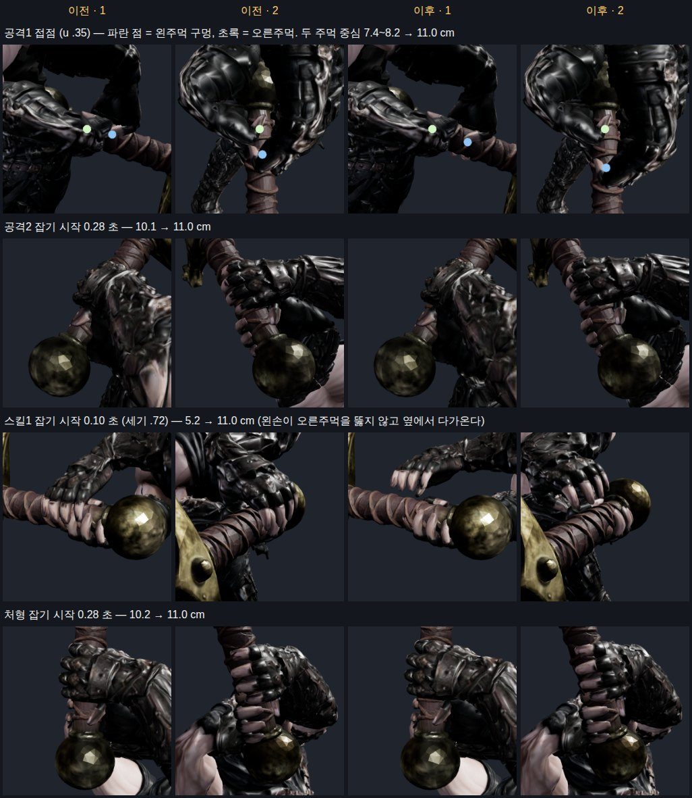
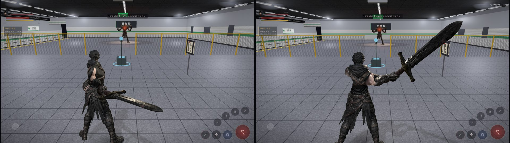

# 96 — 카인 두 손 잡기: 주먹 겹침 없애기 (2026-09-26)

디렉터: 「공격1 주먹 겹침도 고쳐」 (95 의 남은 것 1번)

## 1. 문제

- 공격1 접점(u .35)에서 왼주먹이 오른주먹과 **3 cm 겹쳤다** — 두 주먹 중심 8.2 cm (주먹 폭 10.8 cm).
  몸통 비틀기가 왼어깨를 3~6 cm 멀리 보내 팔이 모자랐고, 모자란 만큼 왼주먹이 손잡이 목표(오른손에서 11 cm)보다 오른주먹 쪽에 멈췄다.
- 95 는 4.5 cm 넘게 모자랄 때만 놓았다 → 4.5 cm 안에서 모자란 자세는 **겹친 채로 잡고** 있었다.
- 멈춘 자세만 쟀더니 못 본 것: **연속 재생(60 fps)** 으로 재 보니 잡기 시작에도 겹쳤다 —
  공격2 10.0 · 스매시 10.5 · 처형 8.7 cm, 스킬1 은 4.8 cm(잡기 시작에 왼주먹이 오른주먹을 뚫고 지나감).

## 2. 고친 것 (`js/combat-motion.js`)

| 무엇 | 전 (95) | 후 |
|---|---|---|
| 팔이 모자랄 때 | 오른손을 먼저 당김(최대 22 cm) | **왼쇄골을 먼저 내민다**(최대 31°, 「근거 없음」 — 렌더로 확인), 그래도 모자라면 오른손을 당긴다(최대 25 cm, 「근거 없음」) |
| 쥔 손의 대략 판정 | 풀기 전에 «어깨~목표 거리»로 미리 놓고 당김 | 쥔 손은 실제 풀이(쇄골·당김 뒤 남은 거리)로만 정한다 — 먼저 당기면 공격1 접점에서 대검이 21 cm 몸 쪽으로 들어왔다 |
| 놓기 · 다시 잡기 | 4.5 cm 넘게 모자라면 놓고 2.5 cm 안이면 다시 잡음 | **0.8 cm** / **0.4 cm** (「근거 없음」) — 모자란 만큼 주먹이 겹치므로 거의 다 닿을 때만 잡는다 |
| 놓을 때 | 오른손 당김이 남아 대검이 25 cm 몸 쪽에 있었다(강철 회전) | 오른손 당김·쇄골도 두 손 잡기 세기만큼만 섞는다 |
| 잡기 시작 · 놓기 도중 | 관절을 세기만큼 섞어 왼주먹이 호를 그리며 오른주먹을 지나감 | **두 주먹 떼기**(`separateFists`, 아래) |

### 두 주먹 떼기

- 주먹을 지름 11 cm 공으로 본다(주먹 폭 10.8 cm 에서, 「근거 없음」). 두 중심이 11 cm 안이면 왼팔(위팔·아래팔)을 한 번 더 풀어 민다.
  - 왼주먹이 칼날 쪽(앞)에 있으면 손잡이 방향으로 `hand2[0]`(11 cm)까지.
  - 폼멜 쪽(뒤)에 있으면 오른주먹에서 곧장 멀어지게. 뒤에 있는 주먹을 앞으로 밀었더니 **오른주먹을 뚫고 한 프레임에 18 cm 튀었다**.
  - 두 목표를 축 위치 ±3 cm 에서 섞는다 — 한 프레임에 갈래가 바뀌면 13 cm 튀었다.
- 팔이 모자라 못 밀면(잡기 시작엔 쇄골·당김도 세기만큼만 들어가 있다) 손잡이 옆으로 비켜 둔다.

## 3. 결과

연속 재생(60 fps, 대기 30 프레임 뒤 0 초부터, 두 손 잡기 세기 > .05 인 모든 프레임), 두 주먹 중심 최소 거리:

| 클립 | 이전 | 이후 | 한 프레임 최대 왼주먹 이동(오른손 기준) 이전 → 이후 · 클립 자체(두 손 잡기 없이) |
|---|---|---|---|
| 공격1 | 10.4 (멈춘 접점 8.2) | 11.0 | 5.3 → 3.7 |
| 공격2 | 10.0 | 10.9 | 4.1 → 4.1 |
| 공격3 | 11.0 | 11.0 | 19.0 → 19.0 · 56 (클립이 원래 빠르다) |
| 스매시 | 10.5 | 10.8 | 4.9 → 4.9 |
| 스킬1 | 4.8 | 10.6 | 6.1 → 9.5 · 10.1 |
| 스킬4 | 14.9 | 11.0 | 6.6 → 9.5 · 15.5 |
| 처형 | 8.7 | 11.0 | 5.8 → 7.4 |
| 강철 회전 | 17.8 | 20.0 | 24.3 → 7.4 (놓을 때 대검이 제자리로) |

- 스킬1·스킬4·처형은 한 프레임 이동이 조금 늘었다(오른주먹을 뚫지 않고 옆으로 돌아 다가오므로) — 모두 클립 자체의 손 속도 안이다.
- 멈춘 자세(60 프레임 수렴) 10 가지: 왼주먹 축 0.0 cm · 손잡이 11.0 cm · 주먹 방향 < 5° (95 기준 그대로).
- 쇄골은 공격1·2·3·스매시·스킬1 에서 최대 31° 까지 쓴다. 오른손 당김은 연속 재생 중 공격1 8 · 스킬1 16 cm.

실제 d01(뒤 카메라 — 왼주먹은 몸에 가려 보이지 않는다, 오류 0): 

## 4. 시험 · 도구

- `tests/hand-grip.test.mjs` — 멈춘 자세에 공격1·2·3 접점 포함(이전 코드는 공격1 8.2 cm 로 실패),
  **연속 재생** 공격1·공격2·스매시·스킬1·처형에서 두 주먹 중심 ≥ 10 cm. `npm test` 390/390.
- `tools/3d/grip-audit.html` — `window.play(clip,t)` 연속 재생 검수, `window.RIG`(진단값).

## 5. 남은 것

- 공격3·궁극기 초반은 클립 자체가 왼손을 한 프레임에 35~56 cm 옮긴다(두 손 잡기와 무관) — 클립 곡선 쪽 일.
- 오른손 당김(최대 25 cm)은 대검 궤적을 몸 쪽으로 바꾼다 — 판정 궤적(무기 끝)은 그만큼 짧아진다. 아직 판정과 맞춰 재지 않았다.
- 주먹을 공으로 본 11 cm 는 카인 주먹 폭에서 잡은 값 — 류·세라는 두 손 무기가 아니라 해당 없음.
