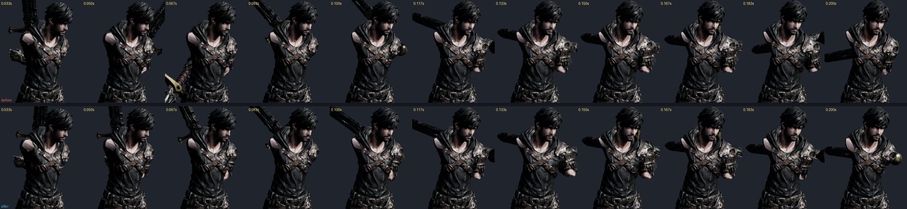
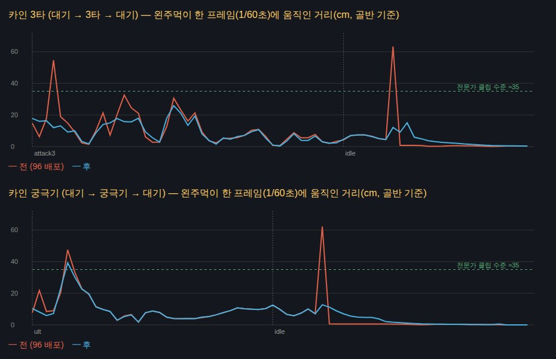
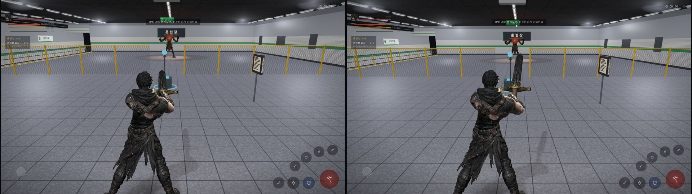

# 97 — 카인 3타·궁극기 왼손 튐 (2026-09-26)

디렉터: 「공격3 궁극기 왼손 튀는 것도 고쳐」 (96 의 남은 것)

## 1. 어떻게 쟀나 — 게임과 같은 순서로

96 에서 연속 재생을 잴 때 `mixer.update → restore → 두 손 보정` 순서로 돌렸다. three.js 믹서는 값이 바뀐 뼈만 쓰기 때문에
이 순서면 보정한 뼈(팔·쇄골)가 **첫 프레임 값에 멈춰** 있었다 — 게임(`restore → mixer.update → 보정`)과 다른 움직임을 잰 것.
이번에 도구·시험(`tests/hand-grip.test.mjs` 연속 재생, `tools/3d/grip-audit.html` `play()`)을 게임 순서로 고쳤다.
게임 순서로 다시 재도 96 의 결론(두 주먹 겹침 없음)은 유지된다: 96 배포 코드 연속 재생 최소 간격 10.2~11.0 cm, 지금 10.5~11.0 cm.

잰 것: 게임처럼 곡선화(`smoothCharacterClips`) + 교차 페이드(`transitionFor`) + 두 손 잡기를 켜고 대기 → 기술 → 대기를 60 fps 로 돌려
왼주먹(주먹 구멍)의 **한 프레임 이동**과 **가속**(2차 차분, 튐의 크기). 기준으로 전문가 클립(스킬1·3·4·반격)을 같은 방식으로 재니 가속 ≤ 35 cm/프레임².

## 2. 원인 넷

| # | 원인 | 어디서 | 크기 |
|---|---|---|---|
| 1 | **3타 클립의 팔꿈치 뒤집힘** — `rig_char.py` 가 무기 경로(손)를 주고 팔을 IK 로 풀어 24 fps 로 굽는데, 팔꿈치 쪽을 키마다 따로 골라 오른 아래팔이 한 키(42 ms)에 98~175° 뒤집혔다. 키 자세의 손은 맞지만 게임이 키 사이를 뼈마다 섞으면 대검이 한 프레임 아래로 꺾였다 돌아온다 | 3타 0.04~0.13 초 | 칼끝 가속 296 cm/프레임² |
| 2 | **행동이 끝나면 두 손 잡기를 한 프레임에 놓음** (`twoHandS=0`) — 왼팔이 클립 자세로 튄다 | 모든 두 손 기술 끝 | 3타 끝 63 cm, 1타 끝 115 cm |
| 3 | **흐려지는 도중 클립이 끝남** — 끝나기 0.14 초 전에 흐림(0.20~0.26 초)을 시작하는데 끝 자세를 잡지 않아(`clampWhenFinished=false`) 남은 무게 30~46 % 가 한 프레임에 빠진다 | `game3d.js` 솔로 (온라인은 이미 잡고 있었다) | 궁극기 끝 대검 62 cm |
| 4 | **잡는 중(세기 < 1)엔 관절 회전을 섞음** — 클립 팔과 잡은 팔이 100° 넘게 다르면 팔이 호를 그리며 휘돈다. 또 오른손 당김·쇄골이 매 프레임 새로 재져 0↔20 cm 로 뒤바뀌었다 | `combat-motion.js` | 3타 시작 55 cm, 1타 접점 대검 62 cm |

## 3. 고친 것

- **두 손 놓기도 시간으로** (`combat-motion.js`): 행동이 끝나도 세기가 남아 있으면 초당 10 으로 놓는다.
- **끝 자세 잡은 채 흐리기** (`game3d.js` 4 곳): 흐리기 시작할 때 `clampWhenFinished=true`.
- **잡는 중엔 «자리»를 섞는다** (`applyLeftGrip`): 주먹 점·팔꿈치·손 방향을 곧게 섞고 두 뼈로 다시 푼다(비틀림만 회전을 섞음).
- **당김·쇄골 속도 제한**: 필요한 양은 매 프레임 재되, 쓰는 양은 당김 1 m/s · 쇄골 5 rad/s 로만 따라간다(「근거 없음」). 모자란 몇 프레임은 96 의 두 주먹 떼기가 막는다.
- **3타 클립 팔 다시 풀기** (`tools/3d/clip-arm-repair.mjs` → `art/3d/kain_anim.glb`):
  - 손(무기 경로)은 원본 키 그대로(가슴 공간 Catmull-Rom), 팔만 60 fps 로 다시 푼다.
  - 팔꿈치 쪽은 앞 프레임을 이어받되 원본 키 팔꿈치 쪽으로 0.5 만큼 당긴다 — 키에서는 원본 자세에 붙고, 뒤집히는 곳은 이어받기가 버틴다.
  - 비틀림은 원본 그대로. **0~0.28 초만** 고치고 0.06 초에 걸쳐 원본으로 되섞는다 — 판정(0.44 초) 이후는 원본과 같다.
  - 명령: `node tools/3d/clip-arm-repair.mjs art/3d/kain_anim.glb attack3 --window 0,0.28,0.06 > a3.json && node tools/3d/glb-put-clips.mjs art/3d/kain_anim.glb a3.json`

### 해 보고 버린 것 (확대 렌더로)

| 방법 | 수치 | 버린 까닭 |
|---|---|---|
| 해부학 경첩 축에 위팔 비틀림을 맞춤, 6 클립 전체 | 3타 가속 25 | 궁극기 어깨가 부풀고 소매가 꼬여 찢어짐, 3타 0.5~0.6 초 어깨 망토 이음새가 흰 줄로 벌어짐 |
| 비틀림 원본 · 팔꿈치 자연 방향 당김 | 3타 가속 20 | 키 자세에서도 망토 이음새 흰 줄 |
| 원본 키 팔꿈치 그대로 잇기 | 3타 가속 43 · 오른손 54 | 키 사이 팔꿈치가 크게 돌아 대기 → 3타 섞임과 겹쳐 여전히 튐 |

곁에서 찾은 것: 굽는 IK 클립(1·2·3타·스매시·처형·궁극기)은 절반쯤의 키에서 팔꿈치를 자연 클립(대기·달리기·Meshy)과 반대 축으로 굽혀 둔다(위팔을 돌려 맞춤).
궁극기는 두 손 잡기가 팔을 덮어 보이지 않아 클립은 그대로 뒀다(코드만으로 전문가 수준).

## 4. 결과

게임처럼(곡선화 + 교차 페이드 + 두 손 잡기, 60 fps), 단위 cm/프레임:

| | 왼주먹 이동 최대 | 왼주먹 가속(튐) | 오른주먹 가속 |
|---|---|---|---|
| 3타 전 → 후 | 63.3 → **25.9** | 62.8 → **18.9** | 86.2 → **16.7** |
| 궁극기 전 → 후 | 62.3 → **39.2** | 67.4 → **31.5** | 68.5 → **20.9** |
| 1타 → 2타 → 3타 전 → 후 | 78.0 → 74.1 | 106.2 → 71.0 | 81.8 → 76.1 |
| 전문가 클립(스킬1·3·4·반격) | 20~45 | 23~35 | 19~30 |

- 3타 칼끝 가속(클립만): 296 → 23.5. 궁극기 시작 0.12 초 39 cm 는 궁극기 클립 자체가 왼손을 빨리 옮기는 곳 + 잡기 시작(전 47).
- 확대(0.9 m) 검수: 3타 0.05~0.36 초 양팔 — 키 자세는 원본과 같고, 뒤집히던 0.05·0.1·0.15 초만 달라짐. 새 찢어짐·늘어남 없음.
- 실제 d01: 기본 1·2타 · 궁극기 발동, 오류 0. 

## 5. 시험 · 도구

- `tests/clip-arm.test.mjs` — 3타·궁극기 칼끝 가속 ≤ 60 cm/프레임²(「근거 없음」, 뒤집힘 수백과 휘두름을 가름). 원본 클립이면 3타 296 으로 실패.
- `tests/hand-grip.test.mjs` — 연속 재생을 게임 순서로, 행동이 끝난 첫 프레임 두 손 잡기 > 0.8(전 0.00), 0.7 초 뒤 < 0.02. `npm test` 391/391.
- `tools/3d/clip-arm-repair.mjs` — 굽는 단계 팔 뒤집힘 고치기(`--window`, `--elbow`, `--twist`).

## 6. 남은 것

- 같은 뒤집힘이 **1타(칼끝 가속 257 @ 0.23 초)·스매시(219 @ 0.68 초)·2타(125 @ 0.77 초)** 에도 있다. 같은 도구로 구간만 고칠 수 있다 — 클립마다 확대 검수가 필요해 이번엔 손대지 않았다.
- 1타 접점(0.40 초)·스매시 끝(2.07 초)은 대검 경로 자체가 한 프레임 55~62 cm 로 빠르다(설계된 휘두름) — 튐인지 판단은 디렉터 확인.
- 대기 ↔ 굽는 IK 클립의 팔 뼈가 57~118° 달라 교차 페이드(0.085~0.26 초) 동안 팔이 크게 돈다.
- 카인 망토·위팔 이음새는 팔을 들어 올린 자세에서 원래도 가는 틈이 보인다(85번 문서와 같은 한계).
