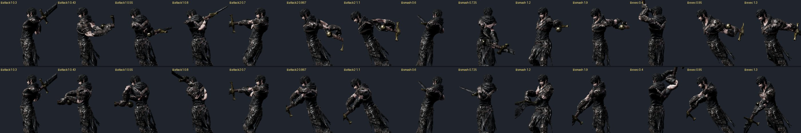
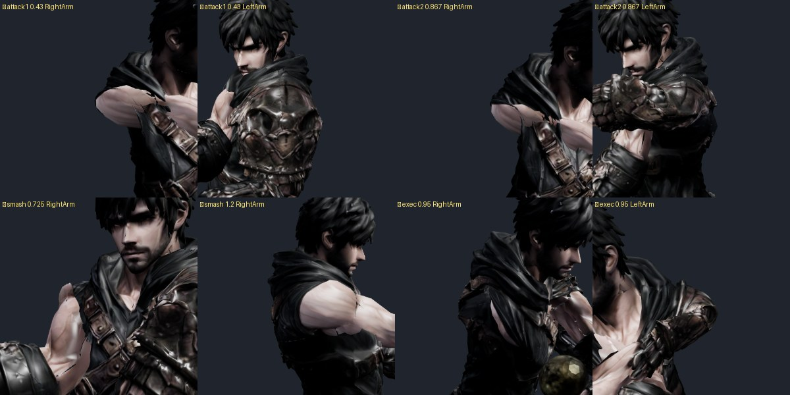

# 98 — 「게임에 적용이 안 됨」 원인 · 1타·2타·스매시 대검 꺾임 (2026-09-26)

디렉터: 「1타 스매시 2타 대검 꺾임도 고쳐. 그리고 게임에 들어가보니 적용이 안되어 있던데 머가 문제인지 함 봐줘」

## 1. 적용이 안 된 까닭 — 서비스워커

배포는 제대로 됐다: 사이트의 `kain_anim.glb`·`combat-motion.js`·`game3d.js` 해시가 저장소와 같고, `sw.js` 빌드도 `de58c09`.
앱(안드로이드)도 `capacitor.config.json` 의 `server.url` 로 사이트를 그대로 읽는다(묶어 넣은 옛 파일 아님).

문제는 **새 버전으로 갈아타는 순서**였다:

1. 화면이 켜지면 `version.json` 을 보고 빌드가 다르면 워커 갱신을 부탁한 뒤 **2.5 초 뒤 무조건 새로고침**(`ui.js`).
2. 새 워커는 설치 때 아트까지 **110 MB 를 통째로 다시 받았다**(`cache:'reload'`) — 휴대폰에선 몇 분, 앱을 닫으면 처음부터.
3. 그동안(=새로고침된 화면) 옛 워커가 계속 맡는다: 코드(JS)는 네트워크 우선이라 **새 코드**, GLB 는 캐시 우선이라 **옛 캐릭터 클립**.
   → 화면 아래 빌드 번호(JS 가 찍음)는 새것인데 대검 동작은 옛것.

로컬 브라우저로 그대로 재현했다(워커 + 파일 바꾸기):

| | 옛 워커 | 새 워커 |
|---|---|---|
| 파일만 바뀜 | 옛 파일 | **새 파일** |
| 새 빌드 뒤 | **옛 파일** | 새 파일 |
| 오프라인 | 캐시 | 캐시 |

고친 것:
- `sw.js`: 설치 때 **코드만** 미리 받는다(되묻기 `no-cache`, 안 바뀌면 304). 아트는 쓸 때 서버에 «바뀌었나»만 묻고(ETag — GitHub Pages 가 준다) 바뀐 것만 받는다. 오프라인이면 캐시.
- `sw.js`: 활성화 때 화면을 강제로 다시 불러오지 않고 알리기만 — 새로고침은 `ui.js` 가 출격 중이 아닐 때 한다(던전 한복판 재시작 방지, 106번과 같은 원칙).
- `ui.js`: 새 워커가 넘겨받은 뒤(`controllerchange`, 최대 15 초) 새로고침.
- **이번 배포 한 번은** 옛 워커가 맡고 있는 기기에서 넘어가는 중이라, 앱을 한 번 닫았다 열거나 새로고침을 한 번 더 하면 확실하다. 다음 배포부터는 곧바로 반영된다.

## 2. 대검 꺾임의 진짜 원인 — 굽는 단계의 «앞» 뒤집힘

97 에서 3타는 «키마다 팔꿈치가 뒤집힘» 으로 고쳤다. 1타·2타·스매시는 그것보다 크다. 옆에서 보니 **접점 무렵 두 팔과 대검이 등 뒤로** 가 있었다.

- `rig_core.py` 의 `char_frame` 이 캐릭터 앞을 «골반 뼈 −Y 축의 수평 성분» 으로 잡는다. 그 축은 거의 **바로 아래**를 향해서, 골반이 조금만 앞뒤로 기울어도 수평 성분의 방향이 180° 뒤집힌다.
- 굽는 단계는 손 자리·자루·날을 그 앞 기준으로 놓으므로, 뒤집힌 키에서는 손·대검이 **몸 뒤로 거울처럼** 옮겨졌다. 뒤집히는 순간 대검이 한 키(42 ms)에 159° 돈다.
- 설계 경로(`PATHS`)로 오른손 방향을 계산해 원본 키와 견주니 뒤집힌 키가 뚜렷했다:
  1타 0.42 초~끝 · 2타 0.79 초~끝(접점 0.87 포함) · 스매시 0.71~2.04 초 · **처형 0.42 초~끝**(같은 결함이라 함께 고침).
  3타는 설계 경로와 다른 원본이라 해당 없음(97 에서 따로 고침).

고친 것 — `tools/3d/clip-arm-repair.mjs --design` (+ `tools/3d/carry-paths.mjs` = `PATHS` JS 판):
키마다 설계 경로의 오른손 수평 방향을 **진짜 앞**(골반의 수평 회전 — 스매시처럼 몸이 돌면 같이 돈다)으로 놓고 원본 손과 견준다.
90° 넘게 어긋난 키는 양손·팔꿈치를 골반 세로축 둘레로 되돌린 뒤, 97 과 같은 방식(팔꿈치 이어받기 + 원본 쪽 당김, 비틀림 원본)으로 60 fps 로 다시 푼다.
Blender 가 없어 `rig_core.char_frame` 자체는 고치지 않았다 — 다시 구우면 같은 문제가 난다(남은 것 참고).

## 3. 결과

칼끝 가속(클립만, 게임과 같은 곡선화, cm/프레임²):

| | 1타 | 2타 | 3타 | 스매시 | 처형 | 궁극기 |
|---|---|---|---|---|---|---|
| 원본 | 257 | 125 | 296 | 219 | 55 | 14 |
| 후 | **44** | **27** | **23** | **83** | **24** | 14 |

- 스매시 83(1.75~1.78 초)은 설계된 «머리 위 뒤로 들었다가 내리찍기» 의 내리찍는 순간 — 뒤집힘이 아니다.
- 확대 검수: 접점 자세 양 어깨 — 새 찢어짐 없음(망토 가장자리 톱니는 원래 이음새, 85·97 번과 같은 한계).
- `npm test` 392/392 — `tests/clip-arm.test.mjs` 에 «원본 키 1/30 초마다 오른손이 설계 방향과 90° 안» + 칼끝 가속 ≤ 100 추가(원본이면 1타 0.40 초 132° 로 실패).

## 4. 남은 것

- `rig_core.char_frame` 은 여전히 골반 −Y 를 앞으로 쓴다 — 다음에 Blender 로 다시 구울 일이 있으면 «골반 앞 = 양 허벅지 잇는 선과 위쪽의 외적» 으로 바꿔야 한다.
- 1타 접점(0.37~0.40 초)은 설계대로 0.13 초에 90° 쓸어 벤다 — 빠른 휘두름(칼끝 44)이라 남겼다.
- 대기 ↔ 공격 교차 페이드 동안 팔 뼈 차이가 커 팔이 크게 도는 것은 97 과 같이 남아 있다.
