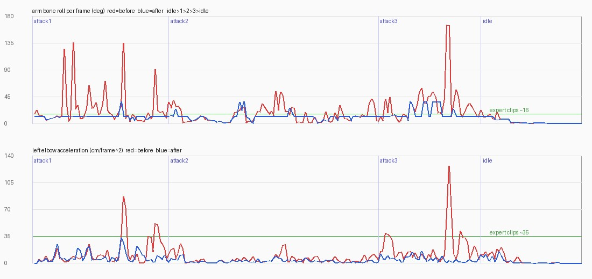
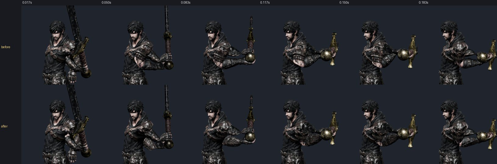
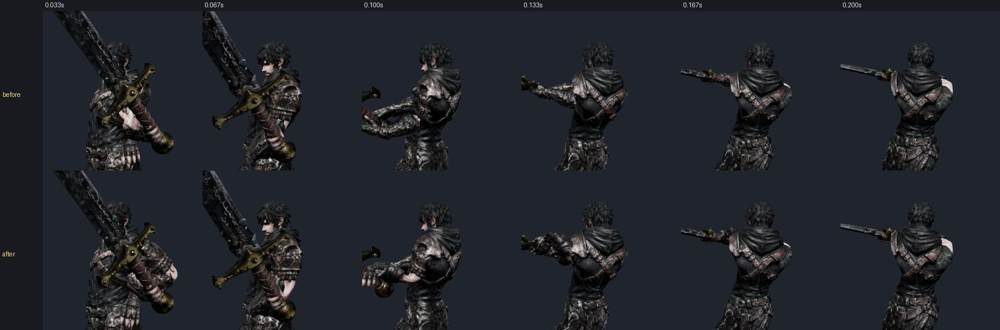
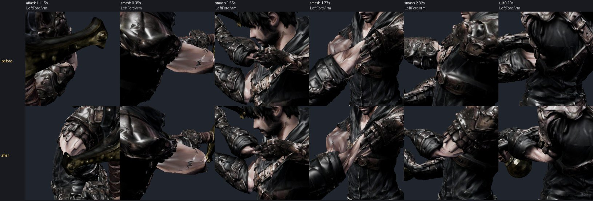

# 99 — 대기↔공격 넘어갈 때 팔 도는 것 (2026-09-26)

디렉터: 「대기↔공격 넘어갈 때 팔 도는 것도 고쳐」 (97·98 의 남은 것)

## 1. 어떻게 쟀나

게임과 같은 순서(곡선화 + `transitionFor` 교차 페이드 + 두 손 잡기, 60 fps)로 대기 → 기술 → 대기를 돌리고 두 가지를 쟀다.

- **팔 뼈 제자리 돌기**: 위팔·아래팔에 붙인 옆 방향 표지가 뼈 축 둘레로 한 프레임에 몇 도 도는지(가슴 기준). 전문가 클립(대기·달리기·Meshy) ≤ 16°.
- **왼팔꿈치 가속**: 골반 기준 팔꿈치 자리의 2차 차분(cm/프레임²). 전문가 클립 ≤ 35.

처음 쓴 «뼈 비틀림 각(스윙-트위스트)» 은 팔을 거의 편 자세에서 값이 멋대로 뛰어(가짜 180°) 버렸다.

## 2. 원인 셋

| # | 원인 | 크기(전) |
|---|---|---|
| 1 | **두 손 잡기가 왼팔꿈치 쪽을 매 프레임 새로 고름** — 기준이 클립 팔꿈치라, 굽는 클립의 팔꿈치가 뒤집히는 곳에서 20~28 cm 떨어진 팔꿈치가 한 프레임에 반대편으로 건너뛰었다 | 왼팔꿈치 가속 76~126 |
| 2 | **손잡이 둘레 돌림도 매 프레임 새로 고름** — 왼주먹이 손잡이 둘레로 한 프레임 80~97° 돌았다 | — |
| 3 | **굽는 클립의 팔 비틀림 뒤집힘 + 교차 페이드** — 1·2·3타·스매시·처형·궁극기 클립은 손은 맞지만 위팔·아래팔 비틀림을 키마다 따로 골라(97) 대기와 100~150° 다르고 클립 안에서도 뒤집힌다. 페이드(0.085~0.26 초)나 키 사이 보간이 그걸 몇 프레임에 돈다 | 아래팔 한 프레임 135~165° |

## 3. 고친 것

- **왼팔꿈치 쪽은 시간으로만 돈다** (`combat-motion.js` `poleStep`): 가장 좋은 팔꿈치 쪽은 «목표» 로만 쓰고, 실제 쪽(가슴 기준)은 초당 8 rad(프레임 7.6°)까지만 따라간다. 놓을 때는 클립 팔꿈치 쪽이 목표. 「근거 없음」 — 전문가 클립 팔꿈치 돌림 15~17°/프레임 안쪽.
- **손잡이 둘레 돌림은 앞 프레임 20° 안에서** (`planLeftGrip`): 앞 해에서 20° 넘는 후보는 먼저 빼고, 닿는 후보가 없을 때만 전부 본다. 값 벌점(앞 해와의 차이²×2)도 둔다.
- **팔 뼈 제자리 돌기 묶기** (새 `js/arm-blend.js`, 게임·온라인 아바타의 카인·류·세라): 두 손 보정 뒤에 위팔·아래팔이 제 축 둘레로 도는 빠르기를 12°/프레임으로 묶는다. 뼈 자리와 손 방향(대검·잡은 손)은 그대로 — 넘친 몫은 다음 관절이 잠깐 흡수하고 몇 프레임에 따라잡는다. 그 관절 비틀림이 90° 를 넘으면(클립이 원래 더 비튼 만큼은 괜찮다) 최대 3 배(36°/프레임)로 빨리 따라잡는다.
  - 처음엔 묶기만 했더니 손목이 150° 넘게 꼬인 프레임이 늘었다(스매시 1 → 33, 궁극기 0 → 9) — 그래서 관절 한도를 넣었다(스매시 10, 궁극기 1).
- `game3d.js` 순서: 팔 묶기 되돌림 → 손 보정 되돌림 → `mixer.update` → 손 보정 → 팔 묶기 → 시네마.
- `tools/3d/grip-audit.html` 에 `window.seq(list,t)` — 게임처럼 대기에서 섞어 들어가 t 초까지(`?roll=0` 이면 묶기 끔).

### 해 보고 버린 것

| 방법 | 버린 까닭 |
|---|---|
| 섞기 시작 때 보이던 팔을 찍어 0.22 초 동안 옮기기(스냅샷) | 수치가 거의 그대로 — 돌기는 페이드보다 클립·두 손 잡기에서 더 많이 나왔다 |
| 팔 자리(손·팔꿈치)를 섞고 다시 풀기 | 팔꿈치가 더 튀었다 |
| 굽는 클립 6개를 경첩 축 비틀림으로 다시 굽기 | 전환 돌기 여전(최대 176°/프레임) + 97 의 망토 이음새 벌어짐 |
| 아래팔 = 위팔→손 비틀림 절반(이어 재기) | 팔꿈치를 145° 넘게 접으면 기준이 뒤집히고, 이어 잰 값이 쌓여 손목이 다시 179° 꼬였다 |

## 4. 결과

| 게임처럼(60 fps) | 팔 뼈 한 프레임 돌기 최대 | 왼팔꿈치 가속 최대 |
|---|---|---|
| 전 | 135~165° | 76~126 |
| 후 | **36°** (대부분 12° 안) | **38** |
| 전문가 클립 | 16° | 35 |

- 확대(0.85 m) 검수: 손목이 가장 많이 꼬이는 프레임(1타 끝 1.15 · 스매시 0.35/1.55/1.77/2.32 · 궁극기 0.10 초) 왼아래팔 — 새 찢어짐·늘어남 없음. 스매시 0.35 초 손목 가장자리 톱니는 전에도 있던 것.

- `npm test` 394/394. `tests/arm-roll.test.mjs`:
  - 묶기 단위 — 80° 뒤집힘은 12°/프레임, 150° 는 36°/프레임 안으로 따라잡고 관절 자리·손 방향은 그대로.
  - 게임 순서 연속 재생(1타·3타·스매시·궁극기·처형·1→2→3타) — 팔 뼈 ≤ 40°/프레임, 왼팔꿈치 가속 ≤ 50. 전 코드면 1타 0.30 초 135° 로 실패.

## 5. 남은 것

- 뿌리는 여전히 굽는 클립(`rig_core.py`)의 팔 비틀림 선택이다. Blender 로 다시 굽게 되면 키마다 비틀림을 앞 키에서 이어 받게 고쳐야 한다(98 의 `char_frame` 과 함께).
- 대기 ↔ 공격 클립의 아래팔 비틀림 차이(최대 110°)는 이제 0.1~0.3 초에 걸쳐 돈다 — 한 프레임에 도는 것은 없어졌지만 «돌기» 자체는 남아 있다. 손목·팔꿈치가 90° 넘게 꼬인 프레임은 전과 비슷한 수(손목 >120°: 1타 4→6, 스매시 1→10, 궁극기 0→1 프레임).
